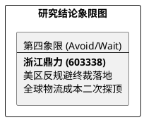

# 研报章节七：投资摘要与风险因素——逻辑颠覆后的战略规避

**研究日期：2026年4月6日**

## 1. 投资摘要 (Investment Summary)

浙江鼎力（603338.SH）原本清晰的全球化成长逻辑已在 2026 年初遭遇不可抗力式的系统性破坏。

*   **核心逻辑颠覆**：
    1.  **避风港逻辑崩塌**：美国 DOC 针对 MEC 的反规避调查终裁成立，通过墨西哥组装避税的路径被彻底封死。美区产品面临 **~70%** 的惩罚性关税，公司正失去全球最大且最高毛利的市场。
    2.  **物流红利转为黑洞**：2026 年 3 月中东冲突导致苏伊士运河通行量大减 60%，海运费反弹 30% 以上且需支付高额战时附加费。公司出口毛利率正面临自上市以来最严重的挤压。
    3.  **技术优势被壁垒对冲**：虽然电动化产品领先，但在极端的关税壁垒及地缘安全审查面前，产品性价比优势已无法转化为份额扩张。
*   **估值结论**：大幅下调 2026 年 EPS 预测至 **3.12 元**。下调目标 PE 至 11.5x，**目标价下调至 36.6 元**。当前股价已明显破位且处于严重高估状态。
*   **技术面**：股价已放量跌破 52.0 元年线支撑，进入加速寻底阶段。

## 2. 风险因素 (Risk Factors)

1.  **美国市场永久性收缩风险（极高）**：70% 关税可能导致公司永久丧失美区大客户订单，MEC 资产面临减值风险。
2.  **全球供应链断裂风险（高）**：中东局势及苏伊士运河瘫痪导致原材料进口及成品出口的物流链条极度脆弱。
3.  **欧洲二次反规避调查风险（中）**：随着美国动作落地，不排除欧盟后续跟进更为严苛的产地认定规则。

## 3. 研究结论象限图 (Final Evaluation Matrix)

