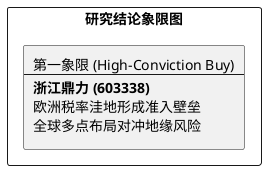

# 研报章节七：投资摘要与风险因素

**研究日期：2026年2月26日**

## 1. 投资摘要 (Investment Summary)

浙江鼎力（603338.SH）正通过地缘博弈获得超额竞争力，处于产能释放驱动高增长的爆发起点。

*   **核心逻辑**：
    1.  **地缘套利优势**：在欧盟市场具备 20.6% 的绝对税率优势，显著低于国内同行，构建了准入壁垒型红利。
    2.  **全球再平衡布局**：通过美国 MEC 本土制造及沙特利雅得基地，成功对冲美区关税风险并开拓中东新增长极。
    3.  **技术与质量双高**：率先实现全系列产品电动化，高端臂式产品占比持续提升，ROIC 处于行业顶级。
*   **估值结论**：预计 2026 年 EPS 为 4.48 元。给予 21x PE，目标价 94.1 元（较当前价空间巨大）。
*   **技术面**：股价全面站上年线，量价配合突破圆弧底，机构资金布局完成。

## 2. 风险因素 (Risk Factors)

1.  **合规审计风险（高）**：若美国 MEC 工厂的本土增值率未能通过反规避审查，将面临高额补缴关税。
2.  **成本及汇率风险（中）**：钢材价格超预期反弹或人民币急升可能挤压制造端毛利。
3.  **行业波动风险（低）**：全球高机市场需求若因经济增速大幅放缓而进入深度衰退。

## 3. 研究结论象限图 (Final Evaluation Matrix)

