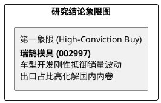

# 研报章节七：投资摘要与风险因素

**研究日期：2026年2月26日**

## 1. 投资摘要 (Investment Summary)

瑞鹄模具（002997.SZ）正从“增长弹性”转向“结构性避险”，定位于对冲车市销量波动的装备研发“卖铲人”。

*   **核心逻辑**：
    1.  **研发刚性对冲**：在车市销量低迷期，车企通过加速换代（出新车）刺激需求。公司作为模具供应商，受益于新车型开发频次增加，44 亿在手订单锁定了业绩底线。
    2.  **出口避险能力**：核心客户奇瑞 50% 以上销量来自出口，公司通过“装备出海”有效分散了国内市场的需求波动风险。
    3.  **一体化成本护城河**：凭借模具自研协同，在整车零部件年降压力下仍能维持毛利韧性。
*   **估值结论**：当前 PE 处于历史低位，已充分定价悲观预期。目标市值区间 130 - 150 亿元，具备显著的价值回归空间。
*   **治理信心**：产业资本减持证伪，实控人与核心客户利益深度绑定。

## 2. 风险因素 (Risk Factors)

1.  **宏观需求风险（高）**：若 2026 年车市销量下滑远超预期，可能导致主机厂订单交付推迟或合同额缩减。
2.  **年降压力风险（中）**：主机厂若将价格战压力超预期传导至供应链，将挤压零部件业务的盈利空间。
3.  **大客户依赖风险（中）**：业务高度依赖奇瑞系，若大客户海外出口受地缘摩擦严重阻碍，将冲击公司增长逻辑。

## 3. 研究结论象限图 (Final Evaluation Matrix)

