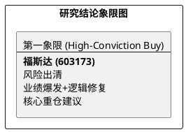

# 研报章节七：投资摘要与风险因素

**研究日期：2026年3月31日**

## 1. 投资摘要 (Investment Summary)

福斯达（603173.SH）已渡过地缘政治引发的极端恐慌期，基本面逻辑正经历强力修复。

*   **核心逻辑修复**：
    1.  **坏账误判纠偏**：此前市场担心的“1.4 亿伊朗坏账”已被逻辑证实为误判。公司预收款制度提供了极强的财务安全边际，2025 年预告高增已证明其内生增长动力。
    2.  **仲裁利空出尽**：7000 万日本 AWE 仲裁损失已于 3 月 18 日官宣并计入 2025 年度损益，基本面“雷区”已彻底清空。
    3.  **交付通道解冻**：中东通航信号标志着 2026 年交付逻辑的重启，结合国内“两新”政策的首批资金下达，2026 年业绩高增确定性极高。
*   **最新结论**：上修 2026 年 EPS 至 **3.44 元**，目标价上调至 **61.92 元**（对应 2026E PE 18x）。
*   **技术面**：38.49 元“金坑”底部确立，股价回归 40 元支撑区，进入右侧回升阶段。

## 2. 风险因素 (Risk Factors)

1.  **原材料价格波动 (中)**：LME 铝价高位运行仍对新接订单毛利构成一定压力。
2.  **国际仲裁与合规风险 (中)**：虽然 AWE 案已结，但全球化经营仍需面对复杂的跨国法律环境。
3.  **地缘政治不确定性 (中)**：中东局势虽缓和但仍未彻底平息，交付进度可能存在月度级别的波动。

## 3. 研究结论象限图 (Final Evaluation Matrix - 2026-03-31 修正)

**更新时间戳：2026年3月31日**
