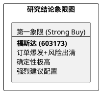

# 研报章节七：投资摘要与风险因素

**研究日期：2026年4月23日**

## 1. 投资摘要 (Investment Summary)

福斯达（603173.SH）目前正处于**基本面利空彻底出清**与**需求侧核弹级爆发**的共振点，投资逻辑已实现从“危机定价”向“强力进攻”的定性逆转。

*   **核心逻辑升级**：
    1.  **合同负债揭示惊人需求**：2026Q1 合同负债骤增至 **25.13 亿元**，创历史新高。在全球能源转型背景下，公司订单获取能力远超市场预期，积压的订单锁定了未来 2 年的高速增长。
    2.  **地缘与仲裁包袱卸下**：2025 年报已足额计提 16 亿日元仲裁损失，历史风险出清；霍尔木兹海峡封锁风险已被股价充分定价。
    3.  **政策红利对冲成本压力**：国内“两新”补贴进入实操期，有效对冲了 LME 铝价高企对综合毛利的影响。

*   **投资建议**：
    将评级由 **🔴 回避或观望** 直接上修至 **🟢 强烈买入 (Strong Buy)**。当前股价（40.29 元）处于底部支撑区，安全边际极高，目标价 **54.00 元**。

## 2. 核心风险因素 (Risk Factors)

虽然逻辑反转，但仍需警惕以下边际变量：
1.  **交付周期拉长风险**：若中东局势导致航道封锁时间超预期，25 亿订单的收入确认节奏将受阻，可能导致短期业绩波动。
2.  **大宗商品持续极端高位**：铝价若长期维持在 3600 美元/吨以上且无回落迹象，将持续挤压 EPC 项目的最终净利率。
3.  **汇兑波动风险**：外销占比超 60%，人民币对美元/欧元的剧烈波动对单季度利润影响显著。

## 3. 研究结论象限图 (Final Evaluation Matrix - 2026-04-23 修正)

**更新时间戳：2026年4月23日**
