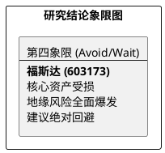

# 研报章节七：投资摘要与风险因素

**研究日期：2026年3月14日**

## 1. 投资摘要 (Investment Summary)

福斯达（603173.SH）正处于地缘黑天鹅引发的逻辑断裂期，原有高成长预期已遭系统性下修。

*   **核心负面变化**：
    1.  **坏账风险实锤**：对伊朗 Petro Sahel 的 1.4 亿元应收账款因 2026 年 2 月末的全面冲突面临全额计提，直接吞噬 2026 年近 1/4 预测利润。
    2.  **交付通道中断**：霍尔木兹海峡关停导致中东核心订单（占海外约 45%）陷入交付不可抗力，2026H1 业绩确收面临断崖式下滑。
    3.  **估值溢价转折价**：全球 LNG 资本开支冻结，以及铝价暴涨导致的成本挤压，使公司从“挑战者溢价”陷入“地缘风险折价”。
*   **最新结论**：大幅下调 2026 年 EPS 至 2.93 元，目标价下移至 **44.00 元**。
*   **技术面**：放量破位下行，股价击穿 48 元强支撑，短期无止跌迹象。

## 2. 风险因素 (Risk Factors)

1.  **中东冲突与资产减值 (🔴 极高)**：地缘政治导致德黑兰及海湾地区资产面临清算风险，1.4 亿坏账计提是近期财务最大的“雷”。
2.  **海峡封锁与交付断裂 (🔴 极高)**：核心营收区的物流中断将导致 2026 年营收增长目标落空。
3.  **原材料价格暴涨风险 (中)**：LME 铝价飙升侵蚀存量及新接订单的毛利空间。

## 3. 研究结论象限图 (Final Evaluation Matrix - 2026-03-14 修正)

**更新时间戳：2026年3月14日**
