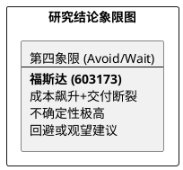

# 研报章节七：投资摘要与风险因素

**研究日期：2026年4月13日**

## 1. 投资摘要 (Investment Summary)

福斯达（603173.SH）因中东地缘局势二次恶化及大宗商品狂飙，基本面逻辑遭遇严重破坏。

*   **核心逻辑证伪与反转**：
    1.  **交付通道再次断裂**：4 月初霍尔木兹海峡及红海航线面临极高封锁风险，“许可制通航”预期破灭，2026 年中东项目交付回补逻辑被阻断。
    2.  **成本刚性挤压**：LME 铝价历史性突破 3571 美元/吨，叠加欧盟 CBAM 碳税（75.36 欧元/吨）落地及好望角绕行的高运费，公司海外高溢价订单的毛利空间被严重侵蚀。
    3.  **内需难以独木支撑**：虽有国内“两新”政策护航，但无法完全填补海外高毛利业务延期带来的巨大业绩缺口。
*   **最新结论**：大幅下修 2026 年 EPS 至 **2.50 元**，目标价下调至 **37.50 元**（对应 2026E PE 15x）。
*   **技术面**：40 元支撑区面临极高破位风险，有二次探底需求。

## 2. 风险因素 (Risk Factors)

1.  **地缘政治黑天鹅 (极高)**：中东局势失控导致海外项目长期停滞或违约。
2.  **原材料价格飙升 (极高)**：铝价、钢价持续在高位运行，摧毁制造端利润。
3.  **贸易壁垒与物流成本 (高)**：CBAM 及高昂的海运费永久性削弱出海竞争力。

## 3. 研究结论象限图 (Final Evaluation Matrix - 2026-04-13 修正)

**更新时间戳：2026年4月13日**
