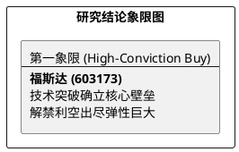

# 研报章节七：投资摘要与风险因素

**研究日期：2026年2月26日**

## 1. 投资摘要 (Investment Summary)

福斯达（603173.SH）正处于技术身位跃迁与利空出尽后的业绩收割期。

*   **核心逻辑**：
    1.  **技术层级质变**：打破十万等级空分领域垄断，具备与林德等国际巨头角力的实力，并深度参与 Refhyne II 绿氢项目。
    2.  **利空彻底出尽**：69% 巨量解禁压力已平稳通过，控股股东续签一致行动协议，筹码结构优化。
    3.  **业绩爆发验证**：2025 年利润预增 60%-91.5%，验证了高成长逻辑的有效性。
*   **估值结论**：预计 2026 年归母净利润继续高增。给予 2026 年 20x PE，目标价 76.20 元（空间约 48%）。
*   **技术面**：解禁利空消化后趋势回归，短期阻力位 55 元，上方无重大套牢区。

## 2. 风险因素 (Risk Factors)

1.  **海外回款风险（中）**：地缘政治波动可能导致海外非标大项目的验收及回款周期拉长。
2.  **竞争加剧风险（中）**：行业巨头在超大型空分市场的反击可能导致行业整体毛利率承压。
3.  **原材料价格风险（低）**：钢、铝等原材料价格大幅上涨可能侵蚀设备制造利润。

## 3. 研究结论象限图 (Final Evaluation Matrix)

