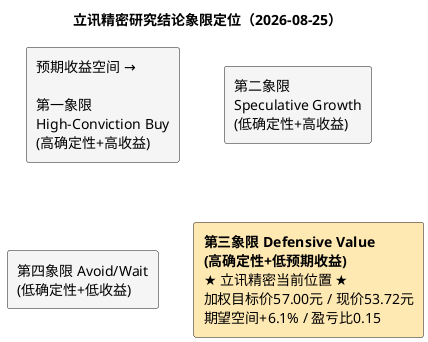

# 研报章节八：投资摘要与风险因素

**研究日期**：2026年8月25日
**研究标的**：立讯精密（002475.SZ）
**现价**：53.72 元（不复权，2026-08-24收盘）；总市值 4,156.76 亿元；总股本 77.38 亿股（A+H）

---

## 1. 投资摘要 (Investment Summary)

**核心定位**：全球精密制造平台龙头，正处于从"果链单极"向"消费电子+AI算力+汽车电子"三轮驱动切换的关键验证期；2026年7月完成H股上市后，公司同时握有境内制造纵深与境外资本弹药。

### 1.1 投资逻辑（三条主线）

1. **AI 算力第二曲线已成规模现实**：通讯及数据中心板块2026H1收入166.09亿元（+49.66%），电连接/CPC/液冷/电源全栈卡位英伟达生态，GB200单机柜整套方案约209万元（2024年4月纪要口径）；2026年四大云厂capex指引约7,300亿美元（+77%），Morgan Stanley预计2027年再增57%。确定性评分4/5。但必须同步记录其脆弱性：LightCounting实证光模块行业double ordering泛滥且销售领先capex拐点约6个月转负；
2. **汽车电子完成规模跃迁**：Leoni并表后板块年收入近667亿元（2026E），跻身全球线束前三量级，管理层口径整合超预期（NPB提前至少一年），毛利率14.5%且修复通道明确。确定性评分3.5/5；
3. **消费电子基本盘量价裂口但底盘稳固**：iPhone组装份额~27%（全球第二）、折叠屏iPhone Q4量产是最大新品催化；但存储危机（RAMageddon）压制出货量上限——Apple已因DRAM短缺削减2026出货计划（郭明錤）、IDC预计全球手机出货-13.9%，2026H1扣非净利仅+6.47%、Q2转负（-0.13%）。

### 1.2 核心矛盾与定价结论

收入表观+40.16%与扣非+6.47%的剪刀差，本质是"并表跳变+涨价抢备货+AI双订"三类不可线性外推成分对真实增长的中和。财务质量三项同向警示（扣非占比76%、OCF-TTM自2025Q3高点三期连降至165亿、ROIC五连降至10.93%）+中报口径有息负债1,371亿元 vs 货币资金718亿元+汇兑年化损失10-20亿元量级，构成估值中枢下移的结构性依据——市场给予PE-TTM 24.14x（十年21.7%分位）、PB 4.68x（6.2%分位）的定价并非情绪错杀，而是质量重定价。

**砍单弹性的推导披露**（回应量化锚点可追溯性）：若Apple砍单3%，直接影响组装与零组件收入约95-115亿元；考虑代工模式的经营杠杆——固定成本（折旧约90亿/年+人工刚性）不随收入同比例下降，边际收入的利润率损失约为平均净利率的2倍——归母净利润冲击约8-11亿元，占中性预测196亿的**4%-6%**；若叠加稼动率下滑引发的存货跌价计提（历史经验：砍单年份减值放大50%+），总冲击可达归母的**7%-9%**。研报风险表中"-8~-9%"即取此上限口径，非简单线性外推。

### 1.3 盈利预测与目标价

| 情景 | 2026E归母净利 | EPS | 情景市值 | **目标价** | 概率 |
| :--- | ---: | ---: | ---: | ---: | :---: |
| 保守 | 145亿 | 1.87元 | 2,460亿 | **31.80 元** | 15% |
| 中性（审计修正后） | 196亿 | 2.53元 | 4,270亿 | **55.20 元** | 60% |
| 乐观 | 228亿 | 2.95元 | 5,920亿 | **76.50 元** | 25% |

- **概率加权目标价：57.00 元**，较现价+6.1%
- **盈亏比 = (57.00−53.72)/(53.72−31.80) ≈ 0.15**——期望收益薄而下行距离厚
- 极端压力锚点（黑天鹅"链主双重背弃"情景）：19-20元

### 1.4 一句话结论

立讯精密是A股稀缺的"确定性平台+期权组合"：引擎评分高、赛道方向正确、AH双平台弹药充足，但当前53.72元的价格已经贴近中性合理锚（55.20元），盈亏比0.15的风险报酬结构不支持激进买入；**纪律性动作是等待股价回落至48元以下（对应盈亏比>0.35）或2026三季报确认扣非拐点后再做加法**。

---

## 2. 风险因素（按烈度优先级排序）

| 烈度 | 风险因子 | 具体内容与量化锚点 |
| :---: | :--- | :--- |
| 🔴 高 | **第一大客户集中** | Apple占营收56.68%（1,883.81亿）；砍单3%经经营杠杆放大后≈归母净利-7~-9%（推导见1.2节）；任何份额调整均无法内部对冲 |
| 🔴 高 | **AI资本开支周期逆转** | 光模块销售历史上领先capex拐点约6个月转负；五大厂外部融资占capex升至32%、Meta单季FCF一度仅12亿美元；LightCounting明示double ordering"从未善终"；2027年行业增速降档是基准假设而非尾部情景 |
| 🔴 高 | **盈利质量趋势恶化** | 扣非占比93%→76%（四年）；OCF-TTM自276亿高点降至165亿；若2026年报OCF/净利<0.5，触发逻辑降级 |
| 🟠 中高 | **汇率与利率挤压** | 2026H1汇兑损失19.86亿元；中报口径有息负债1,371亿 vs 货币资金718亿（H股募资223亿部分回补后仍偏紧）；人民币每升值2%≈净利-3% |
| 🟠 中高 | **存储涨价传导压价** | iPhone BoM大涨倒逼Apple供应链降本谈判（TrendForce估算新机BOM同比+38%）；组装环节首当其冲，毛利率保护依赖自动化对冲 |
| 🟡 中 | **光模块竞争地位薄弱** | 未进LightCounting TOP10；公司自认新进入者短期挑战大；800G价格战2026年加剧 |
| 🟡 中 | **印度产能分流与仲裁悬置** | 2026年印度产26%全球iPhone（富士康/塔塔主导）；立讯印度资产包深陷SIAC仲裁（来源：闻泰科技公告，涉案约19.77亿卢比，最终庭审排期2027年9月当周） |
| 🟡 中 | **Leoni整合不确定性** | 德国卡特尔局反垄断调查未结；欧洲宏观逆风；管理层改善口径缺单体审计数据验证 |
| 🟡 中 | **H股解禁与AH价差** | 控股股东所持H股限售至2027-01-08/2027-07-08分阶段届满；若H股相对A股深度折价，比价效应压制A股估值上限 |
| ⚪ 低 | 可转债博弈 | 存续立讯转债34.92亿元，转股价55.67元高于现价53.72元；股价逼近转股价时的潜在抛压/促转股动机需跟踪 |
| ⚪ 低 | 折旧与减值刚性 | 固定资产659亿+在建工程53亿，折旧压制毛利率0.2-0.3pct/年；2025年资产减值15.45亿（占利润总额7.9%）已是预警信号 |
| ⚪ 低 | 商誉 | 商誉22.39亿元仅占净资产2.5%，风险可控 |
| ⚪ 低 | 苹果管理层更替 | Tim Cook将于2026年9月卸任、John Ternus接任；供应链政策连续性存在低概率扰动窗口 |

## 3. 研究结论象限图

**象限判定：第三象限 Defensive Value（防御/底仓）**

判定理由：确定性维度得分高（利润引擎93%来自评分≥4的驱动力，ROE连续四年21%，客户关系与竞争地位稳固，AH双平台融资通道打开）；但预期收益维度不足（加权目标价距现价仅+6.1%，盈亏比0.15显著低于可操作阈值）。该象限的标准动作是**以底仓思维持有、不追高、等待两类事件之一升级其象限位置**：①股价回落至48元以下（盈亏比修复至0.35以上，46元附近达0.5+）；②2026H2财报确认汇兑出清+扣非增速回升至12%+（中性情景概率上调）。两者任一出现前，维持"优质但不便宜"的观望偏持有评级。

---

*本章数据来源：《研报章节一至七》全部实测与调研结论汇总；H股发行信息来自公司公告2026-074/2026-075（巨潮资讯）。*
