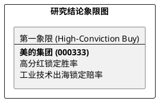

# 研报章节七：投资摘要与风险因素

**研究日期：2026年2月26日**

## 1. 投资摘要 (Investment Summary)

美的集团（000333.SZ）已成功实现从“家电代工厂”向“红利导向型工业科技集团”的范式重构，是降息周期下的优质核心资产。

*   **核心逻辑**：
    1.  **红利价值重塑**：承诺 2025-2027 年分红率不低于 60% 且实施“一年两派”，当前 4.5% - 5.0% 的股息率构建了股价的刚性底部。
    2.  **工业技术爆发**：威灵汽车部件墨西哥工厂投产，全面配套北美主流车企。B 端业务营收占比跨越 25%，成为抵消家电周期的压舱石。
    3.  **全球化避险布局**：通过墨西哥蒙特雷等地的本土化生产，有效对冲了 USMCA 2026 审议带来的潜在关税风险。
*   **估值结论**：预计 2026 年归母净利润 486 亿元。目标价区间 92.0 - 96.0 元（较当前价具备稳健上行空间）。
*   **技术面**：均线系统呈多头排列，依托高分红逻辑，回踩均线即是优质配置点。

## 2. 风险因素 (Risk Factors)

1.  **海外合规风险（中）**：若 USMCA 原产地穿透规则超出零部件本土化范畴，北美业务的利润中枢将承压。
2.  **机器人整合风险（中）**：KUKA 业务的扭亏反转进度若慢于预期，将拖累 B 端板块的整体估值。
3.  **关联交易风险（低）**：美的置业转型后需持续关注关联交易的公允性对上市公司利益的影响。

## 3. 研究结论象限图 (Final Evaluation Matrix)

