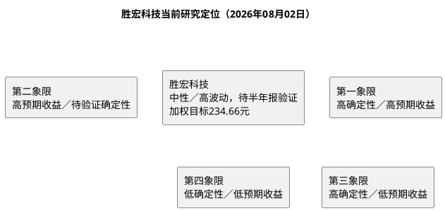

# 研报章节八：投资摘要与风险因素

**研究日期**：2026年08月02日

---

## 一、投资摘要

### 1.1 核心投资逻辑

胜宏科技的可验证基础是：2025年营收192.92亿元、归母净利43.12亿元、毛利率35.22%；2026Q1营收55.19亿元、归母12.88亿元、毛利率34.46%，在建工程51.70亿元。公司披露高阶HDI、高多层板和海外产能布局，行业AI基础设施投资构成外部景气线索；但客户身份、特定平台份额、AI收入、单板价值量、良率和新增产能收入未充分公开披露，不能将其表述为确定性竞争优势。

**三句话浓缩**：
1. **量**：2025年前五大客户占收入51.0%、最大客户29.7%；框架协议一般一至两年且无最低采购要求，须以采购订单、收入与客户集中度验证增长持续性。
2. **价与利润率**：2026Q1毛利率34.46%，低于2025全年35.22%；产品结构、材料传导、新产线折旧与汇兑影响须由半年报验证。
3. **估值**：7月31日不复权价格190.40元、PE(TTM)39.99倍、PB10.75倍。以65／80.17／111亿元三态净利和22／28／34倍PE复算，概率加权目标价234.66元、盈亏比0.99:1；这是前瞻模型，不是公司承诺。

### 1.2 三态估值快照

| | 2026E EPS | 目标 PE | 目标价（不复权） | 空间 |
|:---|:---|:---|:---|:---|
| **保守** | 6.61 元 | 22x | 145.50 元 | -23.6% |
| **基准** | 8.16 元 | 28x | 228.41 元 | +20.0% |
| **乐观** | 11.29 元 | 34x | 384.01 元 | +101.7% |
| **当前价** | — | — | **190.40 元** | — |
| **加权目标** | — | — | 234.66 元 | +23.2% |

### 1.3 投资评级

基于“高增长预测仍有验证门槛、但现价已对应中性情景约23.3倍2026E PE”的定位，给予**“中性／高波动，等待半年报验证”**评级。加权目标上行23.2%，但盈亏比仅0.99:1，尚不足以支持高确信度买入。

### 1.4 证据使用边界

本报告将财报、招股书、公司公告和可追溯调研记录作为公司事实依据；券商研报、行业预测与供应链信息可以作为前瞻模型输入，但须注明来源、日期、概率与验证条件。未披露客户名称、订单金额、产品ASP、良率或收入拆分时，不将该类线索表述为公司已确认事实。

---

## 二、风险因素（按烈度排序）

### 🔴 高风险（可能触发 -20% 以上跌幅）

**1. AI 算力需求周期性回落**

若AI基础设施资本开支放缓、主要客户调整采购或产品认证发生变化，公司可能面临订单与价格压力。由于公司未披露特定客户及产品收入，不对单一终端平台的影响作量化推导。

- 冲击路径：收入增速、毛利率、经营现金流和客户集中度同步恶化
- 量化方式：待取得分产品、订单与现金流数据后，以统一模型压力测试

**2. 美国立法强制"去中国化"PCB 采购**

相关美国法案目前为提案；若未来正式生效并实质限制特定产品的目标市场准入，可能提高贸易与原产地合规成本。

- 冲击路径：海外工厂认证、订单、交付或原产地规则未能形成有效对冲
- 量化方式：按届时HTS、原产地、豁免、客户承担安排及公司海外收入核验

**3. 大客户订单流失**

若最大客户或前五大客户削减采购、订单价格变化，或新产线认证／良率不达预期，集中度会放大经营波动。

- 冲击路径：客户集中度上升、收入或回款走弱、毛利率下行
- 量化方式：以客户集中度、应收账款、收入和现金流的季度变化确认

### 🟡 中等风险（可能触发 -10% 至 -20% 下跌）

**4. 人民币大幅升值**

Q1财务费用同比增加265.7%，公司解释为汇兑损失增加。公司拟将外汇套保额度由4亿美元提高至30亿美元；币种敞口、自然对冲和实际套保效果仍待财报核验。

- 冲击路径：汇兑损益、套保估值和实际经营回款共同影响利润与现金流

**5. 产能扩张超支拖累利润**

Q1在建工程51.70亿元、投资活动现金流净流出41.78亿元，短期借款较年初增加103.2%至30.47亿元。若转固、收入与经营现金流不匹配，折旧、利息与再融资压力将上升。

- 冲击路径：资本开支和借款增加而产能利用率、收入和经营现金流未同步改善

**6. 2027H2 SiC 碳化硅替代部分 GPU 子板需求**

新型封装、供电与互连技术可能改变PCB规格或价值量，但具体技术路线及其对公司产品的影响未获公告级验证。

- 冲击路径：客户认证、产品结构及毛利率发生不利变化后才予以确认

### 🟢 低风险（注意观察）

7. 铜价／CCL持续涨价压缩毛利率，成本传导能力须以季度毛利率和应收／现金流验证
8. 实控人/高管减持（陈涛家族控股 30.94%，港股上市后可能稀释）
9. 股价波动剧烈（截至7月31日，近20日年化波动率93.32%，不适合低风险偏好）

---

## 三、研究结论象限图

**定位**：胜宏科技位于**第二象限边界**：中性预测下有正向空间，但保守情景下行23.6%，且资本开支周期使现金流转换成为PE估值的主要约束。2025年与Q1业绩、客户集中度、扩产投入和H股融资均可核验；客户订单、产能爬坡和利润率仍由8月28日半年报验证。

**与可比标的对比**：
- 与可比公司比较须使用同一时点、同一口径的收入、利润、订单、产能和估值数据；本轮未逐份复核可比公司预测，不以旧有增速或“AI纯度”作投资结论。

---

## 四、核心操作建议

| 策略维度 | 建议 |
|:---|:---|
| **建仓时机** | 技术面低于主要均线，180元为近期交易支撑；技术位置不是基本面买入理由 |
| **仓位建议** | 盈亏比0.99:1，维持观察或既有低仓位；不将概率加权目标价视为追高理由 |
| **风险控制** | 放量跌破180元时暂停加仓并回到基本面复核；不是自动交易指令 |
| **加仓条件** | 8月28日半年报验证Q2收入、毛利率、经营现金流回款／退税拆分、转固、资本开支、短借、汇兑及套保、客户集中度和海外产能，并支持中性情景 |
| **下调条件** | 客户集中度继续上升且收入／回款走弱；毛利率连续走低；转固／认证延迟或汇兑损失扩大 |
| **模型更新条件** | 半年报披露后用实际Q2数据替换当前券商锚和情景假设，重算P×Q、EPS、目标价与盈亏比 |

**执行边界**：当前模型允许形成前瞻目标价，但其依赖卖方预测与情景假设；若半年报未支持中性收入、毛利率、现金流与扩产路径，应向保守情景切换。
