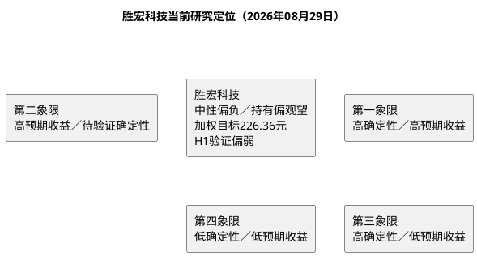

# 研报章节八：投资摘要与风险因素

**研究日期**：2026年08月29日

---

## 一、投资摘要

### 1.1 核心投资逻辑（2026-08-29半年报校准）

胜宏科技的可验证基础是：2025年营收192.92亿元、归母43.12亿元、毛利率35.22%；**2026H1营收116.29亿元（+28.77%）、归母28.57亿元（+33.30%）、扣非24.18亿元（+12.50%）、毛利率33.22%（Q2 32.10%）、Q2扣非-5.28%、OCF 29.11亿元（+144.61%，但Q2仅7.95亿环比-62.5%）**，在建52.23亿（转固16.40亿，越南32.52%/泰国87.53%）、存货58.90亿（+86%）、财务费用2.97亿（+694%，汇兑主因）。公司披露“订单至2027+新拓50+家（半数AI）+14阶36层攻克+100层+能力”，但客户、平台、单板价值量、良率与新增产能收入仍未拆分披露，不能将其表述为确定性竞争优势；**H1验证显示“量增”已兑现但“利增”质量分化**。

**三句话浓缩**：
1. **量**：H1 116.29亿完成中性全年318.75亿的36.5%（进度滞后），Q2 61.10亿 vs 中性要求87.85亿；订单能见度至2027与高多层/HDI排产饱满支撑H2加速预期，但需Q3/Q4月均101亿（较Q2 +65.6%）才能达成中性，需极强兑现。
2. **价与利润率**：H1毛利率33.22%（-3pp YoY）、Q2 32.10%连续回落，扣非Q2转负（-5.28%）、Q2 OCF/NP 0.51，验证CCL 7次调涨（累计100%）+铜历史高位+人员30%+折旧5.56亿对利润率的侵蚀；H2需毛利率修复至38-39%才能回归中性36.6%假设，难度极高。
3. **估值**：8月28日不复权价格241.60元（+27.1% vs 190.40）、PE(TTM)47.25倍（突破P75 46.92）、PB 6.26倍（净资产379.09亿稀释后）。以65／80.17／111亿元三态净利和22／28／34倍PE复算，中性228.41元（-5.5% vs现价）、加权226.36元（-6.31%）、盈亏比负向（现价已高于加权目标）；这是前瞻模型，不是公司承诺。

### 1.2 三态估值快照（2026-08-29）

| | 2026E EPS | 目标 PE | 目标价（不复权） | 较现价（241.60）空间 |
|:---|:---|:---|:---|:---|
| **保守** | 6.61 元 | 22x | 145.50 元 | **-39.8%** |
| **中性** | 8.16 元 | 28x | 228.41 元 | **-5.5%** |
| **乐观** | 11.29 元 | 34x | 384.01 元 | **+58.9%** |
| **当前价** | — | — | **241.60 元** | — |
| **加权目标** | — | — | **226.36 元** | **-6.31%** |

> 概率40/40/20（原30/50/20），保守权重↑10pp反映H1兑现滞后。H1已验证中性要求H2净利51.60亿（单季25.80），较Q2 15.68需+64.5%。

### 1.3 投资评级（下调）

基于“H1兑现滞后（进度36.5%）、毛利率-3pp、Q2扣非转负、财务费用爆增、现价已高于中性及加权目标、PE突破P75”的定位，给予**“中性偏负／持有偏观望，等待Q3修复验证”**评级（原“中性／高波动，待半年报验证”）。加权目标-6.31%、盈亏比负向，**追高赔率已为负**，仅适合既有仓位持有并以145.50元（-39.8%）为风控线；**新增资金需等待Q3毛利率≥33-34%且扣非转正、或股价回落至228元以下再评估**。

### 1.4 证据使用边界

本报告将财报、招股书、公司公告和可追溯调研记录作为公司事实依据；券商研报、行业预测与供应链信息可以作为前瞻模型输入，但须注明来源、日期、概率与验证条件。**2026H1已提供核心证据：营收116.29亿、归母28.57亿、扣非24.18亿、Q2扣非-5.28%、毛利率33.22%/Q2 32.10%、财务费用2.97亿、在建52.23亿/转固16.40亿/越南32.52%/泰国87.53%**，上述为公司事实；未披露客户名称、订单金额、产品ASP、良率或收入拆分时，不将该类线索表述为公司已确认事实。

---

## 二、风险因素（按烈度排序，2026-08-29更新）

### 🔴 高风险（可能触发 -20% 以上跌幅）

**1. AI 算力需求周期性或融资周期回落（外部）+ 毛利率持续承压（内部）共振**

若AI基础设施资本开支（9大CSP 2026 +90%至8867亿）因自由现金流转负（-640亿）、私募信贷/BIS $200B+顺周期收紧而放缓，或主要客户调整采购，公司H2营收101亿/季的极高要求将落空；叠加CCL 9月再涨20-25%+铜14,273历史高位传导滞后，毛利率或进一步下探至31%以下。

- 冲击路径：H1已现毛利率-3pp+扣非转负，若Q3仍低于33%，全年36.6%假设证伪→净利率25.15%→80.17亿难以达成→估值中枢下移至保守
- 量化方式：以Q3毛利率、扣非增速、存货58.90亿消化率为检验

**2. 美国关税37.5%+11-09豁免崖+原产地规则**

37.5%（25% legacy +12.5% forced-labor）已于07-24生效，2/4层板豁免（9903.88.69）延至11-09，逾期回退；实质性改变检验决定泰国/越南能否合规避税，胜宏泰国验证板 vs 沪电满载的兑现差使风险不对称。

- 冲击路径：11-10后若豁免未续，小板成本跳升25pp；若泰国未能被认定为实质性改变，海外产能对冲失效
- 量化方式：按HTS、原产地、豁免及公司海外批量交付核验

**3. 大客户订单与汇率双重杠杆**

若最大客户或前五大客户削减采购、或人民币进一步升至6.7以下且30亿套保未覆盖，集中度51.0%/29.7%将放大波动。H1财务费用+694%（2.97亿）已兑现汇率杠杆，H1外币敞口中美元应收52.3亿、货币7.12亿等，敏感性极高。

- 冲击路径：客户集中度+汇兑损益同步恶化，Q3扣非或再承压
- 量化方式：以客户集中度、应收、汇兑损益、衍生品公允价值季度变化确认

### 🟡 中等风险（可能触发 -10% 至 -20% 下跌）

**4. 产能扩张与现金流错配**

H1在建52.23亿、投资-219.59亿（购建+理财140.25亿）、短借32.39亿（+115.9%）、长借59.92亿（+54.9%）、固投上限180亿。若转固16.40亿对应的折旧（5.56亿）与人员+30%不能被收入覆盖，Q3折旧与利息将进一步压低净利率；Q2 OCF/NP已降至0.51，现金流波动加剧。

- 冲击路径：资本开支和借款增加而产能利用率、收入和经营现金流未同步改善
- 量化方式：以转固、折旧、在建、短借、OCF/NP为检验

**5. 2027H2 新型封装与材料瓶颈**

SiC 及新型封装可能改变PCB规格，但更直接的是**材料瓶颈**：电子玻纤布结构性紧缺（7628以下薄布涨幅达厚布2倍、低Dk/T-glass挤占传统布）、ABF膜垄断等，H1存货+86%至58.90亿已现战略备货压力。

- 冲击路径：客户认证、产品结构及毛利率发生不利变化后才予以确认

### 🟢 低风险（注意观察）

6. 实控人/高管减持（陈涛家族控股 30.94%，港股上市后可能稀释）
7. 股价波动剧烈（截至08-28，近20日年化97.59%，巨量长阴57万手，利好兑现特征，不适合低风险偏好）

---

## 三、研究结论象限图

**定位**：胜宏科技仍位于**第二象限，但向“高预期/低兑现”方向移动**：中性预测下现价已无上行空间（-5.5%）、加权-6.31%、盈亏比负向，但“订单至2027+180亿固投+海外网络”仍提供期权价值；保守情景下行-39.8%为实质风控线。2026H1的116.29亿/28.57亿/扣非24.18亿/毛利率33.22%已可验证，**下一站由Q3的毛利率修复（≥33-34%）、扣非转正、存货消化、泰国批量四变量决定象限去留**。

**与可比标的对比**：
- 沪电股份H1 136.89亿+61%/29.23亿+73%/毛利40.52%（+4.06pp）+泰国满载，兑现质量当前领先；
- 深南电路152.96亿+46%/22.51亿+65%/封装基板+110.76%，协同溢价；
- 鹏鼎控股虽扣非-22%（汇兑拖累）但AI用板毛利37.42%显示高阶HDI仍高溢价。
- 胜宏H1增速与毛利在三极中最低，**相对位次阶段性落后**，需Q3追赶。

---

## 四、核心操作建议（2026-08-29）

| 策略维度 | 建议（较08-02更新） |
|:---|:---|
| **建仓时机** | 现价241.60高于中性228.41及加权226.36，**不追高**；技术面低于全部均线（MA5 248.82为短阻），巨量长阴后需消化 |
| **仓位建议** | 盈亏比负向，**新增资金观望或仅极小试探**；既有仓位以145.50元（-39.8%）为风控线持有 |
| **风险控制** | 放量跌破241.60且量能不缩时，警惕向219-204、180回测；**基本面止损：Q3毛利率<32%或扣非再负** |
| **加仓条件** | **Q3验证**：营收≥70-75亿/季、毛利率≥33-34%并向35%修复、扣非转正（vs Q2 -5.28%）、OCF/NP>0.8、存货58.90亿显著消化、泰国A1二期批量+越南一期投产、汇兑收敛（30亿套保兑现） |
| **下调条件** | Q3毛利率继续走低（<32%）、扣非再负、转固/认证延迟、汇兑损失扩大、客户集中度上升且回款走弱 |
| **模型更新条件** | Q3披露后用实际Q3数据替换H1锚，重算P×Q、EPS、目标价与盈亏比；若Q3未达70亿/季或毛利未修复，应向保守65亿切换 |

**执行边界**：当前模型维持65/80.17/111亿三态总额与22/28/34倍PE，但**概率已向保守倾斜（40/40/20）且现价已超越中性**，应以“**持有偏观望、等待Q3修复**”而非“买入”执行。若Q3验证失败，应果断向保守情景（145.50）切换并下调仓位。
