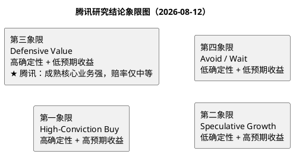

# 研报章节八：投资摘要与风险因素

**研究日期：2026年8月12日**

## 一、投资摘要

腾讯是一家由微信关系链、游戏内容、广告转化、支付网络和云服务共同构成的平台型公司。研究的核心结论不是“腾讯拥有 AI 所以应该高估”，而是成熟现金牛正在为 AI 转型融资：2026H1 收入同比增长约 10%，毛利同比增长约 12%，经营利润同比增长约 14%；同时资本开支同比增长约 82%，技术基础设施运营成本同比增长约 81%，二季度自由现金流为负 138 亿元。老业务质量较高，AI 收入和用户信号已经出现，但 AI 的利润和现金回收尚未闭环。

增长端，微信及 WeChat MAU 14.39 亿、同比增长 2%，视频号总使用时长二季度同比增长超过 20%，营销服务 H1 增长 20.9%；国内游戏二季度增长 17%，Delta Force、VALORANT PC 和新产品提供产品层面的需求证据；金融科技与企业服务 H1 增长 8.8%，AI 云和办公代理进入商业化早期。风险端，用户规模已经成熟，广告需依靠单位转化价值而非 MAU 增长，游戏仍受内容成功率约束，AI 面临算力成本、供应链和应用付费的不确定性。

以 2026E P×Q 模型和正常化前瞻 PE 为主、SOTP 为交叉验证，采用 2026-08-12 未复权收盘价 HKD 461.60 和 90.827 亿股股本：

| 项目 | 目标价/市值 | 相对当前价 | 关键含义 |
|:---|---:|---:|:---|
| 当前价格 | HKD 461.6；市值 HKD 4,192.6 十亿 | — | 以港交所股本计算，不采用第三方股本估计 |
| 保守情景 | HKD 399.5；市值 HKD 3,628.4 十亿 | -13.5% | 广告/游戏放缓、AI 成本回收弱、PE 12x |
| 基准情景（审计后） | HKD 523.4；市值 HKD 4,753.8 十亿 | +13.4% | 2026E 正常化 EPS RMB 31.92，PE 15x，基准市值 -6% 审计调整 |
| 乐观情景 | HKD 737.4；市值 HKD 6,697.9 十亿 | +59.8% | 游戏、广告、FBS 同时超预期，AI 利润传导改善，PE 18x |
| 概率加权 | HKD 529.0；市值 HKD 4,805.0 十亿 | +14.6% | 30%/50%/20% 概率，审计后加权 |

当前价格对应的框架盈亏比为 1.09，略高于 1.0；若要求至少 0.5 倍盈亏比，价格门槛约 HKD 485.8；若要求至少 1.0 倍，门槛约 HKD 464.3，当前价格只是略低于该门槛。故当前价格具备一定安全边际，但不是深度低估。执行上适合把腾讯作为高质量平台底仓或分批观察对象，仓位上限由 AI 现金流验证结果决定；不把乐观目标价当作当前确定收益。

## 二、核心驱动与验证条件

1. **广告单位价值继续提高**：视频号时长、广告主预算、eCPM 和小店/小游戏转化率同步改善；仅有库存增加而没有毛利率改善，不足以支持乐观情景。
2. **游戏产品组合保持生命周期**：成熟游戏 DAU 和流水稳定，新游戏在 90 日和半年留存后仍有贡献，海外固定汇率收入不连续下滑。
3. **AI 从使用走向付费和利润**：WorkBuddy、CodeBuddy、微信 AI、Hy 和腾讯云的席位/调用量形成可识别收入，新增收入开始覆盖 GPU、折旧、带宽和推广成本。
4. **资本开支回报率改善**：算力预付款逐步转化为实际调用和合同收入，剔除预付款后的自由现金流不再依赖一次性调整，资本开支强度见顶后现金回报恢复。
5. **资本回报维持纪律**：回购与股息继续存在，但不以牺牲 AI 基础设施和资产负债表安全为代价。

## 三、风险因素（按股价影响烈度排序）

### 1. AI 投入失去现金回收路径

这是当前最重要风险。若技术基础设施成本继续高增，资本开支和算力预付款扩大，而云、办公代理和微信 AI 不能形成付费收入，利润率和自由现金流会同时承压。市场可能把腾讯从“现金流平台”重新定价为“高资本开支转型公司”，目标 PE 需要下移。

### 2. 游戏内容失败和生命周期下行

腾讯的规模和渠道不能保证每个新产品成功。若成熟游戏 DAU、流水和付费深度连续两个季度下降，且新作 90 日留存低于历史产品，VAS 的高毛利和现金流基础会被侵蚀。版号常态化只能降低供给尾部风险，不能替代产品质量。

### 3. 广告预算与用户体验的双重约束

线上消费温和增长并不意味着广告预算持续高增长。宏观走弱会压缩广告主出价；提高广告库存又可能损害微信和视频号体验。如果 eCPM/转化率没有提升，营销服务增长会伴随毛利率下降，基准目标价需要向保守情景移动。

### 4. AI 云和模型竞争导致价格战

阿里、百度、华为云、火山引擎和创业公司同时扩张算力与模型应用。腾讯的入口和生态是优势，但通用模型和 GPU 云不具独占性。若行业供给增长快于企业付费，token 价格下跌会让收入增长与利润增长脱钩。

### 5. AI、内容、支付和数据监管

备案、拟人化互动、内容清理、未成年人保护、反洗钱、数据安全和算法治理可能拖慢产品迭代、提高审核费用或限制部分商业化场景。监管风险是持续经营边界，不应只在事件发生时才估值。

### 6. 地缘政治和高端算力供应

先进芯片出口许可、供应商替代和海外节点限制可能提高 AI 训练/推理成本或延长交付周期。当前没有证据证明腾讯收入会直接中断，因此只作压力测试；若出现算力供给实质受限，应同时下调 AI 收入、毛利率和 PE。

### 7. 投资组合和联营波动

上市被投企业公允价值、非上市资产账面价值和联营企业利润会造成 IFRS 利润波动。投资组合是隐含资产也是估值噪音，不能把账面价值当成无折价现金。若连续减值或联营亏损扩大，法定利润和资产负债表都会承压。

### 8. 汇率和港股流动性

财报人民币利润转换为港币目标价需要汇率假设；港股风险偏好、南向资金和全球利率变化可能使价格偏离内在价值。汇率和流动性不改变腾讯的人民币经营质量，却会改变港币投资者的实现回报。

## 四、研究结论象限图

**最终定位：第三象限（Defensive Value，防御价值），靠近第一象限边界。**

“高确定性”来自微信生态、成熟游戏、广告转化能力、支付网络、较强资产负债表和持续资本回报；“低预期收益”来自当前价格已经反映了相当部分平台质量，概率加权上行约 14.6%，盈亏比仅 1.09，且技术面仍低于 200 日均线。若未来两个季度同时验证 AI 付费、云毛利率、自由现金流和新游戏留存，估值可向第一象限迁移；若 AI 成本加速、核心游戏下滑、广告降速，则定位向第四象限移动。

## 五、主要来源

1. [腾讯 2026 年中期业绩公告](https://www1.hkexnews.hk/listedco/listconews/sehk/2026/0812/2026081200296.pdf)。
2. [腾讯 2025 年年度报告](https://static.www.tencent.com/uploads/2026/04/09/62d786fcf3d3c8cb7e54791ee95439ac.pdf)。
3. [Investing 腾讯历史行情](https://www.investing.com/equities/tencent-holdings-hk-historical-data)。
4. [港交所 2026 年 7 月月报](https://www1.hkexnews.hk/listedco/listconews/sehk/2026/0806/2026080600836.pdf)。
5. [美国商务部 2026 年 1 月先进计算芯片出口许可政策](https://www.bis.gov/press-release/department-commerce-revises-license-review-policy-semiconductors-exported-china)。
