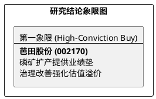

# 研报章节七：投资摘要与风险因素

**研究日期：2026年2月26日**

## 1. 投资摘要 (Investment Summary)

芭田股份（002170.SZ）正处于从传统复合肥制造向“资源+新材料”转型的估值重估期。

*   **核心逻辑**：
    1.  **资源属性质变**：小高寨磷矿获批 200 万吨/年产能并向 290 万吨/年扩建，磷矿业务毛利率高达 83.67%，贡献公司 60% 以上利润，底层逻辑已由“制造”切换为“资源”。
    2.  **一体化成本优势**：凭借“硝酸磷肥”独特工艺，实现“磷矿—高纯磷酸—新能源材料”低成本一体化布局，且具备“零磷石膏”的稀缺环保准入价值。
    3.  **治理与财务修复**：实控人质押比例降至 0%，财务风险溢价释放。
*   **估值结论**：预计 2026 年归母净利润 12.2 亿元，对应目标 PE 15.5 倍，目标价 19.54 元（较当前价有约 34% 空间）。
*   **技术面**：均线系统呈完美多头排列，12.66 元（MA20）构成强力支撑，处于量价齐升的上升通道。

## 2. 风险因素 (Risk Factors)

1.  **新能源项目验收风险（高）**：若子公司 LFP 项目 2026 年 6 月未能如期通过环保验收，将显著拖累新材料板块的利润贡献及估值弹性。
2.  **磷矿价格波动风险（中）**：公司利润高度依赖磷矿。若行业新增产能超预期释放导致磷矿价格跌破 850 元/吨，将直接削弱盈利中枢。
3.  **产品渗透率瓶颈（低）**：硝酸法产品主要适用于旱地，若在南方水田市场的替代进度不及预期，将限制传统复合肥业务的毛利修复上限。

## 3. 研究结论象限图 (Final Evaluation Matrix)

