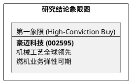

# 研报章节七：投资摘要与风险因素

**研究日期：2026年3月14日**

## 1. 投资摘要 (Investment Summary)

豪迈科技（002595.SZ）正通过底层工艺的垂直整合，实现从“机械主权”向全球高端制造平台的二次飞跃。

*   **核心逻辑**：
    1.  **全球制造竞争力**：公司在轮胎模具领域具备绝对统治力。NEV 轮胎高频更换（1.5-2x）正在重塑模具的“耗材属性”，驱动存量市场需求爆发。
    2.  **能源超级周期**：燃机业务（大型零部件）受益于 AI 算力电力缺口带动的全球天然气发电装机潮，成为 2026 年最确定的增长极。
    3.  **地缘韧性与合规对冲**：墨西哥及埃及工厂已形成多点全球化格局，尽管 2026 年面临墨西哥新关税（25-35%）挑战，但公司通过工具自制及本地化采购加速，具备较强的消化能力。
*   **估值结论**：预计 2026 年 EPS 为 3.81 元。给予 28.75x PE，对应目标价 109.50 元（当前 90.71 元，空间约 20%）。
*   **技术面**：缩量回踩 MA20 支撑区，处于黄金买入点。

## 2. 风险因素 (Risk Factors)

1.  **地缘政治与关税（极高）**：墨西哥 2026 年 1 月起对中国机械加征关税，叠加 7 月 USMCA 穿透审查，对海外工厂毛利构成压制。
2.  **数控系统合规成本（高）**：德国 2026 年 2 月出口新规导致核心系统交付周期拉长及验证成本上升。
3.  **下游波动（低）**：燃机需求超预期放缓。

## 3. 研究结论象限图 (Final Evaluation Matrix)

