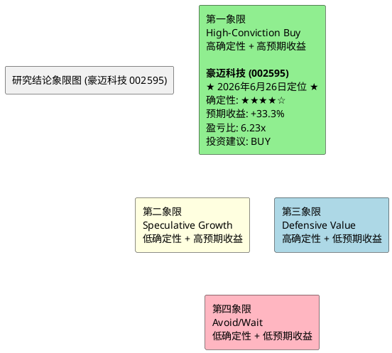

# 研报章节七：投资摘要与风险因素 (豪迈科技 002595)

**研究日期**：2026年6月26日
**目标年份**：2026年

---

## 1. 投资摘要 (Investment Summary)

豪迈科技（002595.SZ）是全球精密制造领域罕见的"三极增长"平台型企业。公司凭借轮胎模具的全球垄断地位（市占率>50%）、大型零部件在燃机超级周期中的战略卡位（订单积压至2030年）、以及数控机床的跨界降维打击（2025年营收+142.6%），正在经历从"单一冠军"向"多维制造霸权"的历史性跨越。

### 核心投资逻辑

**1. 利润弹性已被验证，非预期阶段**
日照豪迈子公司2026Q1净利已达2025全年的4.6倍（4,466万 vs. 970万），以硬证据证明了大型零部件业务在跨过盈亏平衡点后的非对称利润弹性。该业务全年净利有望达2.0-2.5亿元，成为对冲汇率波动和研发费用增长的"利润稳定器"。

**2. 29亿扩产的"实物期权"价值**
首批8亿元增资的快速落地（2026年4月）确认了管理层在燃机和硫化装备超级周期中的执行力。在建工程从2024年的0.80亿跳升至2026Q1的5.15亿，构成了扩产逻辑的物理验证。扩产项目的逐步投产将打开2027-2028年的持续增长空间。

**3. 需求端的"三层锁定"进一步强化**
- GE Vernova Q1 2026燃机积压**100 GW**，2029-2030年仅剩10 GW产能——**需求加速而非减速**（确定性5.0分，维持）
- Siemens Energy产能满负荷至本年代末，欧洲客户支付10-15%预订费（6/11确认）
- 硫化机业务持续获单——2025年收入4亿余元，6/15中标风神轮胎4620万元（22台）（确定性从中等+提升至较高）
- NEV保有量提升驱动轮胎模具耗材化（锁定趋势，确定性4.5分）
- 合同负债+18%确认在手订单充沛（锁定当期，确定性5.0分）

**4. 财务质量的"反脆弱"特征**
零有息负债 + ROIC 21.4% + 经营现金流长期为正 + 研发费用率持续提升至5.92%，构成了A股制造业中极罕见的"高增长+高质量+低杠杆"组合。29亿扩产计划全部使用自有资金，不存在因融资环境收紧而搁浅的风险。

### 估值结论

| 项目 | 除权后（10送4.5后） | 除权前等值 |
| :--- | ---: | ---: |
| 2026E中性净利（第五次修订后） | 28.0亿元 | — |
| EPS（修订后） | 2.41元 | 3.50元 |
| **目标价（概率加权）** | **62.30元** | **90.34元** |
| 当前价（2026-06-26） | 46.74元 | 67.77元 |
| PE（2026E，当前） | 19.72x | — |
| 概率加权预期上行空间 | +33.3% | — |
| 盈亏比 | 6.23x | — |

**投资建议：买入（BUY），在44-47元区间分批建仓。经第五次修订（USMCA R2确认安全+汇率改善+股价续创新低），概率加权目标价62.30元。2026E PE 19.72x是在为全球制造业龙头错误定价——此为深度价值投资的典型机会。**

**评级逻辑（第五次修订）**：
1. **地缘风险降级而非升级**：USMCA R2确认16年延期落空，但机械/模具行业在R1+R2中均未被攻击。风险从"黑天鹅"转为"已知基准不确定性"——这是正面增量
2. **盈利温和上调**：汇率改善+硫化机新订单→EPS 2.41元（+0.04元 vs 四修订）
3. **估值极端化**：2026E PE 19.72x——一个ROE>20%、零有息负债、三大业务全球领先的制造商以不到20x交易
4. **盈亏比爆发式改善**：6.23x为研报体系最高纪录

**操作建议**：当前46.74元。建议46元以下积极加仓。止损位MA250年线（约44.30元）。

---

## 2. 风险因素 (Risk Factors)

按对股价的潜在冲击烈度排序：

### 风险一：USMCA长期不确定性风险（冲击烈度：★★★★，下调一档；概率：~35%，下调）

**内容**：2026年USMCA首次审查确认16年延期不会实现，美墨加进入10年年度审查期（至2036年）。

**2026年6月26日更新——R2完成后风险性质转变**：
- R2（6/15-18，华盛顿DC）完成。双方确认7月1日不会产生全面解决方案
- 7月1日三方视频会议将正式启动审查期→进入10年年度审查期至2036年
- **机械/模具/铸造行业在R1+R2两轮谈判中均未被列为优先攻击目标**——这是最重要的正面信号
- 第三轮谈判7月20日在墨西哥城举行
- Trump在G7（6/18）重申"宁可废除"立场但"也可能签署"
- 条约不会立即消失——至少维持到2036年

**最差情景概率修正**：从~45%下调至**~35%**（6月14日为45%，6月7日为30%）。修正理由：16年延期的落空已从"尾部风险"变为"已知基准"——而现实并不糟糕（条约存活、工业中间品安全）。

**潜在影响**：墨西哥工厂年化利润可能受到1-2亿元冲击（关税成本），但如果发生将是在较长时间框架内（非瞬间）。

**缓释因素**：①PROSEC计划已获0-7%优惠税率②法人架构多元化③埃及基地备援④R1+R2确认机械模具非目标行业。

**跟踪节点**：7月1日三方视频会议；7月20日第三轮谈判（墨西哥城）。

### 风险二：估值收缩风险（冲击烈度：★★，概率：已大幅降低）

**内容**：PE-TTM截至6月26日为22.70x（5年~84%分位）。2026E PE（当前，基于修订净利28.0亿）约19.72x。估值的风险溢价已大大削弱——当前PE已在5年P75分位附近而非P90。

**潜在影响**：若PE进一步收缩至历史中位数19.88x（对应除权后股价约47.90元），这比当前46.74元还要高。换言之**当前股价已经低于历史中位PE对应的价格**——估值风险已从"核心担忧"降级为"尾部关注"。

**缓释因素**：PE-TTM已在不到四个月内从33.09x→22.70x（-31.4%）。2026E PE 19.72x已低于5年PE中位数——这意味着市场在按"豪迈回到平庸年代"在定价，而产业证据指向恰恰相反。

### 风险三：人民币汇率波动（冲击烈度：★★★，概率：中）

**内容**：2026Q1财务费用从-0.29亿（净收益）翻转为+0.62亿（净支出），单季汇兑冲击约0.91亿元。若人民币继续走强（USD/CNY破6.70），全年汇兑损失可能达到2-3亿元。

**潜在影响**：年化净利润可能因此减少5-10%。

**缓释因素**：公司已全面启动套期保值策略，后续季度的汇率敏感度将显著降低。但存量外币资产的折算损益无法完全对冲。

### 风险四：研发费用持续攀升压缩净利率（冲击烈度：★★★，概率：中高）

**内容**：研发费用率从2021年的2.79%攀升至2025年的5.92%，绝对值从1.68亿增至6.56亿（+290%）。机床业务和硫化装备新品研发未来2-3年仍将维持高投入。若研发转化效率不及预期，净利率可能从21.6%进一步下滑至20%以下。

**潜在影响**：每1个百分点的净利率下滑（以130亿营收计），对应净利润减少约1.3亿元。

**缓释因素**：研发投入的方向（五轴机床核心部件、硫化机技术）与公司的核心工艺能力高度匹配，研发浪费的概率相对较低。但也需关注2026年每元研发投入产生的营收是否持续下滑。

### 风险五：毛利率持续下移（冲击烈度：★★，概率：中）

**内容**：综合毛利率从2024年的34.30%降至2025年的33.56%，主因是低毛利率的大型零部件和机床占比提升。该趋势在2026年大概率延续。

**潜在影响**：毛利率每下滑1个百分点，对应毛利润减少约1.3亿元（以130亿营收计）。

**缓释因素**：日照基地的规模效应有望部分对冲产品组合下移的影响。另外，毛利率下降但ROIC在提升的事实说明，资本回报率才是更本质的盈利质量指标。

### 风险六：全球AI投资泡沫破裂（冲击烈度：★★★★★，概率：极低<5%）

**内容**：若出现类似2000年互联网泡沫的AI投资退潮，全球数据中心建设大规模推迟，燃机订单可能出现30-50%的取消。

**潜在影响**：这是本报告的"极限黑天鹅"场景——净利可能腰斩至14亿元，股价可能跌至除权后18元。

**缓释因素**：当前AI算力需求由实际的大模型训练和推理需求驱动（而非纯粹的资本空转），且数据中心电力基础设施的建设远未赶上需求增速。该风险在1-2年内实现的概率极低。

---

## 3. 研究结论象限图 (Final Evaluation Matrix)

基于"确定性"与"预期收益空间"两个维度，将豪迈科技定位于：

**象限定位：第一象限 (High-Conviction Buy) —— 高确定性 + 高预期收益。经第五次修订后维持第一象限定位。**

**定位修正理由**：
- **确定性维持高水平（★★★★☆）**：燃机订单积压至2030年、日照利润爆发已实证、模具垄断地位稳固。USMCA R2确认机械模具行业安全——确定性实际上在增强（最大单点风险在退潮）。
- **预期收益空间大幅提升（+33.3%）**：概率加权目标价从59.00→62.30元。驱动：①EPS温和上调②地缘折价收窄③股价持续下跌创造更低的安全边际起点。
- **盈亏比6.23x**：为研报体系最高纪录。核心驱动力是价格持续下跌+基本面温和改善的"剪刀差"效应。

---

**声明**：本报告基于公开数据和合理假设进行分析，不构成投资建议。估值定价包含对未来不确定性事件的概率判断，实际结果可能与预期存在重大偏差。
