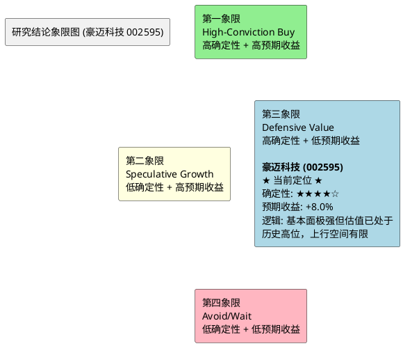

# 研报章节七：投资摘要与风险因素 (豪迈科技 002595)

**研究日期**：2026年5月24日
**目标年份**：2026年

---

## 1. 投资摘要 (Investment Summary)

豪迈科技（002595.SZ）是全球精密制造领域罕见的"三极增长"平台型企业。公司凭借轮胎模具的全球垄断地位（市占率>50%）、大型零部件在燃机超级周期中的战略卡位（订单积压至2030年）、以及数控机床的跨界降维打击（2025年营收+142.6%），正在经历从"单一冠军"向"多维制造霸权"的历史性跨越。

### 核心投资逻辑

**1. 利润弹性已被验证，非预期阶段**
日照豪迈子公司2026Q1净利已达2025全年的4.6倍（4,466万 vs. 970万），以硬证据证明了大型零部件业务在跨过盈亏平衡点后的非对称利润弹性。该业务全年净利有望达2.0-2.5亿元，成为对冲汇率波动和研发费用增长的"利润稳定器"。

**2. 29亿扩产的"实物期权"价值**
首批8亿元增资的快速落地（2026年4月）确认了管理层在燃机和硫化装备超级周期中的执行力。在建工程从2024年的0.80亿跳升至2026Q1的5.15亿，构成了扩产逻辑的物理验证。扩产项目的逐步投产将打开2027-2028年的持续增长空间。

**3. 需求端的"三层锁定"**
- GE等客户燃机订单积压至2030年（锁定量，确定性5.0分）
- NEV保有量提升驱动轮胎模具耗材化（锁定趋势，确定性4.5分）
- 合同负债+18%确认在手订单充沛（锁定当期，确定性5.0分）

**4. 财务质量的"反脆弱"特征**
零有息负债 + ROIC 21.4% + 经营现金流长期为正 + 研发费用率持续提升至5.92%，构成了A股制造业中极罕见的"高增长+高质量+低杠杆"组合。29亿扩产计划全部使用自有资金，不存在因融资环境收紧而搁浅的风险。

### 估值结论

| 项目 | 除权后（10送4.5后） | 除权前等值 |
| :--- | ---: | ---: |
| 2026E中性净利 | 28.4亿元 | — |
| EPS | 2.45元 | 3.55元 |
| 目标PE | 26.25x | 26.25x |
| **目标价** | **64.27元** | **93.19元** |
| 当前价（2026-05-22） | 56.40元 | 81.78元 |
| PE-TTM（当前） | 27.39x (92.4%分位) | — |
| 预期上行空间 | +14.0% | — |
| 概率加权预期回报 | +13.0% (更新) | — |
| 盈亏比 | 1.31x (更新) | — |

**投资建议：谨慎持有（CAUTIOUS HOLD），不建议追高加仓，可考虑在技术面企稳后分批建仓**

当前估值（PE-TTM 27.39x，5年92.4%分位）较5月9日审计时（28.89x，96.7%分位）已有约5%的估值压缩。股价自除权后进一步下跌5.2%至56.40元，部分消化了估值溢价。但盈亏比仍低于2.0x的可投资阈值。建议等待以下触发点之一：①股价回调至除权后50-53元（PE 20-22x）区间；②2026年7月USMCA审查落地后风险释放；③2026H1中报（预计8月）验证日照利润持续性。

---

## 2. 风险因素 (Risk Factors)

按对股价的潜在冲击烈度排序：

### 风险一：USMCA FEOC审查风险（冲击烈度：★★★★★，概率：~40%，较5月9日上调）

**内容**：2026年7月USMCA日落审查中，宽泛版FEOC条款若通过，豪迈墨西哥工厂可能丧失对美出口零关税待遇。

**2026年5月风险升级**：5月20日，15名参议院民主党人正式致函USTR，将"遏制中国在墨西哥投资"列为USMCA审查的七大优先事项之一。5月25日当周，美墨首轮正式谈判在墨西哥城启动。这一公开政治表态将FEOC从"行政部门技术选项"升格为"立法部门明确诉求"，最差情景概率从30%上调至40%。

**潜在影响**：墨西哥工厂年化利润可能受到1-2亿元冲击（关税成本），更严重的是中长期北美市场准入的不确定性上升。

**缓释因素**：①公司已通过PROSEC计划获得0-7%优惠税率；②法人架构多元化和本地管理深度参与降低了"中国资本控制"的认定概率；③埃及基地可作为部分对美业务的备援转口通道；④GE Vernova在墨西哥签署21 GW燃机协议，客户供应链本地化的刚性需求构成隐性保护。

**跟踪节点**：2026年5月25日起美墨正式谈判动态；2026年7月1日审查截止日。

### 风险二：估值收缩风险（冲击烈度：★★★★，概率：中高）

**内容**：PE-TTM截至5月22日为27.39x（5年92.4%分位），较5月9日的28.89x（96.7%分位）已有所回落，但仍处于历史高位区间。大量"超级周期"预期已注入当前估值，但盈利兑现需要时间。若2026H1中报出现利润增速低于20%（vs. 中性预测18.7%），估值倍数可能向历史中枢（20x PE）回归。

**潜在影响**：PE从27.39x收缩至22x（P75分位），对应除权后股价约53.90元，较当前下跌约4.4%。若收缩至20x（中位数），对应除权后股价约49.00元，下跌约13.1%。

**缓释因素**：日照利润的持续性和燃机订单的稳定性提供了EPS端的支撑。估值收缩更多是"消化溢价"而非"杀逻辑"。当前股价的持续调整（从除权后59.50→56.40）本身就在逐步释放估值压力。

### 风险三：人民币汇率波动（冲击烈度：★★★，概率：中）

**内容**：2026Q1财务费用从-0.29亿（净收益）翻转为+0.62亿（净支出），单季汇兑冲击约0.91亿元。若人民币继续走强（USD/CNY破6.70），全年汇兑损失可能达到2-3亿元。

**潜在影响**：年化净利润可能因此减少5-10%。

**缓释因素**：公司已全面启动套期保值策略，后续季度的汇率敏感度将显著降低。但存量外币资产的折算损益无法完全对冲。

### 风险四：研发费用持续攀升压缩净利率（冲击烈度：★★★，概率：中高）

**内容**：研发费用率从2021年的2.79%攀升至2025年的5.92%，绝对值从1.68亿增至6.56亿（+290%）。机床业务和硫化装备新品研发未来2-3年仍将维持高投入。若研发转化效率不及预期，净利率可能从21.6%进一步下滑至20%以下。

**潜在影响**：每1个百分点的净利率下滑（以130亿营收计），对应净利润减少约1.3亿元。

**缓释因素**：研发投入的方向（五轴机床核心部件、硫化机技术）与公司的核心工艺能力高度匹配，研发浪费的概率相对较低。但也需关注2026年每元研发投入产生的营收是否持续下滑。

### 风险五：毛利率持续下移（冲击烈度：★★，概率：中）

**内容**：综合毛利率从2024年的34.30%降至2025年的33.56%，主因是低毛利率的大型零部件和机床占比提升。该趋势在2026年大概率延续。

**潜在影响**：毛利率每下滑1个百分点，对应毛利润减少约1.3亿元（以130亿营收计）。

**缓释因素**：日照基地的规模效应有望部分对冲产品组合下移的影响。另外，毛利率下降但ROIC在提升的事实说明，资本回报率才是更本质的盈利质量指标。

### 风险六：全球AI投资泡沫破裂（冲击烈度：★★★★★，概率：极低<5%）

**内容**：若出现类似2000年互联网泡沫的AI投资退潮，全球数据中心建设大规模推迟，燃机订单可能出现30-50%的取消。

**潜在影响**：这是本报告的"极限黑天鹅"场景——净利可能腰斩至14亿元，股价可能跌至除权后18元。

**缓释因素**：当前AI算力需求由实际的大模型训练和推理需求驱动（而非纯粹的资本空转），且数据中心电力基础设施的建设远未赶上需求增速。该风险在1-2年内实现的概率极低。

---

## 3. 研究结论象限图 (Final Evaluation Matrix)

基于"确定性"与"预期收益空间"两个维度，将豪迈科技定位于：

**象限定位：第三象限 (Defensive Value) —— 高确定性 + 低预期收益**

**定位理由**：
- **确定性高（★★★★☆）**：燃机订单积压至2030年、日照利润爆发已实证、轮胎模具的垄断地位稳固、零有息负债的财务质量优异。公司的基本面在A股制造业中属于最确定的一档。
- **预期收益空间有限（+14.0%）**：当前PE处于5年92.4%分位，虽然较5月9日的96.7%已回落，但估值进一步扩张空间仍然有限。概率加权预期回报+12.9%，盈亏比1.35x——较5月9日的+7.0%和0.53x有显著改善，但仍低于"高确信买入"所需的>2.0x盈亏比阈值。改善源于股价下跌而非基本面变化，需理性看待。

**演化路径——什么情况下可以从"第三象限"升级到"第一象限"**：
1. 股价回调至除权后50-53元（对应PE 20-22x），盈亏比回升至>2.0x
2. 2026H1中报超预期（净利增速>25%），同时日照利润持续爆发、机床订单再超预期
3. 2026年7月FEOC风险排除，地缘折价因素消除

**在当前价位，豪迈科技是"好公司但不够好的价格"的经典案例。耐心等待更好的买点而非追高，是对资本更负责任的选择。**

---

**声明**：本报告基于公开数据和合理假设进行分析，不构成投资建议。估值定价包含对未来不确定性事件的概率判断，实际结果可能与预期存在重大偏差。
