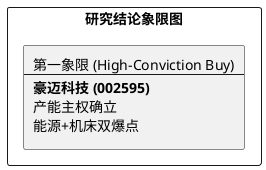

# 研报章节七：投资摘要与风险因素 (豪迈科技 002595)

**研究日期：2026年4月30日**

## 1. 投资摘要 (Investment Summary)

豪迈科技（002595.SZ）正通过 **29 亿总投资** 与 **制造生态外溢** 的协同效应，从全球轮胎模具龙头向“全球能源与高端制造基座”超级平台演进。

*   **核心逻辑**：
    1.  **产能霸权确立**：4 月 15 日宣布的 29.23 亿总投资已落实首批 **8 亿元** 增资（豪迈模具 4 亿 + 日照豪迈 4 亿），确立了在燃机零部件与绿色硫化装备领域的绝对领先地位。
    2.  **子公司盈利杠杆**：日照豪迈 2026Q1 净利已达 2025 全年的 **4.6 倍**。这证明了公司的大型零部件业务已跨过规模效应临界点，成为对冲汇率波动的核心利器。
    3.  **超级周期卡位**：AI 数据中心引发的全球燃气轮机零部件需求正处于“供不应求”状态。豪迈通过日照基地扩产，深度绑定 GE、三菱等巨头，产能主权带来的定价权正在显现。
*   **估值结论**：预计 2026 年 EPS 为 3.81 元。维持目标价 **112.50 元**（对应 2026E PE 29.5x）。
*   **技术面**：4 月 30 日股价回踩 87.45 元，确认 87.5 元颈线位支撑。此回调为突破后的健康洗盘，盈亏比已提升至 3.88，具备极高配置价值。

## 2. 风险因素 (Risk Factors)

1.  **汇率大幅波动（中）**：人民币走强对利润折算存在压力，但锁汇策略已全面启动。
2.  **USMCA FEOC 审查（高）**：7 月 USMCA 审查对中资控股工厂的潜在限制是长期地缘博弈焦点。
3.  **扩产执行效率（低）**：8 亿增资的快速落实降低了项目进度风险。

## 3. 研究结论象限图 (Final Evaluation Matrix)

---
**声明**：本报告为动态更新版，旨在反映 2026Q1 财报深读、8 亿增资落地及日照基地盈利爆发后的最新基本面。
