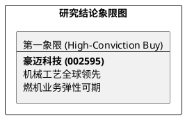

# 研报章节七：投资摘要与风险因素

**研究日期：2026年2月26日**

## 1. 投资摘要 (Investment Summary)

豪迈科技（002595.SZ）正通过底层工艺的垂直整合，实现从“机械主权”向全球高端制造平台的二次飞跃。

*   **核心逻辑**：
    1.  **全球制造竞争力**：公司在轮胎模具领域具备绝对统治力。2026 年核心驱动力已转向“燃机周期弹性 + 合规成本对冲”，受益于 AI 算力电力缺口驱动的全球燃气轮机超级周期。
    2.  **垂直整合与平台化**：通过自制铸造、机床等核心工具，实现极致成本控制。大型零部件业务（燃机/风电）已成为公司第二增长极。
    3.  **地缘避风港布局**：墨西哥基地的建设有效对冲了北美关税压力，正从贸易避风港转变为全球供应的核心节点。
*   **估值结论**：预计 2026 年 EPS 为 3.81 元。给予 28.75x PE，对应目标价 109.50 元（较当前价有约 17% 空间）。
*   **技术面**：处于上升通道中，均线系统配合良好，正在消化历史高位附近的压力。

## 2. 风险因素 (Risk Factors)

1.  **供应链合规风险（高）**：需关注 USMCA 2026 审查中关于中国资本来源的穿透识别，这直接影响墨西哥工厂的关税优惠资格。
2.  **核心系统依赖风险（中）**：高端五轴数控系统仍部分依赖西门子等外购件，若西方收紧出口限制，机床业务的毛利及交付将受实质性影响。
3.  **下游行业波动风险（低）**：燃机景气度若因能源政策剧变而反转，将导致大型零部件订单增速不及预期。

## 3. 研究结论象限图 (Final Evaluation Matrix)

