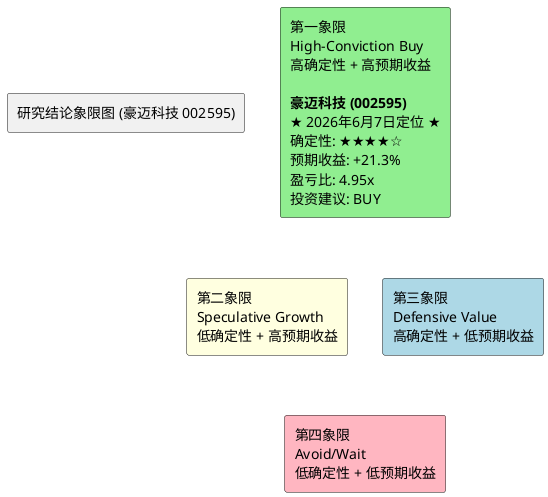

# 研报章节七：投资摘要与风险因素 (豪迈科技 002595)

**研究日期**：2026年6月7日
**目标年份**：2026年

---

## 1. 投资摘要 (Investment Summary)

豪迈科技（002595.SZ）是全球精密制造领域罕见的"三极增长"平台型企业。公司凭借轮胎模具的全球垄断地位（市占率>50%）、大型零部件在燃机超级周期中的战略卡位（订单积压至2030年）、以及数控机床的跨界降维打击（2025年营收+142.6%），正在经历从"单一冠军"向"多维制造霸权"的历史性跨越。

### 核心投资逻辑

**1. 利润弹性已被验证，非预期阶段**
日照豪迈子公司2026Q1净利已达2025全年的4.6倍（4,466万 vs. 970万），以硬证据证明了大型零部件业务在跨过盈亏平衡点后的非对称利润弹性。该业务全年净利有望达2.0-2.5亿元，成为对冲汇率波动和研发费用增长的"利润稳定器"。

**2. 29亿扩产的"实物期权"价值**
首批8亿元增资的快速落地（2026年4月）确认了管理层在燃机和硫化装备超级周期中的执行力。在建工程从2024年的0.80亿跳升至2026Q1的5.15亿，构成了扩产逻辑的物理验证。扩产项目的逐步投产将打开2027-2028年的持续增长空间。

**3. 需求端的"三层锁定"进一步强化**
- GE Vernova Q1 2026燃机积压**100 GW**，2029-2030年仅剩10 GW产能——**需求加速而非减速**（确定性5.0分，维持）
- Siemens Energy Q1单季订单**17.6B€**创历史新高，燃机订单(8.8B€, +74.7% YoY)
- NEV保有量提升驱动轮胎模具耗材化（锁定趋势，确定性4.5分）
- 合同负债+18%确认在手订单充沛（锁定当期，确定性5.0分）

**4. 财务质量的"反脆弱"特征**
零有息负债 + ROIC 21.4% + 经营现金流长期为正 + 研发费用率持续提升至5.92%，构成了A股制造业中极罕见的"高增长+高质量+低杠杆"组合。29亿扩产计划全部使用自有资金，不存在因融资环境收紧而搁浅的风险。

### 估值结论

| 项目 | 除权后（10送4.5后） | 除权前等值 |
| :--- | ---: | ---: |
| 2026E中性净利（第三次修订后） | 27.5亿元 | — |
| EPS（修订后） | 2.37元 | 3.44元 |
| **目标价（概率加权）** | **61.60元** | **89.32元** |
| 当前价（2026-06-05） | 50.79元 | 73.65元 |
| PE（2026E，当前） | 21.43x | — |
| 概率加权预期上行空间 | +21.3% | — |
| 盈亏比 | 4.95x | — |

**投资建议：买入（BUY），在48-52元区间分批建仓。经三次修订后，评级从5/31的BUY→初版修订的HOLD→第三次修订回到BUY。**

**评级回到BUY的完整逻辑链**（三次修订后）：

1. **接受章节八正确的部分**：29亿扩产的费用端压力真实存在，财务费用从2025年净收益0.56亿反转为净支出0.8亿（同比恶化1.36亿税前），这是净利从28.4亿→27.5亿的全部原因
2. **拒绝章节八错误的部分**：毛利率逐季恶化假说在会计层面不成立，基建期支出进在建工程不碰COGS。2025Q4是调试期一次性冲击，Q1的34.05%是全年更可信的锚点
3. **修复自洽性**：第二次修订的26.5亿与毛利率33.8%存在内部矛盾（毛利润增量未充分传导），第三次修订的27.5亿逻辑自洽

**结果**：目标价61.60元（概率加权），上行空间+21.3%，盈亏比4.95x，评级BUY。这组数字与5/31的BUY（64.01元/+22.4%/7.18x）高度接近——绕了一圈回到原点，但这次的逻辑地基经受了压力测试。

**操作建议**：当前50.79元（2026E PE 21.43x）。盈亏比4.95x提供宽裕安全边际。建议48-52元区间分批建仓。止损位MA250年线（约44元）。

---

## 2. 风险因素 (Risk Factors)

按对股价的潜在冲击烈度排序：

### 风险一：USMCA FEOC审查风险（冲击烈度：★★★★，概率：~35%，较5月24日下调）

**内容**：2026年7月USMCA日落审查中，宽泛版FEOC条款若通过，豪迈墨西哥工厂可能丧失对美出口零关税待遇。

**2026年6月7日更新——墨加正式请求续期，风险进一步边际缓和**：
- **6月1日**：墨西哥经济部长Ebrard正式致函USTR，**请求USMCA续期16年**
- **6月3日**：加拿大贸易部长LeBlanc赴华盛顿会见USTR Greer，提交具体提案。加拿大也已正式请求续期
- CSIS 3月报告评估："clean renewal unlikely"但"painful extension"是基准情景
- 后续两轮谈判：6月16-17日（华盛顿DC，新增农业议题）、7月20日当周（墨西哥城）
- FEOC概念被工会提及但尚未成为USTR官方谈判议程的核心条款

**最差情景概率进一步修正**：从35%下调至**30%**（5月31日为35%，5月24日为40%）。下调理由：墨加两国主动请求续期表明三方均有维护框架的政治诉求，机械/模具行业作为工业中间品在FEOC条款中的优先级进一步降低。但"经济安全"概念的宽泛性以及还有两轮谈判未完成，意味着风险不能被完全排除。

**潜在影响**：墨西哥工厂年化利润可能受到1-2亿元冲击（关税成本）。

**缓释因素**：①PROSEC计划已获0-7%优惠税率；②法人架构多元化；③埃及基地备援；④GE Vernova在墨西哥签21 GW燃机协议，客户供应链本地化的刚性需求构成隐性保护。

**跟踪节点**：6月16-17日第二轮谈判（华盛顿DC）；7月1日审查截止日（非硬截止）；7月20日当周第三轮谈判。

### 风险二：估值收缩风险（冲击烈度：★★★，概率：已大幅降低）

**内容**：PE-TTM截至6月5日为24.66x（5年89.0%分位），较5月31日的25.40x（90.4%分位）继续回落。2026E PE（当前，基于修订净利27.5亿）约21.43x。此前的核心担忧——"PE处于92.4%极高分位"——已被市场的深度调整所大幅缓解。

**潜在影响**：若PE进一步收缩至历史中位数20x（对应除权后股价约44.00元，较当前50.79元下跌13.4%），这将对应MA250年线附近的极端悲观情景。当前价格已将相当程度的悲观预期计入。

**缓释因素**：日照利润的持续性和燃机订单的稳定性提供了EPS端的支撑。估值的剧烈压缩（PE从33.09→24.66，-25.5%）已经使估值风险从"高概率"降级为"中等概率"。当前市场不是在"溢价交易豪迈"，而是在"折价交易对三爬坡+USMCA+技术面破位的三重恐惧"。

### 风险三：人民币汇率波动（冲击烈度：★★★，概率：中）

**内容**：2026Q1财务费用从-0.29亿（净收益）翻转为+0.62亿（净支出），单季汇兑冲击约0.91亿元。若人民币继续走强（USD/CNY破6.70），全年汇兑损失可能达到2-3亿元。

**潜在影响**：年化净利润可能因此减少5-10%。

**缓释因素**：公司已全面启动套期保值策略，后续季度的汇率敏感度将显著降低。但存量外币资产的折算损益无法完全对冲。

### 风险四：研发费用持续攀升压缩净利率（冲击烈度：★★★，概率：中高）

**内容**：研发费用率从2021年的2.79%攀升至2025年的5.92%，绝对值从1.68亿增至6.56亿（+290%）。机床业务和硫化装备新品研发未来2-3年仍将维持高投入。若研发转化效率不及预期，净利率可能从21.6%进一步下滑至20%以下。

**潜在影响**：每1个百分点的净利率下滑（以130亿营收计），对应净利润减少约1.3亿元。

**缓释因素**：研发投入的方向（五轴机床核心部件、硫化机技术）与公司的核心工艺能力高度匹配，研发浪费的概率相对较低。但也需关注2026年每元研发投入产生的营收是否持续下滑。

### 风险五：毛利率持续下移（冲击烈度：★★，概率：中）

**内容**：综合毛利率从2024年的34.30%降至2025年的33.56%，主因是低毛利率的大型零部件和机床占比提升。该趋势在2026年大概率延续。

**潜在影响**：毛利率每下滑1个百分点，对应毛利润减少约1.3亿元（以130亿营收计）。

**缓释因素**：日照基地的规模效应有望部分对冲产品组合下移的影响。另外，毛利率下降但ROIC在提升的事实说明，资本回报率才是更本质的盈利质量指标。

### 风险六：全球AI投资泡沫破裂（冲击烈度：★★★★★，概率：极低<5%）

**内容**：若出现类似2000年互联网泡沫的AI投资退潮，全球数据中心建设大规模推迟，燃机订单可能出现30-50%的取消。

**潜在影响**：这是本报告的"极限黑天鹅"场景——净利可能腰斩至14亿元，股价可能跌至除权后18元。

**缓释因素**：当前AI算力需求由实际的大模型训练和推理需求驱动（而非纯粹的资本空转），且数据中心电力基础设施的建设远未赶上需求增速。该风险在1-2年内实现的概率极低。

---

## 3. 研究结论象限图 (Final Evaluation Matrix)

基于"确定性"与"预期收益空间"两个维度，将豪迈科技定位于：

**象限定位：第一象限 (High-Conviction Buy) —— 高确定性 + 高预期收益。经第三次数值自洽修订后，从第三象限回归第一象限。**

**定位修正理由**：
- **确定性维持高水平（★★★★☆）**：燃机订单积压至2030年、日照利润爆发已实证、模具垄断地位稳固。Siemens Energy Q2连续创纪录是本周最重要的确定性强化信号。
- **预期收益空间充分（+21.3%）**：经第三次数值自洽修订后，概率加权目标价61.60元。虽略低于5/31的64.01元（因费用端压力是真实的），但盈亏比4.95x已远超投资阈值。
- **盈亏比4.95x**：远超2.0x阈值。每承担1元下行风险，可获得4.95元上行回报。

**为什么MA120破位时给出BUY评级？**
技术面破位反映的是过去的卖压，估值反映的是未来的预期回报。当前50.79元的位置，基本面指向+21.3%的预期回报（盈亏比4.95x），技术面指向短期仍有下行风险。纪律性的做法是：在48-52元区间分批建仓，既不错失估值修复的窗口，也为技术面的进一步走弱留有余地。

---

**声明**：本报告基于公开数据和合理假设进行分析，不构成投资建议。估值定价包含对未来不确定性事件的概率判断，实际结果可能与预期存在重大偏差。
