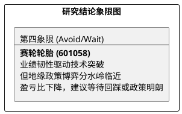

# 研报章节七：投资摘要与风险因素

**研究日期：2026年04月29日**

## 1. 投资摘要 (Investment Summary)

赛轮轮胎（601058.SH）正处于从“产能扩张”向“合规深耕”的战略转型期，全球化布局的红利正与地缘博弈下的成本压力激烈对抗。

*   **核心逻辑**：
    1.  **产能兑现与基本面韧性**：墨西哥基地已进入批量供货阶段。尽管 4 月面临 SCFI (超1960) 与天然橡胶 (超216美分) 价格双双暴涨的成本压制，公司 2026Q1 毛利率仍超预期逆势升至 26.86%，证明了液体黄金及 OTR 巨胎强大的价格传导与产品结构优化能力。
    2.  **地缘政策分水岭**：2026 年 7 月的 USMCA 联合审查是全年的逻辑核心，决定了墨西哥产轮胎的零关税准入能否延续。
    3.  **技术面突破**：股价在 4 月底受年报及一季报超预期催化，成功放量突破 14.10 元的前期箱体阻力，短期走势偏强。
*   **估值结论**：预计 2026 年净利润修正至 **43.8 亿元**。给予计入地缘与合规折价后的保守估值中枢（约 10.8x PE），目标价 **16.61 元**。
*   **盈亏比评估**：当前价 14.31 元，随着股价快速拉升，盈亏比已降至 **0.52 : 1**。虽然技术支撑位（14.00元）上移，但考虑到政策不确定性，追高博弈胜率下降。

## 2. 风险因素 (Risk Factors)

1.  **地缘审查风险（极高）**：2026 年 7 月 USMCA 审查若未能通过，墨西哥基地可能面临追溯性高额关税。
2.  **成本传导滞后风险（高）**：中东局势升级导致海运费及橡胶价格持续高位，二、三季度面临极端的成本测试。
3.  **需求前置断层（中）**：若北美/欧洲市场因政策刺激退坡出现需求萎缩，产能利用率爬坡将受阻。

## 3. 研究结论象限图 (Final Evaluation Matrix)

