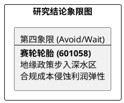

# 研报章节七：投资摘要与风险因素

**研究日期：2026年2月26日**

## 1. 投资摘要 (Investment Summary)

赛轮轮胎（601058.SH）正处于从“规则套利”向“合规求生”的阵痛期，地缘博弈下的合规成本正成为侵蚀利润的核心变量。

*   **核心逻辑**：
    1.  **技术与技术溢价**：凭借“液体黄金”化学炼胶工艺及非公路胎（OTR）的突破，公司在高端市场具备一定定价权。
    2.  **合规准入壁垒**：前瞻性布局墨西哥及印尼基地，并具备 EUDR 溯源能力。这种“规则适应力”在未来将清退二三线竞品，维持份额。
    3.  **利润弹性受压**：USMCA 2026 审查及 EUDR 合规要求显著提升了本地化采购成本（如墨西哥炭黑/橡胶较国内贵 15-20%），冲抵了运费下行的利好。
*   **估值结论**：预计 2026 年净利润下修至 45.2 亿元。给予计入地缘折价后的 12x PE，目标价 16.55 元（赔率吸引力一般）。
*   **技术面**：股价处于长周期震荡下缘，面临周线级别均线压制。

## 2. 风险因素 (Risk Factors)

1.  **审查失败风险（高）**：若 2026 年 7 月 USMCA 审查未能通过原产地认定，将面临追溯性高额关税。
2.  **原材料高位风险（中）**：橡胶及合成材料价格长期高位横盘将持续挤压毛利。
3.  **需求传导风险（低）**：液体黄金等高端产品在 BBA 等豪华车企的定点量产进度若慢于预期。

## 3. 研究结论象限图 (Final Evaluation Matrix)

