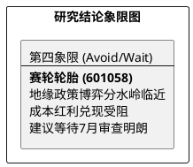

# 研报章节七：投资摘要与风险因素

**研究日期：2026年04月07日**

## 1. 投资摘要 (Investment Summary)

赛轮轮胎（601058.SH）正处于从“产能扩张”向“合规深耕”的战略转型期，全球化布局的红利正与地缘博弈下的成本压力激烈对抗。

*   **核心逻辑**：
    1.  **产能兑现与份额保卫**：墨西哥基地已进入批量供货阶段，液体黄金技术维持了高端市场的定价权，但在 EUDR 及 USMCA 框架下，合规成本成为利润侵蚀的核心变量。
    2.  **成本红利时滞**：受霍尔木兹海峡局势及天然橡胶价格回升（SICOM > 200）影响，原预期的海运及原材料红利兑现推迟。
    3.  **地缘政策分水岭**：2026 年 7 月的 USMCA 联合审查是全年的逻辑核心，决定了墨西哥产轮胎的零关税准入能否延续。
*   **估值结论**：预计 2026 年净利润修正至 **43.3 亿元**。给予计入地缘与合规折价后的 12.5x PE，目标价 **16.45 元**。
*   **盈亏比评估**：当前价 13.17 元，盈亏比约 **0.91 : 1**。虽然技术支撑位确认，但博弈胜率受政策不确定性压制。

## 2. 风险因素 (Risk Factors)

1.  **地缘审查风险（极高）**：2026 年 7 月 USMCA 审查若未能通过，墨西哥基地可能面临追溯性高额关税。
2.  **成本传导风险（高）**：中东局势升级导致海运费（SCFI）及橡胶价格持续高位，挤压毛利空间。
3.  **需求前置断层（中）**：若北美/欧洲市场因政策刺激退坡出现需求萎缩，产能利用率爬坡将受阻。

## 3. 研究结论象限图 (Final Evaluation Matrix)

