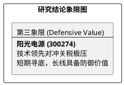

# 研报章节七：投资摘要与风险因素

**研究日期：2026年04月01日**

## 1. 投资摘要 (Investment Summary)

阳光电源（300274.SZ）正经历其全球化进程中最严峻的“地缘压力测试”。

*   **核心逻辑演进**：
    1.  **从“高增长”转向“高质量防御”**：2025 年报确认了储能霸主地位与健康的财务底色，但 2026 年初美国 82.4% 的极端关税墙打破了原有利润扩张路径。
    2.  **技术溢价的刚性化**：ERCOT 构网型强制令的生效，证明了公司在核心算法上的全球定价权，这将部分对冲销量的萎缩。
    3.  **价值底座下移**：通过利润下修与估值对冲，业绩确定性回归。162 亿净利润与 164.00 元目标价构成了新的理性参考。
*   **估值结论**：中性目标价 **164.00 元**。
*   **研究评级**：建议**分批逢低配置**，短期尊重寻底趋势。

## 2. 风险因素 (Risk Factors)

1.  **美国极端地缘博弈（极高）**：82.4% 关税若长期维持且追溯至东南亚基地，将迫使公司彻底退出北美市场。
2.  **供应链安全性（高）**：波兰工厂投产前的产能真空期，供应链调配压力可能引发额外物流成本。
3.  **行业价格战（中）**：国内电芯价格回升若无法有效传导至下游集成，将挤压公司毛利率。

## 3. 研究结论象限图 (Final Evaluation Matrix)

