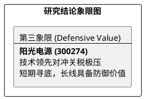

# 研报章节七：投资摘要与风险因素

**研究日期：2026年04月25日**

## 1. 投资摘要 (Investment Summary)

阳光电源（300274.SZ）正经历其全球化进程中最严峻的“地缘压力测试”。

*   **核心逻辑演进**：
    1.  **从“高增长”转向“高质量防御”**：2025 年报确认了储能霸主地位与健康的财务底色，但 2026 年初美国 82.4% 的极端关税墙及东南亚 AD/CVD 初裁打破了原有利润扩张路径。
    2.  **技术溢价的刚性化**：ERCOT 构网型强制令的生效，证明了公司在核心算法上的全球定价权，这将部分对冲销量的萎缩。同时 LFP 价格的大幅反弹也构筑了极强的存货成本优势。
    3.  **价值底座夯实**：技术面已探明 125-130 元的核心支撑区。162 亿净利润与 164.00 元目标价构成了坚实的理性参考底座。
*   **估值结论**：中性目标价 **164.00 元**。
*   **研究评级**：建议在 130-135 元区间**逢低配置**，右侧布局。

## 2. 风险因素 (Risk Factors)

1.  **东南亚关税与供应链断链（极高）**：东南亚 AD/CVD 初裁若落实高税率，叠加全球基础关税，将迫使公司北美业务面临阶段性完全停滞，高度依赖波兰工厂的投产。
2.  **中东地缘动荡（高）**：沙特项目是目前盈利的核心压舱石，若地缘冲突加剧导致停工，将重创 2026 年业绩基本盘。
3.  **国内价格战传导（中）**：LFP 价格上涨若无法向下游终端顺畅传导，可能部分侵蚀国内项目的毛利率。

## 3. 研究结论象限图 (Final Evaluation Matrix)

