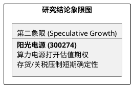

# 研报章节七：投资摘要与风险因素

**研究日期：2026年2月26日**

## 1. 投资摘要 (Investment Summary)

阳光电源（300274.SZ）正处于从“估值幻觉”向“算力电源新期权”回归的红海博弈期。

*   **核心逻辑**：
    1.  **储能霸主韧性**：凭借构网型储能算法及全球运维网络，在参数竞争白热化的红海中死守全球前二市场份额。
    2.  **算力跨界期权**：AIDC 事业部将液冷技术降维打击数据中心散热市场，成功赋予公司跳出传统制造泥潭的新逻辑。
    3.  **财务风险定价**：通过消化高价存货及关税冲击，业绩预期已回归理性，190 亿利润底座具备支撑。
*   **估值结论**：预计 2026 年业绩维持稳健。中性目标价 186.00 元（较现价约 20.7% 空间）。
*   **研究评级**：建议逢低布局。

## 2. 风险因素 (Risk Factors)

1.  **资产减值风险（高）**：近 300 亿高位存货若遭遇电芯价格断崖式下跌，将引发巨额跌价损失。
2.  **地缘关税风险（高）**：美国 301 关税落地与波兰工厂投产进度的错位，使公司 2026 年面临利润挤压。
3.  **行业竞争加剧（中）**：华为、宁德时代等巨头若通过价格战持续压低行业毛利率中枢。

## 3. 研究结论象限图 (Final Evaluation Matrix)

