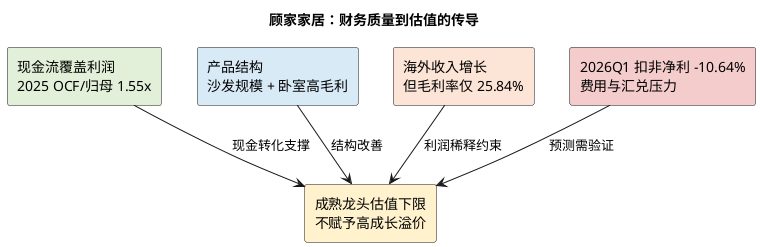

# 顾家家居：企业微观与财务基石

**研究日期**：2026年07月26日  
**标的**：顾家家居（603816.SH）  
**数据截止**：2026年07月24日（行情）；2026年03月31日（公司最新已披露财务）

## 结论先行

| 财务判断 | 已验证事实 | 尚待验证 | 对估值的含义 |
|:--|:--|:--|:--|
| 盈利质量 | 2021—2025 年 OCF/归母净利均高于 1x；2025 年为 1.55x | 2026 年现金流能否在利润承压时继续覆盖 | 支持成熟龙头的估值下限 |
| 产品结构 | 沙发放量、卧室产品毛利率 42.91% | 沙发放量尚未转化为毛利率扩张 | 不给高成长品牌溢价 |
| 全球化 | 2025 年境外收入 +11.46% | 境外低毛利、应收和运输费率能否改善 | 收入对冲，不预设利润溢价 |
| 最新经营 | 2026Q1 毛利率改善 | 扣非净利 -10.64%，费用与汇兑压力上升 | 中性预测应保持克制 |

顾家家居是以沙发为核心、向卧室、整家定制、智能零部件及海外供应链延展的软体家居龙头。它并非地产链中最轻的资产，也并非纯品牌零售商：国内依赖经销网络和门店运营，海外仍以 ODM/OEM 为基本盘、正尝试 OBM 与跨境电商。因此，它的核心投资价值不是高增长，而是“现金流稳定、渠道覆盖广、产品结构升级”的防御性质量；核心约束则是国内耐用消费需求疲弱、海外业务低毛利且应收扩张，以及一季报扣非利润转弱。

2025 年实现营收 200.56 亿元、归母净利 17.90 亿元、扣非净利 16.29 亿元，同比分别增长 8.53%、26.37%、25.13%。增长强于行业不是偶然：沙发收入 115.76 亿元、同比 +13.44%，卧室产品 34.65 亿元、同比 +6.63%，而低毛利、外购属性较强的集成产品收入下降 5.03%。但这不代表公司已摆脱周期。2026Q1 营收仅 +2.42%，归母净利 -4.39%，扣非净利 -10.64%，盈利增速与 2025 年明显背离；后续预测应把 2025 年的利润修复视作“可验证的基数”，而不是线性增长起点。

## 业务结构与盈利质量

| 2025 年业务 | 收入（亿元） | 毛利率 | 增长/变化 | 在模型中的角色 |
|:--|--:|--:|:--|:--|
| 沙发 | 115.76 | 34.91% | 收入 +13.44%，销量 +13.41%，毛利率 -0.45pct | 最大利润底座；只给温和量增 |
| 卧室产品 | 34.65 | 42.91% | 收入 +6.63%，毛利率 +2.11pct | 结构改善的核心来源 |
| 集成产品 | 23.14 | 29.64% | 收入 -5.03% | 不作为增长引擎 |
| 定制家具 | 10.31 | 28.73% | 受新房链和联单效率共同约束 | 低增长、低确定性 |
| 信息技术服务 | 7.32 | 81.85% | 收入 +4.28% | 高毛利但体量小，不改变估值体系 |

| 2025 年区域质量 | 收入（亿元） | 同比 | 毛利率 | 研究解释 |
|:--|--:|--:|--:|:--|
| 境内 | 99.40 | +6.18% | 38.35% | 高毛利，但受需求与渠道效率约束 |
| 境外 | 93.26 | +11.46% | 25.84% | 增长更快，但较境内低 12.51pct |
| 合并口径 | 200.56 | +8.53% | 32.76% | 结构改善不足以推动综合毛利显著上行 |

公司覆盖客餐厅、卧室、定制柜类及零部件，品牌包含顾家、KUKA HOME、CHITA 等，并运营 LAZBOY、NATUZZI 的中国区合作品牌。2025 年家具制造收入 185.33 亿元、毛利率 30.34%；信息技术服务收入 7.32 亿元、毛利率 81.85%，但后者规模小，不能抬高对主业利润率的判断。以产品看，沙发毛利率 34.91%，卧室产品毛利率 42.91%，定制家具毛利率 28.73%，集成产品毛利率 29.64%。卧室品类的高毛利和沙发的规模增长是 2025 年利润改善的最主要内部解释；集成产品收缩则说明“一体化整家”尚不能被简单当作收入加速器。

地域结构进一步说明公司的双重属性：境内收入 99.40 亿元、同比 +6.18%、毛利率 38.35%，境外收入 93.26 亿元、同比 +11.46%、毛利率 25.84%。境外收入已接近一半，却比境内低 12.51 个百分点毛利，意味着海外收入增长对利润的弹性弱于国内高端产品结构改善。若外贸占比继续抬升而 OBM 占比未实质提高，收入端的全球化会稀释综合毛利率；故估值不应给海外收入全部以品牌溢价。

| 年度 | 营收（亿元） | 归母净利（亿元） | 扣非净利（亿元） | 毛利率 | ROE | ROIC | OCF/归母净利 |
|:--|--:|--:|--:|--:|--:|--:|--:|
| 2021 | 183.42 | 16.64 | 14.27 | 28.87% | 23.18% | 19.18% | 1.23x |
| 2022 | 180.10 | 18.12 | 15.44 | 30.83% | 21.61% | 17.91% | 1.33x |
| 2023 | 192.12 | 20.06 | 17.81 | 32.67% | 21.87% | 18.09% | 1.22x |
| 2024 | 184.80 | 14.17 | 13.01 | 32.72% | 14.72% | 12.48% | 1.89x |
| 2025 | 200.56 | 17.90 | 16.29 | 32.76% | 17.68% | 15.66% | 1.55x |

这张表给出的结论是：毛利率在 2023 年后没有显著抬升，利润波动主要来自费用、汇兑、产品结构和规模效率；但经营现金流连续五年覆盖净利润，2024-2025 年尤其充裕，利润含金量优于许多依赖渠道赊销扩张的家居公司。2025 年经营活动现金流 27.74 亿元，同比增长 3.50%，显著高于归母净利；该优势使公司在需求低迷时仍可维持研发、分红及海外产能投入。

## 从“收入恢复”到“单季利润”的再审计

| 2025 年利润修复来源 | 已发生数据 | 不能推出的结论 | 2026 年验证口径 |
|:--|:--|:--|:--|
| 沙发放量 | 收入/销量均约 +13.4% | 不等于拥有提价权 | 毛利率、单店零售与销售费用率 |
| 卧室结构 | 毛利率 42.91%，同比提升 2.11pct | 不等于全品类均能高端化 | 卧室收入、毛利与复购/联单表现 |
| 集成产品收缩 | 收入 -5.03% | 不等于整家战略失效 | 定制/集成的客单价和费用效率 |
| 低基数 | 2024 年归母净利 -29.39% | 不可把 2025 年净利 +26.37%线性外推 | 2026H1 扣非净利和费用率 |

不能将 2025 年的归母利润 +26.37%直接解读为经营杠杆已经全面打开。先看分母：2024 年收入下降 3.81%、归母净利下降 29.39%，ROE 和 ROIC 分别降至 14.72%和 12.48%，本身就是较低的利润基数。再看分子：2025 年收入仅恢复至 2023 年之上 4.4%，而归母净利仍较 2023 年低约 10.6%。因此，2025 年更准确的定位是从 2024 年的低点修复，并不是利润率中枢的上移。2025 年综合毛利率 32.76%，几乎与 2024 年的 32.72%持平，直接否定了“由毛利率普遍扩张带动利润高增”的解释。

修复主要来自三个更具体的环节。第一，规模最大的沙发收入增长 13.44%，销售量增长 13.41%，两者几乎同步，说明当年增长主要来自出货量而非明显提价；但其成本增长 14.24%，比收入快 0.80 个百分点，毛利率反而下降 0.45 个百分点。第二，卧室产品收入增长 6.63%、成本仅增长 2.83%，毛利率提升 2.11 个百分点至 42.91%，是更有质量的结构贡献。第三，集成产品收入下降 5.03%，并没有借由“整家”概念扩张，但其较低毛利的外购属性业务收缩，客观上避免了对利润的进一步拖累。结论是，2025 年利润修复建立在沙发放量、卧室结构改善和部分低效业务收缩的组合上；其中沙发成本率并未显示定价权增强。

产销表也给出应当区别对待的库存信号。2025 年沙发产量 305.92 万标准套、销量 305.21 万套，销量增速 13.41%略高于产量增速 12.52%，年末库存仅增 2.83%；卧室产品产量 129.80 万套、销量 129.44 万套，库存增 3.70%。这意味着生产端没有出现产量远高于销售的主动补库，至少在制造端不存在显性积压。可是这不能替代对经销商库存的判断：国内经销网络年内新开 1,234 家、关闭 1,235 家，净减少 1 家；直营店从 108 家降至 84 家。网络规模未扩张而门店仍有较高周转，表明公司正用门店筛选和运营改善替代粗放开店，亦意味着国内收入增长不能靠单纯加店外推。

最新已披露季度是对上述判断的重要反证检验。2026Q1 营收 50.33 亿元，同比仅增 2.42%；归母净利 4.96 亿元，同比降 4.39%；扣非净利 4.10 亿元，同比降 10.64%，毛利率则由 32.39%提升至 33.59%。毛利率上升而扣非净利下降，说明压力不在产品成本本身，而在规模、费用与汇兑：季度研发费用由 0.76 亿元升至 1.04 亿元，财务费用由 -0.07 亿元变为 0.49 亿元。换言之，2026Q1 不是需求崩塌，却也不支持把 2025 年的净利增速外推。后续两季若收入仍低个位数增长，销售费用和研发费用的刚性将使利润端继续承压；若外汇收益不能恢复，海外规模越大也未必同步增厚归母利润。

最近半年度报告提供了这一变化发生前的中间坐标：2025H1 收入 98.01 亿元、归母净利 10.21 亿元、扣非净利 9.00 亿元，同比分别增长 10.02%、13.89%和 15.26%，经营现金流 10.94 亿元，同比增长 71.89%。彼时国内和海外收入均在恢复，海外收入规模扩张却维持较低毛利。这与全年结果、2026Q1 的费用和汇兑压力构成连续证据链：经营并非依赖一次性收益，但其盈利弹性低于收入弹性，海外扩张、研发和零售转型的收益尚要经后续 ROIC 验证。

## 营运资本、资产负债与费用审计

| 营运资本与资本配置 | 2025 年末 / 2026Q1 | 方向判断 | 对模型的约束 |
|:--|:--|:--|:--|
| 应收账款 | 2025 年末 18.70 亿元，+26.63%；2026Q1 16.84 亿元 | 年末增速快于境外收入，Q1 有所回落 | 需观察中报是否靠账期换收入 |
| 存货 | 2026Q1 由 22.68 降至 19.21 亿元 | 表内库存改善 | 不能替代渠道库存判断 |
| 合同负债 | 2025 年末 16.60 亿元；2026Q1 12.71 亿元 | 订单前瞻仍需警惕 | 与社零、门店及同比口径联立观察 |
| 短期借款 | 2025 年末 5.58 亿元 | 杠杆压力温和 | 支持防御性，不等于需求改善 |
| 商誉 | 2025 年末 3.63 亿元，+31.98% | 规模可控，来自零部件布局 | 用 ROIC 和减值测试验证协同 |

| 费用与现金质量 | 2025 年 / 2026Q1 | 正面信号 | 风险信号 |
|:--|:--|:--|:--|
| 销售费用 | 2025 年 34.37 亿元 | 支持零售与服务能力 | 低增长时费用刚性强 |
| 研发费用 | 2025 年 3.69 亿元；2026Q1 同比 +38.2% | 功能产品、零部件能力投入 | 短期侵蚀扣非利润 |
| 财务费用 | 2026Q1 由 -0.07 转为 +0.49 亿元 | — | 汇兑损失放大季度波动 |
| 经营现金流 | 2025 年 27.74 亿元；OCF/归母 1.55x | 现金持续覆盖利润 | 合同负债走弱不应被忽略 |

需要警惕的是现金流并非毫无瑕疵。2025 年末应收账款 18.70 亿元，同比增长 26.63%，公司解释为外贸营收扩大；增速远高于境外收入 +11.46%，至少意味着回款效率需要在后续报告中验证。2026Q1 应收降至 16.84 亿元、存货从 22.68 亿元降至 19.21 亿元，合同负债从 16.60 亿元降至 12.71 亿元：前两项改善，合同负债回落却提示经销端预收及订单景气没有同步转强。Q1 经营现金流 1.02 亿元，较上年同期 0.09 亿元改善，主要来自销售收现增加；单季季节性较强，不应年化。

截至 2026Q1，公司总资产 189.58 亿元、归母权益 110.85 亿元；2025 年资产负债率 42.75%，短期借款已从 12.85 亿元降至 5.58 亿元，杠杆并不构成核心风险。值得单列的是商誉：2025 年末 3.63 亿元，同比 +31.98%，源自收购常州登丰电气等事项。绝对规模仅占总资产 1.9%，短期不足以推翻财务质量，但“智能铁架—电机—电控”协同若无法兑现，未来会以减值或低回报资本开支形式损害 ROIC。

费用侧呈现主动投入而非无效扩张。2025 年销售费用 34.37 亿元、研发费用 3.69 亿元，研发同比 +31.19%，远高于营收增速；研发占收入 1.84%，1715 名研发人员支撑功能铁架、智能床及材料创新。销售费用仍占营收 17% 左右，反映门店、营销和零售转型是重运营模式的必要成本。2026Q1 研发费用同比 +38.2%，财务费用由上年同期 -0.07 亿元转为 +0.49 亿元，后者主要与汇兑损失相关，是 Q1 扣非下滑的重要解释，也构成海外扩张的真实成本。

现金流质量也需要拆开看。2025 年经营现金流 27.74 亿元，覆盖归母净利 1.55 倍；销售收现 219.39 亿元，比利润表收入高约 18.83 亿元，体现经销预收、出口回款和经营性负债共同作用。与此同时，经营现金流同比只增长 3.50%，明显慢于净利增长，且年末合同负债从 20.51 亿元降至 16.60 亿元；这并非坏账证据，却提醒我们不能把现金流高于利润简单等同于需求加速。2026Q1 合同负债进一步降至 12.71 亿元，受季节性、发货节奏与订金结转共同影响，必须与二、三季度的收入、经销商库存和收现率联合观察。

资产负债表的另一面是资本配置。2025 年末货币资金 25.69 亿元、短期借款 5.58 亿元、长期借款 8.14 亿元，净有息负债压力温和；但公司当年投资现金流为 -12.15 亿元、筹资现金流为 -21.30 亿元，筹资流出同比增加 45.28%，主要由归还借款和股东回报驱动。公司有能力为越南、墨西哥、美国等本地化供应和智能零部件布局提供资金，但投资价值不取决于“能投”，而取决于海外基地和新零部件能否在 2—3 年后形成高于资本成本的回报。研究中将把在建工程、固定资产、海外毛利率及应收账款增速作为同一组资本配置验证指标，避免将海外投资和收入增长重复当作利好。

## 财务基石的可验证结论

本章给予顾家“财务质量中上、增长质量待二次验证”的定位。正面证据是：五年内经营现金流持续覆盖利润，2025 年沙发销量与产量匹配、库存增幅受控，负债率 42.75%且短期借款下降，卧室产品毛利率 42.91%显示品牌和产品结构确有溢价。负面证据也足够具体：2025 年应收账款增速显著快于海外收入，境外毛利率只有 25.84%，沙发放量却没有提升毛利，2026Q1 扣非利润已经转负增长。因而后文的基准情景不能采用“收入增速恢复即利润同比更快增长”的乐观假设，而应把内销毛利、出口回款、汇兑损益和研发/销售费用率分别建模。

## 本章判断及向后传导

顾家的财务底色是“高于行业平均的现金转化、仍可观的 ROE、弱需求下的费用刚性”。这支持在估值端给予成熟龙头而非困境企业的下限；但不足以支持高成长估值。后续产业章节将检验国内需求下滑是否仅为短周期压力，竞争章节将判断功能沙发和卧室产品的结构性增长能否替代地产红利，盈利预测会把海外毛利率、应收周转与汇兑作为明确变量。

**主要证据**：公司 2025 年年度报告第 33-40、43、115 页及财务报表；公司 2025 年半年度报告、2026 年第一季度报告；项目统一视图 `fin_indicator`、`fin_income_statement`、`fin_balance_sheet`、`fin_cashflow_statement`、`fin_ttm`、`v_daily_valuation`。原始公告：[2025 年年报](https://stockmc.xueqiu.com/202604/603816_20260423_YN13.pdf)、[2025 年半年报](https://static.cninfo.com.cn/finalpage/2025-08-23/1224554686.PDF)、[2026Q1 报告](https://static.cninfo.com.cn/finalpage/2026-04-30/1225257293.PDF)。
