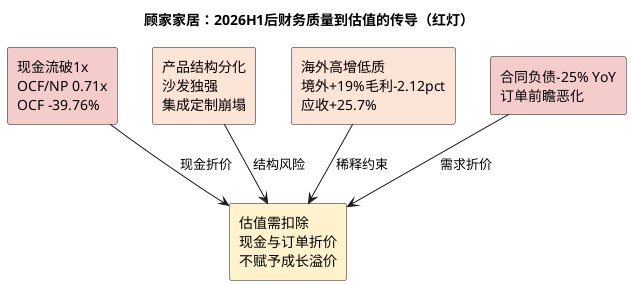

# 顾家家居：企业微观与财务基石

**研究日期**：2026年08月31日  
**标的**：顾家家居（603816.SH）  
**数据截止**：2026年08月31日（行情）；2026年06月30日（公司最新已披露财务，公告日2026-08-28）

## 结论先行

| 财务判断 | 已验证事实（至2026H1） | 本轮新增恶化 | 对估值的含义 |
|:--|:--|:--|:--|
| 盈利质量 | 2021—2025年OCF/归母净利均高于1x；2025年为1.55x | **2026H1 OCF/归母跌至0.71x**，OCF -39.76%至6.59亿，扣非-14.59% | 现金流不再无条件支撑估值下限，需计入现金转化折价 |
| 产品结构 | 2025年沙发放量、卧室毛利率42.91% | **2026H1沙发+13.81%至64.50亿但毛利率35.16%微降0.89pct；卧室-0.13%至16.91亿、毛利率39.83%降2.98pct；集成-29.05%、定制-38.67%** | 内销结构改善证伪，仅沙发单腿支撑 |
| 全球化 | 2025年境外收入+11.46% | **2026H1境外50.67亿+19.01%占主营52.6%，但境外毛利率24.24%同比-2.12pct；境内45.61亿-12.71%毛利率42.14%反而+2.55pct** | 收入对冲成功但以毛利与应收为代价，海外扩张稀释综合毛利至32.49% |
| 最新经营 | 2026Q1扣非-10.64% | **2026H1扣非-14.59%且Q2单季-18.69%、营收-0.92%；销售费用+3.81%/研发+20.35%/财务费用0.96亿同比+1.21亿汇兑扰动** | 中性预测必须下修，不能维持18.1亿利润假设 |
| 资产负债 | 2025年末应收18.70亿+26.63% | **2026H1应收19.16亿+25.73% YoY远快于营收+0.75%；合同负债11.54亿-25.1% YoY/-30.5% vs年初；短期借款11.91亿+113%** | 营运资本三链共振恶化，触发跟踪手册证伪条件 |

顾家家居仍是以沙发为核心、向卧室、整家定制、智能零部件及海外供应链延展的软体龙头。但2026H1将首次覆盖时“盈利质量中上、增长待验证”的判断，修正为 **“现金流与订单领先指标转弱、内销失速、海外以质换量”** 的更审慎定位。核心约束从“弱需求下的费用刚性”升级为“需求、盈利、现金三链共振恶化”。

2026H1实现营收98.75亿元、归母净利9.26亿元、扣非净利7.69亿元，同比分别+0.75%、-9.31%、-14.59%；Q2单季营收48.42亿元-0.92%、扣非3.59亿元-18.69%（Q1扣非-10.64%持续扩大），盈利下滑在Q2加速。2025年利润修复（营收200.56亿+8.53%、归母17.90亿+26.37%）建立在低基数上，2026H1已证实不能线性外推。

## 业务结构与盈利质量（更新至2026H1）

| 2026H1业务（主营96.28亿） | 收入（亿元） | 毛利率 | 同比 | 在模型中的新定位 |
|:--|--:|--:|:--|:--|
| 沙发 | 64.50 | 35.16% | +13.81%，成本+15.40% | 唯一增长极，但毛利率-0.89pct显示无提价权 |
| 卧室产品 | 16.91 | 39.83% | -0.13%，成本+5.09% | 收入停滞且毛利率-2.98pct，结构贡献转负 |
| 集成产品 | 8.25 | 31.60% | -29.05%，成本-30.45% | 大幅收缩，验证整家协同失效 |
| 定制家具 | 3.39 | 32.82% | -38.67%，成本-38.43% | 新房链拖累，低增长假设证伪 |
| 信息技术服务 | 2.98 | 80.23% | -20.24% | 高毛利但萎缩，不能对冲主业 |
| 其他 | 0.25 | 6.25% | -25.15% | 忽略 |

| 2026H1区域（主营口径） | 收入（亿元） | 同比 | 毛利率 | 同比变化 |
|:--|--:|--:|--:|:--|
| 境内 | 45.61 | -12.71% | 42.14% | +2.55pct（结构提纯但量崩） |
| 境外 | 50.67 | +19.01% | 24.24% | -2.12pct（以价换量） |
| 合计主营 | 96.28 | +1.53% | 32.72% | -0.93pct |

合并营业收入98.75亿（含其他业务）与主营96.28亿的差额为合并口径其他，综合毛利率从上年同期32.89%降至32.49%（-0.40pct），Q2单季毛利率仅31.35%（去年同期33.40%）环比显著恶化，说明综合毛利改善逻辑已被推翻。

| 年度/期 | 营收（亿元） | 归母净利（亿元） | 扣非净利（亿元） | 毛利率 | ROE（加权） | ROIC | OCF/归母 |
|:--|--:|--:|--:|--:|--:|--:|--:|
| 2021 | 183.42 | 16.64 | 14.27 | 28.87% | 23.18% | 19.18% | 1.23x |
| 2022 | 180.10 | 18.12 | 15.44 | 30.83% | 21.61% | 17.91% | 1.33x |
| 2023 | 192.12 | 20.06 | 17.81 | 32.67% | 21.87% | 18.09% | 1.22x |
| 2024 | 184.80 | 14.17 | 13.01 | 32.72% | 14.72% | 12.48% | 1.89x |
| 2025 | 200.56 | 17.90 | 16.29 | 32.76% | 17.68% | 15.66% | 1.55x |
| **2026H1** | **98.75** | **9.26** | **7.69** | **32.49%** | **8.37%（半年度）** | **7.65%** | **0.71x** |

核心变化：ROE半年度8.37%较上年同期9.83%降1.46pct，投入资本回报率7.65%较上年同期9.00%降1.35pct，净利率从10.41%降至9.48%（-0.93pct）。五年OCF持续覆盖利润的纪录在2026H1首次中断。

## 从“收入恢复”到“利润与现金双杀”的再审计

| 2025年修复来源 | 2026H1实际表现 | 证伪程度 | 后续验证 |
|:--|:--|:--|:--|
| 沙发放量 | 收入+13.81%但成本+15.40%致毛利率-0.89pct | 量增不增利，提价假设证伪 | 沙发毛利率能否止跌 |
| 卧室结构改善 | 收入-0.13%、毛利率-2.98pct至39.83% | 高毛利结构转负 | 卧室能否止跌回升 |
| 集成收缩避损 | 收入-29.05%进一步收缩 | 被动收缩非主动优化 | 定制/集成是否继续拖累 |
| 低基数修复 | 2026H1扣非-14.59%且Q2加速至-18.69% | 线性外推证伪 | 2026全年能否避免负增长 |

不能再将2025年利润+26.37%解读为杠杆打开。2026H1营业成本+1.36%快于营收+0.75%，毛利润仅32.09亿 vs 去年32.24亿微降；销售费用16.90亿+3.81%（费用率17.11%→17.12%看似稳定但在收入零增长下刚性凸显）、研发2.37亿+20.35%（费用率2.01%→2.40%）、财务费用0.96亿（去年-0.25亿）汇兑扰动合计增加1.21亿，三项合计侵蚀毛利29bp以上的剩余空间。

产销端未披露标准套销量，但门店质量信号未改善：半年报未更新门店净增减，但2025年净关店25家的优化趋势未逆转，且境内收入-12.71%暗示单店产出仍承压。

## 营运资本、资产负债与费用审计（2026H1触发红灯）

| 营运资本 | 2026H1（YoY） | 2025年末 | 环比Q1 | 结论 |
|:--|:--|:--|:--|:--|
| 应收账款 | 19.16亿 **+25.73%** | 18.70亿+26.63% | 16.84→19.16 **+13.77% QoQ** | 连续两期增速远快于营收（H1营收+0.75%境外+19%），以账期换收入确认 |
| 存货 | 18.19亿 -2.37% YoY | 22.68亿 | 19.21→18.19 -5.3% | 表内去库但不能替代渠道库存，境内-12.71%暗示渠道库存压力未除 |
| 合同负债 | 11.54亿 **-25.11% YoY** | 16.60亿 | 12.71→11.54 **-9.26% QoQ** | 触发手册“>15%下降”警报，且连续两季下滑，订单前瞻恶化 |
| 短期借款 | 11.91亿 **+113% vs年初（113.46%）**（YoY -9.4%） | 5.58亿 | 7.80→11.91 +52.7% | 杠杆快速上升，货币资金33.46亿（账面）中受限13.42亿，真实流动性需扣除 |
| 在建工程 | 4.94亿 +32.83% vs年初（YoY +23.0%） | 3.72亿 | — | 印尼基地投入加速，资本开支前置 |
| 商誉 | 3.63亿 持平 | 3.63亿+31.98% | — | 仍占总资产1.85%，需ROIC验证 |
| 股权质押 | 前10大股东中TB Home 26,668,066股**质押及冻结(100%)**、杭州代明14,700,000股质押、邹妙琴9,508,700股质押，合计约5,080万股占总股本5.5% | — | — | 平仓风险需关注，H1未披露预警线 |
| 定增限售 | 2026-08-07新增1.0428亿股@17.94元，净额18.63亿，限售期**36个月（控股股东锁定，2027-08-07前不可上市流通）** | — | — | 解禁冲击待2027年评估，当期仅摊薄 |

| 费用与现金质量 | 2026H1 | 同比 | 风险定级 |
|:--|:--|--:|:--|
| 销售费用率 | 17.11% | 16.61%+0.50pct | 低增下刚性，高 |
| 研发费用率 | 2.40% | 2.01%+0.39pct | 投入加码侵蚀当期利润，中高 |
| 财务费用 | 0.96亿 | -0.25亿→0.96亿 | 汇兑损失为Q2恶化主因，高 |
| 经营现金流 | 6.59亿 **-39.76%** | 10.94亿 | **OCF/NP 0.71x跌破1.0，中** |
| 投资现金流 | -0.61亿 | -5.32亿 | 金融产品支出减少，但资本开支仍高 |
| 筹资现金流 | +2.61亿 | -0.73亿 | 借款增加所致，非经营改善 |

**三链共振诊断**（对应跟踪手册流程图）：
- **需求链**：合同负债-25.1% YoY且QoQ -9.26%、境内收入-12.71%、家具社零1-7月-4.5%（H1 -3.7%进一步恶化）→ **恶化**
- **盈利链**：毛利率-0.40pp（Q2 -2.05pp）、扣非-14.59%（Q2 -18.69%）、销售/研发/财务费用合计占收比22.24% vs 20.03%去年→ **恶化**
- **现金链**：OCF -39.76%、OCF/NP 0.71x<0.8、应收+25.7%显著快于收入→ **恶化**
结论：三链中至少两条恶化已满足，按手册应“切换保守情景并重估”，不能“等待行业叙事好转”。

资产负债表质量：总资产195.96亿+2.97% vs年初（YoY +7.03%），归母权益103.97亿-1.79% vs年初（分红及利润下滑），资产负债率45.26% vs 42.75%年初上升2.51pct，杠杆在定增18.63亿净额到账前（8月7日登记，H1报表尚未体现）仍快速抬升，需关注剔除定增后的真实去杠杆能力。定增新增1.0428亿股（17.94元/股，募资净额18.63亿，限售36个月锁定至2027-08-07），总股本由8.2145亿增至9.2573亿（+12.68%），Q3起每股指标将被摊薄，目标价需按新股本重算。董监高及控股股东截至08-31未检索到减持公告（已排查巨潮资讯公告，声明闭环），但质押5.5%需持续跟踪。

## 财务基石的可验证新结论

本章将顾家评级从“财务质量中上”下调至 **“盈利与现金质量进入观察期，资产负债表进入加杠杆观察”**。正面仅剩：沙发单品仍能以量跑赢行业、境内高毛利产品结构提纯（境内毛利率+2.55pct至42.14%）、越南/墨西哥基地运营稳健（境外+19%）。负面已占主导：OCF首次跌破NP、合同负债与订单前瞻大幅恶化、应收以25%+增速换取19%境外增长、境内收入双位数崩塌且卧室/集成/定制集体停滞或衰退、费用刚性叠加汇兑使净利率连续两季度承压。

后文传导：产业章节需解释为何境内-12.71%显著弱于家具社零-3.7%（份额丢失或渠道失速）；竞争章节需回答沙发+13.81%是否可持续且能否抵消卧室/定制塌陷；盈利预测必须下修全年利润至约17亿中枢并计入股本摊薄；估值需扣除现金与订单折价。

## 本章判断及向后传导

顾家的财务底色从“现金转化支撑防御估值”转为“现金与订单约束防御估值”。后续产业章节将检验境内失速是周期压力还是份额丢失，竞争章节将评估沙发单品优势能否对抗喜临门/慕思集体承压的行业性风险，盈利预测会将合同负债、应收周转、汇兑及股本摊薄作为显式变量。

**主要证据**：公司2026年半年度报告全文（180页，公告编号2026-064，披露日2026-08-28）、2026年Q1报告、2025年年报；项目统一视图`fin_indicator`（H1营收98.75亿+0.75%/归母9.26亿-9.31%/扣非7.69亿-14.59%/OCF 6.59亿-39.76%）、`fin_balance_sheet`（合同负债11.54亿/应收19.16亿/存货18.19亿/短借11.91亿）、`v_daily_valuation`（2026-08-28收盘24.38元 PE TTM 13.31x）、定增公告（2026-08-11，104,281,493股@17.94元，净额18.63亿，登记日2026-08-07）。
