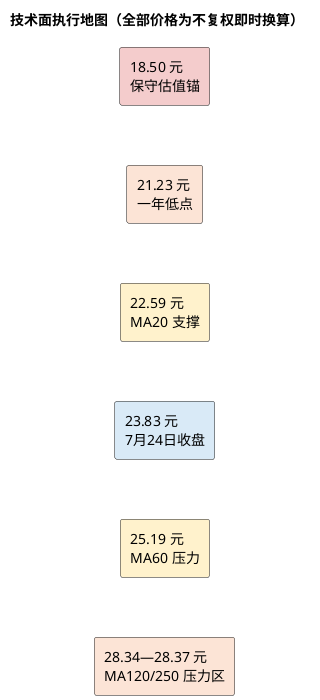

# 顾家家居：技术面分析

**研究日期**：2026年07月26日  
**行情数据截止**：2026年07月24日

## 趋势结构

| 价格区域 | 触发条件 | 对应动作 | 需要避免的误读 |
|:--|:--|:--|:--|
| 21.23 元以下 | 且基本面两项以上恶化 | 切换保守情景、优先风险控制 | 不因低 PE 机械补仓 |
| 20—21 元 | 中报前瞻指标未恶化 | 分批观察建仓区 | 不是无条件买入指令 |
| 25.2 元以上 | 放量且中报验证扣非/订单 | 才能评估趋势改善 | 单日突破不是反转确认 |
| 28.3 元附近 | 中长期均线重叠 | 观察解套卖压与盈利上修 | 不把基本面目标价当技术阻力 |

技术分析只用于识别入场位置与风险管理，不能替代基本面估值。本章均线和趋势使用后复权价格，不复权价格用于交易执行。7 月 24 日不复权收盘 23.83 元，对应后复权 57.48 元；后复权 MA20/60/120/250 分别为 54.49/60.77/68.42/68.36。股价站上 MA20，但仍低于 MA60、MA120 和 MA250，结构上是中期下降趋势中的短线反弹，而不是已确认的长期反转。

过去一年后复权高低点为 81.95/50.73，对应不复权区间的观测高低为 37.59/21.23 元。当前距一年低点已有反弹，却距离中长期均线仍有距离。按当前复权因子 2.4121 作即时换算，MA20 54.49 元（后复权，折算当前市价约 22.59 元）是短期支撑；MA60 60.77 元（后复权，折算当前市价约 25.19 元）是第一中期压力；MA120 68.42 元（后复权，折算当前市价约 28.37 元）及 MA250 68.36 元（后复权，折算当前市价约 28.34 元）构成更强的趋势反转压力区。换算仅为把后复权技术坐标映射至当前市价，实际交易还应结合当日复权因子。

## 量价和执行框架

| 量价指标 | 当前数值/状态 | 说明 | 交易上的使用方式 |
|:--|:--|:--|:--|
| 不复权收盘价 | 23.83 元（2026-07-24） | 实际执行价格口径 | 与估值目标、买入区直接比较 |
| 后复权收盘价 | 57.48 元 | 用于均线与趋势判断 | 不直接作为交易价格 |
| MA20 | 54.49 元，折算约 22.59 元 | 短期平均持仓成本附近 | 观察短线支撑是否有效 |
| MA60 | 60.77 元，折算约 25.19 元 | 首个中期趋势压力 | 放量站稳才讨论趋势改善 |
| MA120/250 | 68.42/68.36 元，折算约 28.37/28.34 元 | 长期均线重叠压力 | 观察解套卖压，不提前追价 |
| 20 日平均成交量 | 90,996 手，较此前 20 日 +9.1% | 有温和参与，未形成确认性放量 | 不能单独确认反转 |
| 60 日后复权区间 | 50.73—75.24 元 | 当前价格靠近区间下部 | 支持“修复而非反转”的定位 |

| 条件化价格路径 | 价格/量能条件 | 基本面条件 | 执行纪律 |
|:--|:--|:--|:--|
| 短线支撑有效 | 守住 22.59 元附近 | 中报前瞻指标未继续恶化 | 仅保持观察仓，不追涨 |
| 理想赔率出现 | 回调至 20—21 元 | 合同负债、扣非、应收、境外毛利未同步走坏 | 可分批、小仓验证 |
| 中期反转尝试 | 放量突破并维持在 25.19 元上方 | 扣非、费用率、回款三项改善 | 才能提高跟踪优先级 |
| 长期趋势改善 | 越过 28.3 元压力区 | ROE、海外毛利和扣非回到中性模型 | 重新评估目标价与仓位 |
| 下行证伪 | 跌破 21.23 元 | 需求、盈利、现金至少两链恶化 | 转保守情景，先控风险 |
| 极端压力 | 估值锚向 18.50 元靠近 | 系统性需求与海外订单走弱 | 不是自动补仓信号 |

7 月中旬后股价从约 23 元反弹至 24.32 元，7 月 24 日回落收于 23.83 元；单日成交额约 1.84 亿元，尚未形成持续放量突破。短期需要观察 24.6-25.2 元区间能否以成交量和基本面催化突破；若不能突破，反弹更可能成为下行趋势中的均值修复。下方先看 22.6 元附近（MA20 即时换算）和 21.23 元近一年低点；基本面未改善时，跌破 21.23 元不应机械补仓，而应重新判断保守盈利情景。

量能没有给出明确的趋势确认。最近 20 个交易日平均成交量为 90,996 手，较此前 20 日的 83,443 手增加 9.1%；这说明低位反弹阶段有温和资金参与，却远不足以单独证明主导资金完成换手。最近 60 日后复权收盘区间为 50.73—75.24 元，当前 57.48 元仍靠近区间下部。价格相对 MA20 为 +5.5%，相对 MA60 为 -5.4%、相对 MA250 为 -15.9%，形成“短均线向上、长均线仍压制”的典型修复结构。没有放量越过 MA60 前，技术结论只能是交易性反弹，不能与基本面目标价混同。

关键位的解释也要区分支撑来源。22.59 元是按当日复权系数将 MA20 映射至不复权价，仅代表近一个月平均持仓成本附近，不是固定绝对价；21.23 元是一年不复权低点，具有更强的市场心理意义，但高低点并非同一日的后复权/不复权严格换算。25.19 元对应 MA60，是首次趋势压力；28.34—28.37 元对应 MA250/MA120 的重叠区，若无盈利上修和成交量扩张，反弹至该区更可能出现解套卖压。上方不能仅以 27.70 元基本面目标价当作技术阻力，因为该价代表 12 个月定价假设而非历史成交密集区。

| 时间框架 | 判断 | 关键位（不复权市价） | 交易含义 |
|:--|:--|:--|:--|
| 1-3 个月 | 反弹/震荡，未确认反转 | 支撑 22.6、21.23；压力 25.2 | 不追涨，等待量价确认或回调 |
| 6-12 个月 | 取决于中报验证与 ROE | 压力约 28.3 | 只有站稳中长期均线才有趋势改善 |
| 极端风险 | 需求与盈利同时下修 | 保守估值 18.5 | 风控以基本面证伪为先 |

本章与估值的衔接是：23.83 元虽处历史低估值，但技术面未显示强趋势买点；20-21 元既更接近基本面理想买区，也会提高盈亏比。任何向上突破都需要 2026H1 扣非利润、销售费用率、合同负债和境外毛利率同步支持。

需要特别避免两个常见误读。第一，历史 PE/PB 低分位与后复权价格的中期下降趋势并不矛盾：前者说明市场已压低估值，后者说明资金尚未确认盈利拐点。第二，除权后的不复权价格不能直接用于长期均线，故本章将技术判断严格建立在后复权数据上，而将目标价、仓位和止损讨论回到实际可成交的不复权市价。若公司现金分红、送配或复权因子变化，所有即时换算价格都应重新计算。

技术面对基本面研究的价值，是把中报前的行为纪律写清楚：现价处于 MA20 之上而长期均线之下时，仓位应小于已经完成趋势反转时的仓位；若 8 月财报确认扣非恢复，且价格放量站稳 MA60，再将估值上修与趋势改善结合；若财报不及预期并跌破近一年低点，则优先执行基本面风险控制。换言之，价格负责执行，财报负责改变结论。

## 条件化路径，而非点位预言

未来 1—3 个月的基准路径是 21.2—25.2 元不复权区间内的震荡：MA20 附近守住而成交量温和增加，可视为市场等待中报确认；突破 25.2 元且至少连续数日维持、同时量能明显高于近 20 日均值，才可把短线修复升级为中期反转尝试。若只出现盘中突破而收盘回落，则应理解为压力区卖盘仍重。6—12 个月的趋势改善门槛更高：不仅要越过 28.3 元附近的长均线重叠区，还要有实际财报把 ROE、海外毛利和扣非利润带回中性模型的轨道。

向下路径同样应条件化。跌破 22.6 元但合同负债、收现和中报经营指标改善，可能只是市场波动，可在基本面仓位框架内复核；若跌破 21.23 元且同时出现扣非利润两位数下滑、销售费用率抬升、应收或渠道库存恶化，则价格行为与基本面证伪共振，应优先将估值切换到 18.50 元保守情景，而非用低 PE 机械加仓。真正的“地狱价格”9.44—11.20 元是资产/压力估值锚，不是普通交易止损的建议。

因此技术面没有独立买卖结论，只提供三条执行纪律：第一，所有交易价格使用不复权价格，所有均线判断使用后复权价格并在当日换算；第二，25.2 元以上的追价需要量价和中报两项确认；第三，21.23 元以下的风险控制优先检查基本面证伪，而不是单纯依据图形。这样可避免把复权口径、估值目标和交易点位混为一谈。

**数据来源**：项目统一视图 `daily_kline` 与 `v_daily_valuation`，价格为截至 2026 年 7 月 24 日收盘数据。
