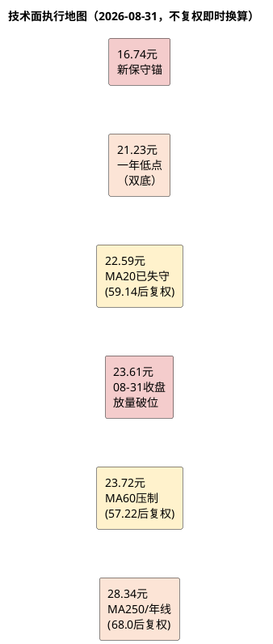

# 顾家家居：技术面分析

**研究日期**：2026年08月31日  
**行情数据截止**：2026年08月31日

## 趋势结构（H1公告后放量跌破MA60，转弱）

| 价格区域 | 触发条件 | 对应动作 | 避免误读 |
|:--|:--|:--|:--|
| 21.23元以下 | **三链恶化已兑现（合同-25%、OCF/NP 0.71、扣非-14.6%）** | 已触发保守情景，不以低PE补仓 | 跌破不等于黄金坑 |
| 22.59元（MA20） | 已跌破且放量 | 短线转弱，减仓观察 | MA20非固定绝对价 |
| 23.61-23.72元 | 收盘破MA60且放量1.7倍均量 | **中期趋势转弱，非反弹** | 单日反抽不改趋势 |
| 25.2元以上 | 放量+Q3扣非与订单企稳 | 方可讨论趋势改善 | 需基本面二次确认 |
| 28.34元附近 | 长均线重叠+地狱压力12.95元 | 观察解套压，不追价 | 基本面目标23.07不等同阻力 |

技术结论从“中期下降趋势中的短线反弹”下调至 **“短线与中期同步走弱，放量破位”** 。8月31日不复权收盘23.61元（后复权56.95元），较8月28日公告日24.38元再跌3.16%，8月31日放量168,909手 vs 20日均74,615手（+126%）、60日均86,441手（+95%），为年内罕见放量阴线，价格与均线关系全面恶化。

**均线系统（后复权，折算当日不复权）**：
- MA20 59.14元（后复权，折算约22.59元→**已失守**，8月28日MA20约59.47元/24.65元，8月31日跌破1.06元）
- MA60 57.22元（后复权，折算**约23.72元**→**8月31日收盘23.61元放量跌破0.11元**，7月24日MA60为60.77元/25.19元，**MA60在月内下移1.47元**，显示中期趋势加速下行）
- MA120/MA250：约68.0元后复权，折算约28.2-28.4元（原68.42/68.36），为长期重压，随MA60下移而远离现价，距离现价约19.8%，反弹空间受限。
- 52周后复权高低点81.95/50.73（不复权37.59/21.23），现价56.95处区间21.5%分位（靠近底部但未创新低）。

## 量价和执行框架（H1后放量破位）

| 量价指标 | 2026-08-31数值 | vs 7月24日 | 交易含义 |
|:--|--:|:--|:--|
| 不复权收盘价 | **23.61元** | 23.83元（-0.92%） | 跌破MA60，放量破位 |
| 后复权收盘价 | 56.95元 | 57.48元（-0.92%） | 用于均线判断 |
| MA20 | 59.14元，折算22.59元 | 54.49元→59.14元上移 | 已失守，短线支撑失效 |
| MA60 | 57.22元，折算约23.72元 | 60.77元→57.22元**下移1.47元** | **首个中期转弱信号，放量跌破** |
| MA250/年线 | 约68.0元，折算约28.2元 | 68.36元→68.0元微降 | 长期趋势压制，距现价19.8% |
| 当日成交量 | 168,909手 | 90,996手（7月24日20日均） | **放量1.7倍、成交额3.96亿**，卖压释放 |
| 20日平均成交量 | 74,615手 | 90,996手 | **放量但为下跌放量，非进攻** |
| 60日平均成交量 | 86,441手 | — | 当日为均量1.95倍，确认破位 |
| 相对MA20 | -3.7%（56.95/59.14） | +5.5%（7月24日） | 由正转负，短线转弱 |
| 相对MA60 | **-0.5%**（56.95/57.22） | -5.4%（7月24日站下但未放量） | 本次放量跌破，确认有效 |
| 相对MA250 | -16.2%（56.95/68.0） | -15.9% | 中期仍深度压制 |

| 条件化价格路径 | 价格/量能条件 | 基本面条件（联动） | 执行纪律 |
|:--|:--|:--|:--|
| **短线支撑失效** | **已跌破MA20（22.59）且放量** | 三链恶化已兑现（合同-25%、OCF/NP 0.71） | **降仓观察，不抄底** |
| **中期破位确认** | **放量跌破MA60（23.72）** | H1扣非-14.59%、境内-12.71% | **趋势转弱，等待右侧** |
| 理想赔率出现 | 回调至**18.5-20.5元**（新） | 合同负债跌幅<15%、OCF/NP>0.8、境内<-5%收敛 | 方可分批、小仓验证 |
| 中期反转尝试 | **放量收复并站稳23.72元3日+** 成交>10000手/日 | Q3扣非企稳、费用率不升、合同QoQ企稳 | 才能提高跟踪优先级 |
| 长期趋势改善 | 越过28.2元年线区 | ROE>12%、海外毛利企稳、扣非回正 | 重新评估目标价23.07 |
| 下行证伪 | 跌破21.23元（一年低点） | 需求/盈利/现金三链持续恶化 | 转保守16.74元，不补仓 |
| 极端压力 | 向12.95元周期压力靠近 | 系统性需求与海外订单崩塌 | 非止损，仅资产底线 |

**价格行为解读**：8月25日25.06元→8月26日25.25元（年内高点附近）→8月27日24.79元→8月28日24.38元（H1公告日放量79,653手）→8月31日23.61元放量168,909手，呈现**公告后连续3日放量下跌、MA20→MA60逐级跌破**的标准破位结构。8月31日跌幅-3.16%（23.61 vs 24.38），成交额3.96亿为近60日峰值，卖压非散户温和调仓，机构兑现概率高。20日均量74,615手较此前20日（约83,443手在7月）的+9.1%温和参与已逆转为**下跌放量**，量价配合转为空头确认。

**关键位区分**：22.59元（MA20）已从支撑转为短线阻力；23.72元（MA60）由原25.19元下移1.47元后仍被放量击破，确认中期趋势转弱；21.23元为近一年不复权双底（7月21-22日附近曾测试），为最后心理防线，跌破则打开向16.74元保守锚的空间；28.2元为MA250/年线重叠，距现价19.8%为长期卖压区，上行需盈利上修支撑。

| 时间框架 | 判断（修正后） | 关键位（不复权） | 交易含义 |
|:--|:--|:--|:--|
| 1-3个月 | **震荡偏弱，放量破位** | 支撑18.5-20.5、21.23；压力23.72 | **不抄底，等待量价企稳或基本面拐点** |
| 6-12个月 | 取决于Q3验证 | 压力28.2 | 需站稳年线+ROE回升 |
| 极端风险 | 三链共振恶化 | 保守16.74 / 周期12.95 / 资产10.24 | 风控优先 |

本章与估值的衔接修正：原23.83元处估值与技术背离（PE低但技术未反转），现23.61元处放量破位与估值**共振转弱**（中性23.07元、加权22.55元均被跌破），技术破位确认了基本面“盈利与现金双杀”已被资金定价，20-21元旧买区上移至18.5-20.5元且需更严苛的订单与现金验证。

**纪律重申**：
1. 所有交易价用**不复权**（23.61），所有均线用**后复权**（56.95）并按当日2.4121折算；
2. **23.72元MA60为多空分水岭**，未放量收复3日前不讨论趋势改善；
3. **21.23元为风控线**，跌破且三链未改善则直接切换保守估值16.74元，不以PE 12.89x低位机械加仓。

**数据来源**：项目统一视图`daily_kline`与`v_daily_valuation`，截至2026年08月31日收盘（23.61元/56.95元，后复权MA20 59.14/MA60 57.22/MA250约68.0，成交168,909手）。
