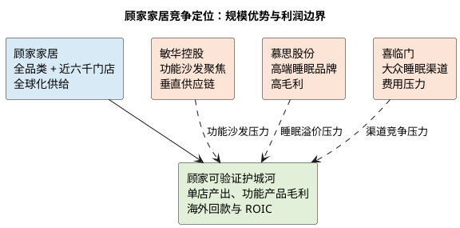

# 顾家家居：竞争格局与地位

**研究日期**：2026年07月26日

## 竞争结论仪表盘

| 赛道 | 顾家的相对位置 | 最强对手/压力 | 可验证胜负手 |
|:--|:--|:--|:--|
| 沙发 | 规模与渠道领先，2025 年销量 +13.41% | 敏华在功能沙发与供应链更聚焦 | 沙发毛利率能否止跌、功能产品份额 |
| 卧室/睡眠 | 34.65 亿元收入、42.91% 毛利率 | 慕思的品牌溢价、喜临门的渠道竞争 | 单品盈利与复购，而非仅套餐销售 |
| 定制/整家 | 可提高联单效率 | 欧派、索菲亚等专业化对手 | 客单价、单店产出、销售费用率 |
| 海外 | 多地制造与 ODM/OBM/跨境并行 | 低毛利、关税、回款与执行复杂度 | 境外毛利、应收、运输费率联动 |

## 竞争位置：软体龙头，但不是无竞争的定价者

顾家的核心竞争场在中高端软体家具：沙发、软床、床垫及功能智能产品；竞争对手包括敏华控股、喜临门、慕思、区域品牌和大量白牌。定制家具则要面对欧派、索菲亚、志邦等更专注的对手。公司年报援引第三方认定其连续四年为中国品牌全球沙发销量第一，这可视作品牌与规模的佐证，但不是利润护城河的充分证据：功能沙发的全球销量第一是敏华的公开主张，二者在品类、区域和渠道上直接竞争，行业没有能够永久锁定价格的寡头结构。

顾家的相对优势由四部分构成。第一，品牌和渠道覆盖：2025 年末经销店 5,875 家、直营店 84 家，合计 5,959 家；其中自有品牌经销店 4,228 家。全年新开 1,238 家、关闭 1,263 家，净关店 25 家。总量稳定并不说明门店无压力，却说明公司在出清阶段仍能维持网络密度。第二，品类协同：沙发、卧室和定制柜类可共享门店、设计与交付资源，降低消费者一次性购买整家方案的选择成本。第三，供应链：牛皮、海绵、木材、面料等集中采购，海外本土采购提升，配合越南、墨西哥、美国制造。第四，产品研发：2025 年研发费用 +31.19%，功能铁架、电机电控和智能床形成由“成品组装”向零部件能力延伸的路径。

## 量化竞争比较与不足

| 竞争要素 | 顾家的现有优势 | 竞争边界 | 财报验证指标 |
|:--|:--|:--|:--|
| 品牌与渠道 | 约 5,959 家门店，覆盖广 | 门店数量不等于单店效率 | 单店零售、净开关店、销售费用率 |
| 产品组合 | 沙发规模、卧室高毛利、整家联单 | 品类宽不等于每条赛道都有溢价 | 分品类收入、毛利、客单价 |
| 供应链 | 集中采购、多地制造、零部件自研 | 海外基地亦增加管理与资本开支 | 原料/运费率、利用率、ROIC |
| 会员与履约 | 750 万累计会员、99.4%齐单交付率（公司披露） | 未经第三方审计，不能直接上调倍数 | 复购、转介绍、履约成本与费率 |

| 2025 年渠道变化 | 新开 | 关闭 | 净变化 | 应读出的结论 |
|:--|--:|--:|--:|:--|
| 经销店 | 1,238 | 1,263 | -25 | 网络进入存量优化，不能用开店驱动外推收入 |
| 直营店 | 期末 84 家 | 上年期末 108 家 | -24 | 直营收缩需结合单店效率而非单看数量 |
| 合计门店 | 5,959 家 | — | — | 规模是渠道基础，质量须由坪效与费用验证 |

| 维度 | 顾家家居 | 敏华控股 | 对顾家的含义 |
|:--|:--|:--|:--|
| 主要优势品类 | 沙发、卧室、整家定制、跨境电商 | 功能沙发、床具及配套 | 顾家品类更宽，敏华在功能沙发更聚焦 |
| 国内需求暴露 | 约 99.4 亿元内贸，门店网络广 | 中国市场同样承压 | 两者都无法绕开地产后周期 |
| 海外模式 | ODM/OBM/跨境电商并行，多地生产 | 海外销售及生产基础深 | 顾家海外增长快，但毛利率较低 |
| 毛利率观察 | 境内 38.35%，境外 25.84% | 2025/26 财年整体约 39.4% | 顾家需证明海外扩张不长期稀释利润 |
| 关键风险 | 经销商效率、海外应收、整家协同 | 国内收入与销售费用压力 | 竞争可能先表现为促销和费率上升 |

敏华 2025/26 财年收入约 167.51 亿港元、股东应占利润约 18.12 亿港元，同比均承压，且中国市场收入下降；这验证了“行业竞争仍激烈”的外部事实。顾家 2025 年沙发收入 +13.44%、销售量 +13.41%，在相同环境下表现较好，初步支持其份额提升而非单纯价格增长。需注意：沙发收入成本 +14.24%，略快于收入，毛利率下降 0.45 个百分点；份额提升目前伴随着一定成本压力，尚不能称为强定价权。

## 可比公司不是估值模板，而是竞争强度的压力测试

2025 年数据提供了比口号更有用的横截面对照。敏华控股截至 2026 年 3 月的财年实现收入及其他收入 167.51 亿港元、股东应占利润 18.12 亿港元，分别同比下降 2.9%和 12.1%，整体毛利率 39.4%；其中核心沙发及配套产品收入下降 4.2%，中国市场收入下降 6.8%，北美收入则增长 2.6%。敏华在功能沙发的产品聚焦、垂直供应链和海外制造比顾家更纯粹，其毛利率显著高于顾家 32.76%的综合水平。顾家在沙发销量增长的同期仍出现单品毛利率下滑，正说明其可以取得份额，却尚不能证明在功能化升级上拥有与敏华相同的利润池。

睡眠赛道反过来给出顾家的能力边界。慕思 2025 年收入 52.27 亿元、归母净利 5.36 亿元，同比分别下降 6.71%和 30.21%，综合毛利率却为 51.34%；其床垫业务收入 26.39 亿元，AI 产品收入 2.55 亿元、同比增长 127.68%。喜临门 2025 年收入 88.19 亿元、归母净利 2.41 亿元，收入仅增 1.02%、净利下降 25.11%。两家公司都说明高毛利床垫/睡眠品牌也无法免受需求与费用压力，但慕思的高毛利率亦表明消费者为睡眠品牌、体验和技术支付溢价的能力真实存在。顾家 2025 年卧室产品 34.65 亿元、42.91%毛利率，已经占据有价值的规模位置；它的挑战是将“卧室产品”从整家套餐中的一个品类，转化为能独立被消费者认知和复购的睡眠资产。没有这一转化，顾家的卧室毛利优势仍容易被沙发、集成产品和出口业务稀释。

| 2025 年可比口径 | 顾家家居 | 敏华控股（截至2026/3） | 慕思股份 | 喜临门 |
|:--|--:|--:|--:|--:|
| 收入 | 200.56 亿元人民币 | 167.51 亿港元（收入及其他收入） | 52.27 亿元人民币 | 88.19 亿元人民币 |
| 收入同比 | +8.53% | -2.9% | -6.71% | +1.02% |
| 归母/股东应占利润 | 17.90 亿元人民币 | 18.12 亿港元 | 5.36 亿元人民币 | 2.41 亿元人民币 |
| 利润同比 | +26.37% | -12.1% | -30.21% | -25.11% |
| 综合毛利率 | 32.76% | 39.4% | 51.34% | 不以本表横比 |
| 竞争含义 | 规模、全品类、海外制造 | 功能沙发专业度与成本体系 | 高端睡眠品牌溢价 | 大众睡眠渠道与费用压力 |

| 可比结论 | 事实依据 | 对顾家估值的含义 | 禁止的推论 |
|:--|:--|:--|:--|
| 顾家 2025 年跑赢部分同业 | 收入与利润表现优于多家可比 | 支持份额/结构改善的判断 | 不等于行业已经复苏 |
| 敏华利润率更高 | 敏华整体毛利率约 39.4% | 功能沙发仍有专业化压力 | 不可直接套用敏华估值倍数 |
| 慕思睡眠溢价更强 | 2025 年综合毛利率 51.34% | 顾家卧室业务有提升空间 | 不把卧室毛利当作全公司毛利 |
| 喜临门利润承压 | 收入微增、利润下滑 | 需求弱时渠道与费用风险真实存在 | 不将同业困难机械等同于顾家失速 |

表中币种和会计口径不同，不能用于机械计算 PE 或净利率排名；其用途是进行方向验证：顾家的收入和利润在 2025 年确实跑赢多个可比公司，因而“份额/产品结构改善”有事实基础；同时，顾家低于敏华和慕思的毛利率也提醒市场，规模更大、品类更多不自动等于消费品牌溢价更高。估值环节应把顾家放在“全品类成熟龙头”的中间位置，而不是把它按纯功能沙发或纯高端床垫龙头估值。

## 护城河拆解：什么可以沉淀，什么只是投入

第一层是渠道和履约网络。顾家年末约 5,959 家门店，覆盖近六千个线下触点；这使新品展示、送装服务和全屋联单具备规模基础。门店本身并非壁垒——慕思仍有五千余家专卖店，敏华拥有强势功能沙发渠道，区域品牌也可在低线市场快速开店——但总部对货品、会员、电子合同和履约数据的整合会形成较高的运营转换成本。顾家披露会员累计突破 750 万、年度活跃会员近 380 万、会员转介绍关联零售超过 10 亿元，且履约区域齐单交付率为 99.4%。这些是公司自报经营指标，尚缺第三方审计，不能直接当作估值倍数上调；其价值在于未来可通过复购、单店零售和销售费率验证。

第二层是供应链和产品工程。2025 年家具制造成本中原材料占 65.28%，沙发原材料占其成本 79.48%，意味着集中采购、材料替代、铁架电机自制和产线良率是影响毛利的第一性变量。公司收购及布局登丰电机、锴创铁架等零部件，有机会把功能产品从外购件组装转向系统集成，缩短交付并提高质量控制；但这同时增加固定资产、研发和整合风险。真正的护城河应表现为功能产品毛利率高于普通沙发、返修率下降、海外交付稳定和 ROIC 上升，而不是专利数或投资公告本身。

第三层是全球化供给。顾家的越南、墨西哥、美国生产与印尼项目可为海外客户提供更短交期和关税缓冲，但同行也在向低成本地区配置产能，因此它是“跟上竞争”的必要条件，未必是长期超额利润来源。印尼项目总投资 11.24 亿元、土地及建筑工程占 85.09%、建设四年且达纲年收入目标 25.20 亿元，表明其更像重资产交付能力而非轻资产品牌输出。项目公告同时提示正式土地购买协议尚未签订；这正是物理世界的验证点，而非可以用愿景替代的风险。

## 非财务交叉验证与竞争结论

本章尝试了三类非财务验证。订单维度，公司年报披露不存在重大采购或销售合同，故不能用“在手订单”替代需求判断；研究改用沙发产销、合同负债和应收周转作为后续代理指标。供应链维度，印尼可研披露了园区、用地、建设期和投资构成，确认项目处于建设准备而非已达产阶段。技术维度，竞争不应被简化为“智能”标签：敏华的功能沙发专注、慕思的 AI 睡眠单品、顾家的铁架—电机—电控整合分别对应不同的用户价值，顾家尚需用产品利润率与售后数据证明技术代差。

因此，本章结论从“有渠道护城河”收紧为：顾家拥有抢份额和稳定交付的结构性优势，足以使其在需求低迷期的收入表现好于部分同业；但在功能沙发和睡眠两条高毛利赛道，专业品牌仍是强对手，海外产能也可能先带来资本开支和管理复杂度。对预测的传导是，给予沙发和卧室收入温和跑赢行业的假设，但不预设综合毛利率快速向敏华或慕思靠拢。

## 定价权和渠道审计

| 定价权审计问题 | 当前答案 | 需要的数据 | 当前研究结论 |
|:--|:--|:--|:--|
| 沙发销量增长是否来自提价？ | 否，收入与销量增速接近 | 单价、促销、分渠道数据 | 更接近份额与出货量提升 |
| 沙发是否拥有成本转嫁能力？ | 尚未证明，成本增速快于收入 | 原料成本、单品毛利率 | 不给予强提价权假设 |
| 渠道是否带来经营杠杆？ | 尚未证明 | 单店产出、销售费用率、闭店率 | 以效率而非店数判断 |
| 零部件自研能否形成壁垒？ | 仍在投入/整合阶段 | 功能产品毛利、返修率、ROIC | 作为待验证选择权处理 |

公司对上游的议价能力来自集中采购和规模，但原材料占家具制造成本 65.28%，沙发成本中原材料占 79.48%，皮革、海绵、木材、面料和五金价格仍会实质影响毛利率。对下游，直营与特许经销并存使其可控制品牌和货盘，却不能将库存风险完全隔离。2025 年应收账款增长 26.63%，明显高于收入，主要来自外贸；2026Q1 应收回落是正面信号，但至少应观察两个季度，确认不是季末压款后回收。

渠道壁垒需要区分“数量”与“质量”。净门店数近乎持平，并不能自然转化为同店增长。真正应跟踪的是单店零售额、经销商库存周转、合同负债、销售费用率和闭店率。若功能沙发与卧室爆款能提高单店坪效，门店网络会从固定成本转为份额武器；若消费者需求走弱、经销商只能以折扣清货，网络会反过来要求更多营销补贴。

## 本章结论

顾家具备真实但有限的护城河：品牌、广渠道、全品类供给和全球供应链，足以提高行业低迷期的存活率和抢份额概率；但护城河还未显示为稳定扩张的毛利率或无争议的高 ROIC。盈利模型应给予其成熟龙头的合理估值，却不应赋予消费品高溢价。后续估值中，功能产品份额提升应进入利润预测；海外关税、汇率及管理复杂性应以估值折价而非重复扣减利润。

**主要证据**：公司 2025 年年报第 34—40 页、门店及成本披露；[敏华控股财务报告页](https://www.manwahholdings.com/show_list.php?id=127)、[敏华 2025/26 年中期报告](https://www.hkexnews.hk/listedco/listconews/sehk/2025/1201/2025120102357_c.pdf)、[慕思 2025 年年报摘要](https://vip.stock.finance.sina.com.cn/corp/view/vCB_AllBulletinDetail.php?id=12261075)、[喜临门 2025 年年报](https://money.finance.sina.com.cn/corp/view/vCB_AllBulletinDetail.php?id=12188987&stockid=603008)、[顾家印尼项目可研](https://stockmc.xueqiu.com/202509/603816_20250902_EMS1.pdf)。
