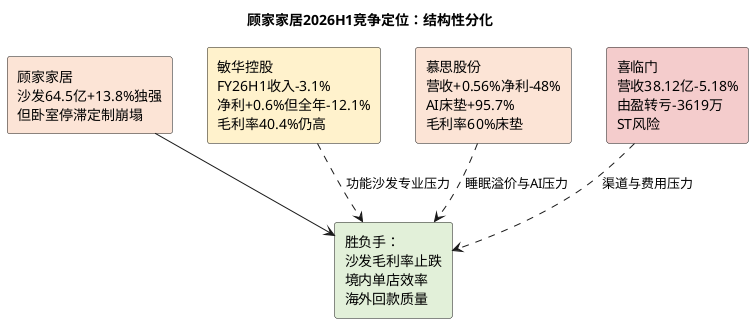

# 顾家家居：竞争格局与地位

**研究日期**：2026年08月31日

## 竞争结论仪表盘（2026H1后：沙发单腿支撑，全品类护城河承压）

| 赛道 | 顾家H1表现 | 最强对手H1表现 | 相对结论 | 可验证胜负手 |
|:--|:--|:--|:--|:--|
| 沙发 | 64.50亿 **+13.81%**，毛利率35.16% -0.89pct | 敏华功能沙发收入-约4%（FY26Q1-Q2延续承压）、整体收入-3.1% | **顾家跑赢且份额提升确认** | 沙发毛利率能否止跌企稳 |
| 卧室/睡眠 | 16.91亿 **-0.13%**，毛利率39.83% **-2.98pct** | 慕思床垫+7.83%但归母-48.13%（费用侵蚀）、喜临门转亏-3619万 | **顾家亦承压但优于喜临门，逊于慕思产品韧性** | 卧室毛利与复购能否止跌 |
| 定制/整家 | 3.39亿 **-38.67%**、集成8.25亿-29.05% | 欧派/索菲亚未披露H1但行业定制集体承压（37家家居中仅17家增收） | **顾家塌陷幅度超行业，整家协同证伪** | 定制能否收敛跌幅 |
| 海外 | 50.67亿 **+19.01%**，毛利率24.24% -2.12pct | 敏华北美+2.6%（FY25/26）、慕思境外+22.69%但基数小 | **顾家海外增速领先但以毛利与应收为代价** | 境外毛利、应收、回款联动 |

## 竞争位置：沙发龙头韧性确认，但全品类与定制短板暴露

顾家核心竞争场仍为中高端软体家具，但2026H1将“全品类协同”叙事证伪为“沙发单腿支撑”。沙发64.50亿+13.81%在家具社零-4.5%、竞对敏华沙发-4%（FY25/26全年沙发及配套产品下降4.2%）、喜临门-5.18%、慕思营收+0.56%的对比中显著跑赢，份额提升有硬数据支撑。然而卧室-0.13%、集成-29%、定制-38.67%的集体回撤，说明公司“一体化整家”尚未形成跨品类护城河，定制赛道面对欧派、索菲亚等专业化对手无优势，反而成为境内-12.71%的重灾区。

海外模式：顾家50.67亿+19.01%增速在软体同业中居前（敏华海外整体平稳、慕思境外+22.69%但基数仅1.34亿），但毛利率24.24%较境内42.14%低17.9pct，且应收+25.73%快于境外收入，显示竞争策略为“低价+账期换份额”，与敏华毛利率39-40%的高盈利模式形成鲜明反差——顾家可以抢量，却未证明能抢利润池。

## 量化竞争比较与不足（2026H1刷新）

| 竞争要素 | 顾家H1验证 | 竞争边界 | 财报验证 |
|:--|:--|:--|:--|
| 品牌与渠道 | 约5,959家门店（2025年末），H1未更新但境内-12.71%暗示单店产出显著下滑 | 规模未转化为效率，单店承压 | 境内收入/门店估算单店下滑双位数 |
| 产品组合 | 沙发独强，卧室停滞，集成定制崩塌 | 品类宽不等于每条赛道有溢价，整家联单证伪 | 沙发+13.81% vs 定制-38.67%分化20pp+ |
| 供应链 | 越南/墨西哥基地支撑境外+19%，但TDI+31%推高成本、运费仍高 | 海外基地是必要条件非超额利润源 | 境外毛利率-2.12pct、原材料65.28%暴露 |
| 研发与专利 | 研发2.37亿+20.35%，专利3000+、H1新增400项 | 投入加码但当期费用化侵蚀利润 | 研发费用率2.40% vs 毛利率-0.40pp |
| 会员与履约 | 750万会员、99.4%齐单交付（2025披露） | 未经审计且H1境内失速显示转化未起 | 复购数据H1未更新，需三季报验证 |

| 2026H1可比口径 | 顾家家居 | 敏华控股（FY26H1：2025.10-2026.03对应） | 慕思股份 | 喜临门（ST喜临门） |
|:--|--:|--:|--:|--:|
| 收入 | 98.75亿元人民币 (H1) | 80.45亿港元（约73亿人民币，-3.1%） | 24.91亿（+0.56%） | 38.12亿（-5.18%） |
| 归母/股东应占利润 | 9.26亿（-9.31%） | 11.46亿港元（+0.6%）但全年-12.1% | 1.86亿（-48.13%） | -0.36亿（由盈转亏） |
| 综合毛利率 | 32.49%（-0.40pct） | 40.40%（+0.9pct H1，回落至39.4%全年） | 床垫60.02%（综合未披露但高） | 未披露但亏损 |
| 核心赛道信号 | 沙发+13.81%独强 | 沙发及配套-约4%、中国市场-6.8% | AI床垫+95.69%（2.36亿） | 线下门店承压、新零售让利 |
| 竞争含义 | 量增利不增，以账期换境外 | 毛利率优势仍高但中国侧亦承压 | 技术驱动但费用激增致利润腰斩 | 渠道与费用双杀，ST风险 |

*注：敏华财年为4-3月，FY26H1为2025.10-2026.03，FY26全年162.76亿港元-2.8%、股东利润-12.1%，与顾家H1周期不完全可比，仅作方向参考*

| 2026H1可比结论 | 事实依据 | 对顾家估值的含义 |
|:--|:--|:--|:--|
| 顾家沙发跑赢行业 | +13.81% vs 行业社零-4.5% vs 敏华沙发-4% | 支持沙发份额上调，但为唯一亮点 |
| 卧室/定制集体承压 | 卧室-0.13%毛利率-2.98pct、定制-38.67% | 全品类溢价证伪，不给整家估值溢价 |
| 慕思AI高增但利润崩 | AI +95.69%但净利-48%（销售费用7.91亿+18.9%广告2.74亿） | 睡眠赛道技术投入期，顾家追赶成本高 |
| 喜临门由盈转亏 | -3619万、营收-5.18%、ST且控股股东预重整 | 行业底部区域，但顾家境内-12.71%亦弱 |
| 敏华毛利率仍高 | H1 40.4% vs 顾家32.49%差7.9pp | 功能沙发专业化壁垒仍存，顾家需证明毛利率企稳 |

## 护城河拆解：2026H1后“存活率”仍存，“扩张性”存疑

**第一层渠道与履约**：5,959家门店的密度在需求-12.71%时从资产变为负担。原模型假设“门店筛选+坪效提升”带来经营杠杆，H1销售费用仍+3.81%而境内-12.71%，显示费用刚性远超单店改善，渠道护城河未转化为利润。

**第二层供应链与产品工程**：集中采购与海外本土化未能抵御TDI +31%成本冲击（营业成本+1.36%快于营收+0.75%），且沙发成本+15.40%快于收入+13.81%。功能铁架（锴创）、电机（登丰）越南布局支撑海外+19%，但H1毛利率仍降，说明零部件自研尚未转化为毛利优势，需以功能产品毛利率与ROIC验证而非专利数。

**第三层全球化供给**：越南、墨西哥、美国基地进入常态化，印尼基地3月奠基（1.6亿美元、19.5万㎡、一期2027年3月投产、达产2.2亿美元/年产值），为2029年后选项。短期看，海外基地使顾家境外增速领先同业，但代价是境外毛利率-2.12pct+应收-账期拉长+汇率敞口（财务费用+1.21亿），重资产交付能力不等同于品牌溢价。

## 非财务交叉验证与竞争结论（2026H1更新）

- **订单维度**：主营不存在重大合同，但合同负债-25.1% YoY与应收+25.7%组合，替代“在手订单”指标显示：国内订单萎缩、海外以信用扩张。
- **供应链维度**：印尼可研（总投11.24亿、土地建筑占85.09%）与奠基进度（2026-03-16）确认项目进入建设期，但尚未产生收入，估值不计入利润。
- **技术维度**：慕思AI床垫+95.69%、专利+AI投入致净利-48%，验证智能睡眠赛道“投入期”属性；顾家赫兹S9 Space D功能架等旗舰产品H1零售6000万+、至净+X5组合1.75亿，但卧室整体-0.13%显示高端旗舰未拉动板块，技术代差未转化为报表。

**本章结论修正**：从“有限护城河但可抢份额”收紧为 **“沙发单品护城河仍硬，全品类与定制护城河证伪，海外护城河以利润稀释为代价”**。盈利模型应：**上调沙发份额假设（全年+10-13%），下调卧室（0-2%→-2%至+1%）、定制/集成（-30%至-20%）、信息服务（-15%至-5%）**，且不预设综合毛利率向40%靠拢。

## 定价权和渠道审计（2026H1后）

| 审计问题 | H1答案 | 证据 | 结论 |
|:--|:--|:--|:--|
| 沙发增长是否提价？ | 否，成本+15.40% > 收入+13.81% | 沙发毛利率35.16% -0.89pct | 量增以让利为代价 |
| 是否有成本转嫁？ | 尚未，综合毛利率-0.40pp（Q2 -2.05pp） | TDI+31% vs 毛利率下降 | 无强转嫁能力 |
| 渠道是否杠杆？ | 否，境内-12.71%而销售费用+3.81% | 销售费用率17.11%→17.12%在零增长下刚性 | 渠道未带来杠杆 |
| 零部件壁垒？ | 未兑现，ROIC 7.65% vs 9.00%去年 | 研发+20.35%但毛利率仍降 | 仍为投入期 |

**主要证据**：公司2026H1报告分产品/地区分拆（沙发64.50亿+13.81%/卧室16.91亿-0.13%/集成8.25亿-29.05%/定制3.39亿-38.67%/境内45.61亿-12.71%/境外50.67亿+19.01%/合同负债11.54亿-25.1%/应收19.16亿+25.7%）；敏华控股FY26H1（80.45亿港元-3.1%毛利率40.4%净利+0.6%）及FY26全年（167.51亿港元-2.8%净利-12.1%毛利率39.4%）；慕思2026H1（24.91亿+0.56%净利1.86亿-48.13% AI+95.69%毛利率床垫60.02%）；喜临门2026H1（38.12亿-5.18%转亏-3619万）；印尼项目奠基公告（2026-03-16，总投1.6亿美元，建设期4年）。
