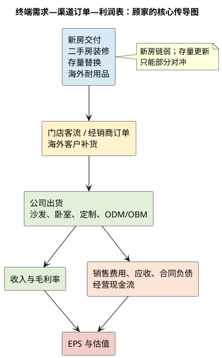

# 顾家家居：产业周期与终端穿透

**研究日期**：2026年07月26日

## 一页周期判断

| 需求层 | 当前信号 | 2026—2027 基准判断 | 必须跟踪的验证指标 |
|:--|:--|:--|:--|
| 新房交付/首次装修 | 2026H1 住宅竣工面积 -25.3% | 仍是国内需求的主要拖累 | 竣工、施工、销售面积 |
| 二手房/改善装修 | 受交易、收入与装修意愿共同影响 | 能缓冲但不能完全替代新房 | 二手房交易、门店客流、定制订单 |
| 存量替换/以旧换新 | 2025 家具零售 +14.6%，2026H1 转为 -3.7% | 政策透支与消费前置风险上升 | 家具社零、补贴节奏、客单价 |
| 海外耐用消费 | 2025 境外收入 +11.46%，毛利率下降 | 可对冲内需，不能直接等同于高景气 | 境外毛利、应收、运输费率 |

## 周期定位：新房后周期下行，存量更新尚不足以完全对冲

| 周期指标 | 已披露数值 | 所处位置 | 不能忽略的时滞 |
|:--|--:|:--|:--|
| 家具类零售额 | 2026H1 870 亿元，同比 -3.7%；6 月 -6.6% | 终端动销走弱 | 当月促销、补贴和品类结构会扰动 |
| 住宅竣工面积 | 2026H1 12,148 万平方米，同比 -25.3% | 新房配套需求池收缩 | 交付到家具采购通常以月计 |
| 住宅销售面积 | 2026H1 同比 -12.4% | 二手房/改善装修的前瞻亦偏弱 | 交易到装修仍有时滞 |
| 2025 家具零售 | 同比 +14.6% | 补贴和换新推动的高基数 | 不可作为 2026 趋势增速 |

| 终端需求类型 | 顾家对应品类/渠道 | 主要驱动 | 当前判断 | 领先指标 |
|:--|:--|:--|:--|:--|
| 新房首次装修 | 定制、整家、成品家具 | 竣工、开工、交房 | 主要拖累 | 竣工、施工、合同负债 |
| 二手房/改善装修 | 沙发、卧室、定制 | 交易、可支配收入、装修意愿 | 有缓冲、难成强引擎 | 二手房交易、门店客流、客单价 |
| 存量替换 | 功能沙发、床垫、送装焕新 | 补贴、体验、回收便利度 | 可提高渗透，存在需求前置 | 家具社零、补贴、线上线下零售 |
| 海外耐用品 | ODM、OBM、跨境电商 | 利率、住房交易、客户库存 | 2026 筑底、恢复待验证 | 海外毛利、应收、运输费率 |

顾家所处的软体家具和定制家居都属于可选、耐用、低频消费。对沙发、床垫等成品家具而言，新房交付、婚育与改善型置换决定增量需求；对定制柜类而言，装修开工与竣工节奏更直接。行业已从过去“新房交付驱动的扩容期”转入存量住房更新、品牌集中和渠道效率比拼的成熟期。成熟不等于没有增长，但需求总量不再保证增长，增长必须来自抢份额、品类渗透或海外市场。

最新外部数据不支持把国内景气判断为复苏。国家统计局数据显示，2026 年 1-6 月家具类零售额 870 亿元，同比 -3.7%，其中 6 月单月 -6.6%；同期住宅竣工面积 12,148 万平方米，同比 -25.3%，住宅销售面积同比 -12.4%。竣工下滑通常会通过装修、家具采购向后传导，因此顾家内贸 2025 年的 +6.2%并不能被机械外推。更合理的解释是，公司依靠渠道运营和产品结构跑赢了行业，而非行业本身已经向上。

## 终端拆分与跨期需求审计

顾家的需求不应被简化为“地产后周期”。新房交付、二手房装修、存量替换和海外耐用品对应不同的购买决策与滞后期；其中功能沙发、床垫和送装服务能够提高存量替换的渗透，但不能消除新房链下行。2025 年卧室产品毛利率 42.91%说明产品结构有缓冲，但功能产品并非刚需，线上增长若依赖折扣也不等于盈利增长。

## 库存、供需与压力传导

| 库存/订单代理变量 | 已知事实 | 正确解读 | 需要触发的警报 |
|:--|:--|:--|:--|
| 制造端产销 | 2025 年沙发销量增速高于产量，年末库存仅 +2.83% | 工厂端未见主动补库 | 不能代替经销商库存数据 |
| 经销商库存 | 公司称周转改善，未披露绝对金额 | 仅为方向性信息 | 门店关闭、折扣和费用率共同恶化 |
| 存货 | 2026Q1 环比减少 3.47 亿元 | 表内去库正面 | 不代表终端去库完成 |
| 应收 | 2026Q1 环比减少 1.86 亿元 | 单季回款改善 | 若增长再快于境外收入则质量转弱 |
| 合同负债 | 2026Q1 环比减少 3.89 亿元 | 订单前瞻警报，而非利好 | 二、三季度同比仍弱才需下调模型 |

| 供需压力传导 | 最先受影响的指标 | 随后出现的财务表现 | 投资模型动作 |
|:--|:--|:--|:--|
| 新房/社零走弱 | 客流、经销商订单、合同负债 | 内销增速下行、销售费用率抬升 | 下调国内 Q |
| 渠道库存积压 | 促销、折扣、净关店 | 毛利率承压、回款变慢 | 下调毛利与现金转换 |
| 海外客户去库存 | ODM 订单与应收 | 境外收入/毛利偏弱 | 下调海外 Q 与 PE 信心 |
| 产能扩张早于需求 | 在建工程、利用率 | 折旧和自由现金流承压 | 不提前计入印尼项目利润 |

软体家具的制造门槛低于高端设备，产品同质化和渠道分散使供给在需求转弱时容易通过降价维持产能。压力传导路径是“竣工/零售下降—经销商订单变少—门店促销与库存承压—品牌让利或投放增加—制造端毛利和费用率受压”。顾家年报称经销商库存周转大幅提升，但未披露绝对渠道库存；因此财报中合同负债、应收、公司存货才是可观测代理变量。公司 2026Q1 存货环比下降 3.47 亿元、应收下降 1.86 亿元，说明表内库存并未失控；合同负债环比下降 3.89 亿元，则是下半年订单需验证的警报，而不是利好。

海外端供需结构相对更复杂。全球软体制造向低成本区域迁移，顾家已在越南、墨西哥、美国等地布局，并筹备印尼基地。海外终端需求对利率和住房交易敏感，ODM 客户在去库存期可快速削减订单；但多地制造能够降低单一关税和运费冲击。2025 年境外收入 +11.46%、但毛利率下降 1.31 个百分点，已经说明海外收入的增长并非无代价。印尼项目建设期约四年、达产后再需三年，因而是 2029 年后选项，而非 2026-2027 年盈利催化剂。

## 需求不是一个数字：三类终端与一条时间链

将家居消费笼统地等同于“地产后周期”会低估顾家渠道改造的意义；反过来，将存量翻新概念直接等同于摆脱地产，也会高估它的短期贡献。顾家销售的成品沙发、床垫、餐桌椅和定制柜，最终装载在三种不同的住宅情境中：交付后首次装修、二手房交易后的重新装修、以及不伴随住房交易的旧家具替换。三者的决策周期、客单价和对补贴的敏感度并不相同。首次装修与新房竣工、装修开工同步度最高，通常在交付前后数月形成采购；二手房和改善型置换对交易量、装修意愿和可支配收入更敏感；纯替换最受产品体验、服务、促销和旧品处理便利度影响。顾家通过功能沙发、床垫、送装与“无忧焕新”触及第三类需求，确实能降低对新房的单一依赖，但不意味着这一部分已足以抵消前两类的收缩。

实际数据说明替代尚在发生、但没有完成。中国家具协会披露，2025 年在国补和以旧换新带动下，限额以上家具类零售额同比增长 14.6%，显著高于 2023 年的 2.8%和 2024 年的 3.6%。这与顾家 2025 年内销收入增长 6.18%、沙发销量增长 13.41%方向一致。可是 2026H1 家具类零售额已转为同比 -3.7%，6 月单月 -6.6%。这组“2025 年高增—2026 年上半年转负”的序列不能证明政策无效，却足以说明补贴与促销带来的购买很可能在时间上前移，且地方补贴额度、品类和发放节奏会改变月度需求。对投资模型而言，2025 的行业增速只能作为需求弹性上限，不能作为 2026-2027 的趋势增速。

新房链的压力更有连续性。国家统计局披露 2026 年 1—6 月房地产开发投资同比下降 11.2%，房屋施工面积下降 12.5%，竣工面积下降 23.7%，住宅销售面积下降 12.4%。竣工快速下降意味着过去“保交付”积压项目的释放正在消退；施工和销售仍为负则意味着未来一至两年新增交付也难形成强劲补偿。世界银行在 2026 年 7 月中国经济简报中估算，若无新开工项目，住宅库存去化周期约 30 个月。该估算不是家具需求的直接预测，但它支持本报告的基准判断：未来 1—3 年国内的量不再由新房扩张提供，而由存量翻新、二手房交易和品牌抢份额决定。因此，顾家即使跑赢行业，内销收入的中枢也应以低个位数而非历史两位数增速设定。

海外不是“第二个中国地产周期”。公司 2025 年境外收入 93.26 亿元，已占主营收入近一半；其中既有 ODM/OEM，也在推进 KUKAHOME、跨境电商和本地零售。前者本质上暴露于海外零售客户的补货周期，后者才有机会获取品牌和渠道溢价。美国市场对顾家具有重要方向性：Atradius 基于 Oxford Economics 的 2026 年消费者耐用品预测为美国同比 -0.4%、2027 年 +5.0%，而行业月度调查在 2026 年初仍观察到订单平淡、库存和成本压力上升。两个来源均不应被解读为精确订单指引，但共同表明海外需求更像“2026 筑底、2027 存在恢复弹性”，而非当前立即的高景气。由于顾家境外毛利率已经低于境内 12.51 个百分点，海外收入增长应以真实的回款、毛利和 OBM 渗透来验证，而不能只用出口金额判断。

## 供给、库存与牛鞭效应：真正要看什么

家具产业的供给约束弱于高端制造：通用原材料、标准化加工和大量经销网点使产能能迅速保留或迁移；需求走弱时，企业更可能通过促销、延长账期和经销商让利消化固定成本，而非立刻关厂。这使“行业零售小幅走弱”在品牌厂报表上往往被放大为毛利率、销售费率或应收账款的同时恶化。顾家 2025 年制造端库存并未显示主动补库——沙发销量增速高于产量增速、年末库存仅增 2.83%——但这是品牌工厂库存，不能代表终端门店和经销商库存。公司披露经销商库存周转改善，却没有披露绝对金额或周转天数，研究不能据此把渠道库存风险归零。

可观察的替代指标有四个，且必须联立而非单看。其一是合同负债：2025 年末为 16.60 亿元、2026Q1 降至 12.71 亿元，季节性很强，但若二、三季度仍低于上年同期，才可视为订单前瞻走弱。其二是应收账款：2025 年同比增加 26.63%，明显快于境外收入，若海外订单恢复却继续以信用期换收入，利润质量会下降。其三是存货和销售折扣：2026Q1 存货环比下降不代表终端去库已经完成，须结合下一期毛利率和销售费率判断。其四是门店净开关与单店产出：2025 年总门店净减少 25 家，说明公司选择了存量优化；若未来净关店扩大且内销收入未改善，则“零售转型提升单店”的假说需要下调。

印尼项目是供给压力和长期选择权并存的实例。公司公告显示，项目拟投入 11.237 亿元，位于肯德尔工业园，用地约 19.56 万平方米，计划 2025 年三季度启动、建设四年、全部建成后三年达纲；满产年销售收入目标约 25.20 亿元，含建设期投资回收期为 8.6 年。它提供了对冲关税、缩短海外交付和服务客户的地理选择权，但物理进度意味着 2026—2028 年的损益贡献不应进入基准盈利；同时土地取得、当地供应链、用工和需求偏差均会使项目回报低于可研。这里的正确处理不是给一个“海外扩产溢价”，而是把其视为远期可选项，在估值章节给予风险折价而非提前计入利润。

## 本章对预测的红线与强制复核

本章完成三项强制复核。第一，已穿透国内首次装修、二手房翻新和旧品替换，以及海外耐用消费；未来两年国内新房链偏弱、海外耐用消费先弱后有修复弹性，是有数据支持的方向判断，而非精确销量承诺。第二，已将 2025 年以旧换新带来的家具零售高增与 2026H1 回落对照，认定存在跨期移位风险，故不把补贴红利重复写入 2026 的销量。第三，已将行业低退出门槛、工厂库存、渠道库存代理指标和印尼新增供给时点串联：供需边际仍偏宽松，压力更可能以价格、账期和费用率而不是工厂库存暴涨的形式传导。

## 强制复核结论

1. **未来两年终端景气**：国内新房相关需求仍偏弱，存量更新和功能化只能部分对冲；海外存在增长机会但受宏观与客户库存影响。  
2. **需求前置**：以旧换新和促销可能前移部分耐用消费需求，不能把政策刺激全部资本化。  
3. **供需边际**：国内供给出清缓慢，价格竞争会持续；顾家可凭品牌与渠道延缓压力，却无法免疫。

本章给盈利预测的约束是：国内基础情景只能给予低个位数增长，增长来自份额和产品升级；任何两位数内贸假设均需有家具社零、合同负债和门店单店产出的同时验证。外贸可高于内贸，但必须以毛利率和应收周转为前提。

**主要证据**：[国家统计局 2026H1 社零数据](https://www.stats.gov.cn/sj/zxfb/202607/t20260715_1964127.html)、[国家统计局 2026H1 房地产数据](https://www.stats.gov.cn/zwfwck/sjfb/202607/t20260715_1964126.html)、[中国家具协会 2025 年行业运行简报](https://cnfa.com.cn/messdetail1s58.html?lid=2)、[世界银行 2026 年 7 月中国经济简报](https://thedocs.worldbank.org/en/doc/1ef2e7b9c02124a80292f5d43cce0961-0070012026/original/CEU-July-2026-CN.pdf)、[印尼项目可研报告](https://stockmc.xueqiu.com/202509/603816_20250902_EMS1.pdf)、[Atradius 消费耐用品展望](https://atradius.us/dam/jcr%3Afa43c6c1-ef60-450e-974e-a09ff09c0675/Industry-trends-consumer-durables-may-2026.pdf)、公司 2025 年年报及 2026Q1 报告。
