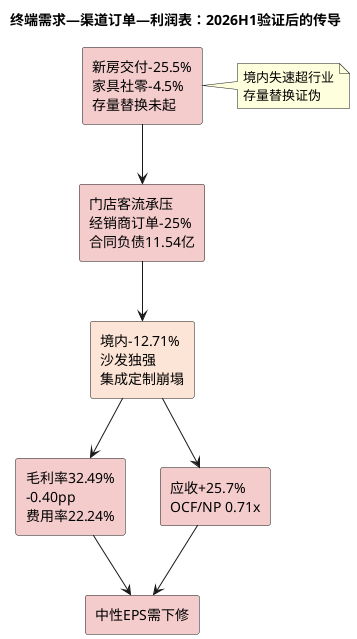

# 顾家家居：产业周期与终端穿透

**研究日期**：2026年08月31日

## 一页周期判断（2026H1后修正：境内失速幅度超行业）

| 需求层 | 最新信号（2026H1/1-7月） | 2026—2027基准判断 | 验证指标 |
|:--|:--|:--|:--|
| 新房交付/首次装修 | 住宅竣工1-7月-25.5%（H1 -25.3%未收敛），新开工-24.6%，销售面积-12.7% | 仍是国内需求主要拖累且边际未改善 | 竣工、施工、销售面积 |
| 二手房/改善装修 | 二手房交易未披露，但家居定制-38.67%显示改善需求亦弱 | 缓冲作用被证伪，难以对冲新房 | 定制/集成收入、门店客流 |
| 存量替换/以旧换新 | 家具类社零**1-7月-4.5%**（H1 -3.7%、7月单月-8.8%），以旧换新政策延续但成交仍降 | 政策未能扭转下滑，前置透支风险兑现中 | 家具社零、补贴落地、客单价 |
| 海外耐用消费 | 公司境外+19.01%但行业TDI成本+30%、人民币升值3%、美国软体关税延期至2027（25%现税负犹存） | 境外收入可对冲但需支付毛利+应收代价，属“代价式对冲” | 境外毛利、应收、运费、关税进度 |
| **顾家印证** | **境内-12.71%远弱于家具社零-3.7%/-4.5%，说明份额丢失而非跑赢** | **境内已从“跑赢行业”转为“跑输行业”** | 合同负债-25.1% YoY |

## 周期定位：新房后周期下行延续，存量更新未能对冲且顾家境内已跑输

| 周期指标 | 最新读数（截至2026-07） | 较7月26日研报时变化 | 含义 |
|:--|--:|:--|:--|
| 家具类零售额 | 1-7月1004亿 **-4.5%**；7月单月145亿 **-8.8%** | H1 -3.7%→1-7月-4.5%，**降幅扩大0.8pp** | 终端动销加速恶化，7月为年内最差单月之一 |
| 住宅竣工面积 | 1-7月13443万㎡ **-25.5%** | H1 -25.3%→1-7月-25.5%，**未收敛** | 新房配套需求池继续收缩 |
| 住宅新开工面积 | 1-7月19490万㎡ **-24.6%** | H1约-24%→-24.6% | 未来1-2年交付前瞻仍弱 |
| 住宅销售面积 | 1-7月37425万㎡ **-12.7%** | H1 -12.4%→-12.7% | 二手房/改善装修前瞻亦弱 |
| 顾家境内收入 | H1 45.61亿 **-12.71%** | 原研报假设0-4%增长，**证伪且跑输行业8.2pp** | 份额丢失，渠道效率问题暴露 |
| 顾家合同负债 | 11.54亿 **-25.1% YoY** | 原Q1 -3.89亿环比→H1 -30.5% vs年初 | 订单前瞻进入深度负区间 |

| 终端需求类型 | 顾家对应品类 | 当前验证结果 | 领先指标状态 |
|:--|:--|:--|:--|
| 新房首次装修 | 定制-38.67%、集成-29.05% | **主要拖累且幅度超预期** | 竣工-25.5%与定制收入高度同步 |
| 二手房/改善装修 | 沙发+13.81%但卧室-0.13% | 仅沙发单品支撑，改善需求未起 | 卧室停滞显示改善意愿弱 |
| 存量替换 | 家具社零1-7月-4.5% | **政策对冲证伪，透支风险兑现** | 补贴延续但零售仍降，以旧换新未转化为收入 |
| 海外耐用品 | 境外+19.01% | **以毛利-2.12pp+应收+25.7%为代价的增长** | 需验证回款与毛利能否企稳 |

最新数据彻底推翻“公司依靠渠道运营跑赢行业”的上半年乐观解读。家具社零1-7月-4.5%且7月-8.8%加速下滑，显示以旧换新等政策未能扭转存量市场颓势；顾家境内-12.71%更是显著跑输行业（-4.5%）约8.2个百分点，说明公司内销失速不仅是行业β，更包含α层面的份额或渠道效率问题。合同负债11.54亿同比-25.1%且环比Q1再降9.26%，与境内收入-12.71%相互印证，预示Q3订单仍承压。

## 终端拆分与跨期需求审计（2026H1后：前置透支兑现）

顾家H1产品分化为理解终端穿透提供了更细颗粒度证据：
- **沙发**：收入64.50亿+13.81%逆势增长，验证功能沙发仍具结构性需求，但毛利率35.16%同比-0.89pct且成本+15.40%快于收入，说明增长以成本让利为代价，非提价权。
- **卧室/床垫**：收入16.91亿-0.13%且毛利率39.83% -2.98pct，彻底逆转2025年“床垫毛利率+2.11pct至42.91%”的结构改善逻辑。卧室未能在存量替换中接力，睡眠赛道竞争（慕思AI床垫+95.69%但净利-48%，喜临门亏损）显示行业整体增利艰难。
- **集成/定制**：-29.05%/-38.67%崩塌，证明新房链对定制柜类的直接拖累远超模型假设的“低个位数增长”，“一体化整家”短期不能对冲地产。
- **信息服务**：-20.24%，高毛利小业务亦萎缩。

跨期需求审计结论从“存在前置风险”升级为“前置透支已兑现”：2025年家具零售+14.6%的高基数确由补贴脉冲驱动，2026年1-7月-4.5%的回落且降幅逐月扩大（6月-6.6%→7月-8.8%），符合“补贴前移—需求透支—基数透支”路径。以旧换新政策2026年延续优化（发改环资〔2025〕1745号、商务部等7部门2026通知），但地方执行中补贴品类、限额差异大，顾家境内-12.71%显示政策红利未转化为公司收入，模型不应再计入政策缓冲。

## 库存、供需与压力传导（2026H1：压力以“价+账期”而非库存暴涨传导）

| 库存/订单代理变量 | 2026H1最新事实 | 较Q1变化 | 正确解读 |
|:--|:--|:--|--|
| 表内库存（存货） | 18.19亿，-2.37% YoY | 19.21→18.19 -5.3% | 表内去库但境内-12.71%暗示渠道库存未去化 |
| 合同负债 | 11.54亿 **-25.11% YoY**，-30.51% vs年初 | 12.71→11.54 **-9.26% QoQ**（去年同期Q1→Q2 +2.5%）| 订单前瞻深度恶化，非季节性 |
| 应收账款 | 19.16亿 **+25.73% YoY** | 16.84→19.16 **+13.77% QoQ** | 以账期换境外收入，盈利质量转弱已确认 |
| 应付账款 | 19.80亿，+3.Some | — | 对上游占款未显著增强，定价权未改善 |

| 供需压力传导 | 2026H1已发生的财务表现 | 模型动作 |
|:--|:--|:--|
| 新房/社零走弱→客流降 | 境内-12.71%、合同负债-25%、销售费用仍+3.81% | **下调国内Q：境内全年假设由0-4%增→改为-8%至-12%** |
| 渠道库存积压→促销 | Q2毛利率31.35% vs 33.40%去年、综合-0.93pp | **下调毛利：境内高毛利稀释有限，综合毛利率由32.7%→32.0-32.5%** |
| 海外客户去库存→ODM波动 | 境外+19%但应收+25%、毛利率-2.12pp | **境外Q维持但下调质量：不预设ODM转OBM溢价** |
| 产能扩张早于需求 | 在建工程4.94亿+32.8%、短借+113% | **不计入印尼项目利润，且计入资本开支对现金流拖累** |

压力传导路径在2026H1已走完前半程：上游TDI均价1.63万+31% YoY（华东TDI 1.75-1.80万高位）推高中游海绵成本，但顾家因海外本土采购及集中采购缓冲，营业成本仅+1.36%快于营收+0.75% 0.61pp，未出现大幅成本失控；压力更多以“国内量崩+海外低价换量+费用刚性+应收拉长”形式传导，符合家具行业“需求弱→促销+账期”而非“工厂库存暴涨”的典型路径。

## 需求不是一个数字：2026H1结构性分化结论

1. **新房链仍为核心拖累且未见底**：竣工-25.5%、新开工-24.6%、销售-12.7%三项同步负增长且降幅未收窄，定制-38.67%与竣工同步，印证“新房交付→定制/集成”强关联。模型全年定制/集成假设需从“低个位数增长”下调至“双位数下滑”。
2. **存量替换对冲证伪**：家具社零1-7月-4.5%且7月-8.8%加速，境内-12.71%跑输社零，说明功能沙发+13.81%的单品亮点不足以拉动整体内销，存量市场竞争白热化下份额集中度提升并未惠及顾家内销。
3. **海外对冲的代价显性化**：境外+19.01%确对冲境内-12.71%，使总营收+0.75%勉强为正，但代价是境外毛利率-2.12pct+应收+25.7%+运输费率仍高位+汇率扰动（财务费用+1.21亿），海外业务从“利润对冲”降格为“收入对冲”。

## 供给、库存与牛鞭效应：2026H1再评估

TDI等原材料31%涨价未充分传导至家具出厂价（顾家综合毛利率仍降0.40pp），说明上游成本压力被中游吸收，下游议价能力弱。家具行业7,425家规上企业分散格局未变，供给出清缓慢，价格竞争将持续。顾家5,959家门店网络未披露H1净增减，但境内-12.71%暗示单店产出显著下滑，“门店数量≠单店效率”判断在H1得到验证。

印尼项目（总投11.24亿，建设期4年，达产3年，满产25.20亿收入）于2026年3月16日奠基、一期计划2027年3月投产，仍为2029年后选项。H1在建工程+32.8%至4.94亿显示投入已启动，短期仅增加折旧与现金流出。

## 本章对预测的红线与强制复核（2026H1后更新）

1. **终端景气**：国内新房相关需求偏弱且境内已跑输行业，存量更新不能对冲；海外19%增长以毛利与应收为代价。→ **盈利预测中境内全年假设下调至-10%±2%，海外+15%但毛利率下调**
2. **需求前置**：2025年补贴高增→2026年1-7月-4.5%且降幅扩大，前置透支已兑现，模型不计入政策缓冲。→ **删除原“0-4%境内增长”乐观假设**
3. **供需边际**：国内供给未出清，竞争以价/账期传导，顾家Q2毛利率31.35%已体现。→ **全年综合毛利率假设下调至32.0-32.3%（原32.7%）**

本章给盈利预测的硬约束更新为：境内全年 -12%至-8%（原0-4%），境外全年 +15%至+19%（原中个位数），但境外毛利率24-25%（原25.84%维持），合计总营收全年约201-203亿（原205.9亿），且需计入股本摊薄。

**主要证据**：国家统计局2026年1-7月社零（家具类1-7月1004亿-4.5%、7月145亿-8.8%）、房地产（住宅竣工13443万㎡-25.5%/销售37425万㎡-12.7%）、TDI价格（隆众上半年均价1.63万+31%/FX168+30%）、公司2026H1产品/地区分拆（沙发64.50亿+13.81%/境内45.61亿-12.71%/境外50.67亿+19.01%/合同负债11.54亿-25.1%/应收19.16亿+25.7%）、印尼项目奠基公告（2026-03-16，总投11.24亿，4年建设期）。
