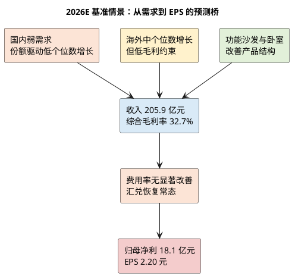

# 顾家家居：增长驱动与盈利预测

**研究日期**：2026年07月26日  
**预测锚点**：2026 年

## 建模原则

预测不使用卖方一致预期倒推。它以 2025 年收入 200.56 亿元、归母净利 17.90 亿元和 2026Q1 收入 +2.42%/扣非 -10.64%为起点，将国内、海外、产品结构和费用分别判断。国内家具社零与竣工数据弱，故不赋予行业顺风；外贸增长、功能沙发和卧室产品升级是可见增量，但海外低毛利和汇兑损益限制利润弹性。

| 增长驱动 | 量（Q）假设 | 价/结构（P）假设 | 2026 影响 | 确定性 |
|:--|:--|:--|:--|:--:|
| 国内软体与卧室 | 行业下行下靠份额实现 0-4%增长 | 功能及中高端产品提升结构，温和提价 | 稳住国内收入、改善毛利 | 3/5 |
| 定制及集成 | 低个位数增长或持平 | 整家协同提升客单，但竞争强 | 低于沙发的增长贡献 | 2/5 |
| 海外 ODM/跨境 | 非美市场及跨境驱动中个位数增长 | 低毛利收入占比上升，毛利承压 | 收入对冲国内弱势 | 3/5 |
| 精益与零部件 | 自动化、采购与自研协同 | 部分抵消运费、汇率和材料 | 净利率稳定关键 | 2/5 |

## 三态利润矩阵

| 情景 | 核心假设 | 2026 营收（亿元） | 归母净利（亿元） | EPS（元） | 概率 |
|:--|:--|--:|--:|--:|--:|
| 保守 | 国内收入 -4%，海外低个位数增；价格竞争和汇兑使净利率回落 | 196.4 | 15.2 | 1.85 | 30% |
| 中性 | 国内持平至低增，海外中个位数增长；功能/卧室结构与精益部分抵消成本 | 205.9 | 18.1 | 2.20 | 50% |
| 乐观 | 国内份额提升、海外订单较强；毛利率稳定且汇兑扰动收敛 | 216.3 | 20.8 | 2.53 | 20% |

| 从 2025A 到 2026E 的核心变化 | 方向 | 对中性 EPS 的含义 |
|:--|:--:|:--|
| 国内需求与定制/集成 | 压力 | 不以行业复苏外推增长 |
| 沙发、卧室结构 | 支撑 | 允许份额与产品升级抵消部分压力 |
| 海外收入 | 支撑但有质量约束 | 不把收入增长直接换算为利润溢价 |
| 销售、研发与汇兑 | 约束 | 费用率不显著改善，利润仅温和增长 |

EPS 按约 8.2145 亿股计算。中性情景只比 2025 年利润高约 1%，刻意没有把 2025 年 26%净利增速延续至 2026；这是对 Q1 扣非下行、家具社零和竣工数据的约束。乐观情景也不把印尼基地达产计入 2026，因为项目仍在建设期。保守情景对应国内需求继续转弱、经销商促销增多、海外毛利下降和汇兑损失扩大的组合。

2025 年国内毛利率 38.35%高于海外 25.84%，因此收入增长的质量取决于区域和产品结构，而不只是总增速。公司可通过功能沙发、床垫与高端系列提高国内结构，但集成产品和定制业务较低的毛利率决定其不能简单靠“全品类”扩张释放利润。2026Q1 存货、应收下降和经营现金流改善支持中性情景的现金转换；合同负债下降与扣非利润下滑则要求中报验证。

费用和现金流是模型的第二道约束。2025 年销售费用 34.37 亿元，是零售转型与门店服务的必要投入；若营收只低个位数增长，销售费用难以同比例下降，净利率就会有经营杠杆反噬。中性情景假定销售费用率不显著上升，研发保持高投入但不进一步大幅吞噬利润。2025 年经营现金流 27.74 亿元、净利 17.90 亿元，提供了充分的现金保障；但自由现金流不能把金融产品收回等偶发投资现金流混入。印尼基地和杭州总部的资本开支若集中发生，短期会降低自由现金流，故模型不给予“低 PCF”额外溢价。

从一季度倒推全年也必须克制。Q1 归母净利 4.96 亿元占 2025 全年净利约 28%，存在季节性；Q1 销售商品收现同比增加，经营现金流转正，但不能据此推断全年需求上行。模型选择将 2026 年营收只预测为 196-216 亿元的宽区间、净利率维持 7.7%-9.6%的情景带，目的是保留对需求、汇率和价格竞争的容错。中性 EPS 2.20 元的成立，不需要地产反转，只需要国内不进一步恶化、海外订单延续且财务费用恢复常态。

## 分业务 P×Q：2026 基准情景的可追溯推导

模型以 2025 年报的产品收入为底，而不是把公司总收入直接乘一个历史增速。Q 指标准套销售、门店动销、海外客户补货等综合数量变化；P 指标价、产品结构和渠道组合，而不是假定全面提价。由于公司未披露各品类单价和国内外产品销量，Q 与 P 只能是研究推断，故在表中明确证据、置信度和不计入项目。每项合计后得到 2026 年收入 205.9 亿元，同比增长 2.7%，与 2026Q1 的收入 +2.42%相容，但并不要求全年每个季度都保持该增速。

| 业务（2025收入） | 2026 Q 假设 | 2026 P/结构假设 | 2026E 收入 | 毛利率假设 | 证据与确定性 |
|:--|:--|:--|--:|--:|:--|
| 沙发（115.76亿元） | 销量 +3.0% | 功能/中高端结构 +1.5% | 121.0亿元 | 34.6% | 2025 销量 +13.41%、但毛利 -0.45pct；份额有证据，提价权有限，**3/5** [E1] |
| 卧室产品（34.65亿元） | 数量 +2.0% | 床垫/床架结构 +2.0% | 36.0亿元 | 42.5% | 2025 毛利 42.91%、收入 +6.63%；强竞品存在，**3/5** [E2] |
| 集成产品（23.14亿元） | 数量 -3.0% | 价格持平 | 22.5亿元 | 29.0% | 2025 收入 -5.03%、外购属性重，**2/5** [E2] |
| 定制家具（10.31亿元） | 数量 +1.0% | 整家客单结构 +2.0% | 10.6亿元 | 29.0% | 新房链弱、仅靠联单改善，**2/5** [E2][E4] |
| 信息技术服务（7.32亿元） | 客户数/服务量 +5.0% | 价格持平 | 7.7亿元 | 80.0% | 高毛利、小基数、2025 收入 +4.28%，**3/5** [E2] |
| 其他及未分产品收入（7.91亿元） | +2.0% | +0.0% | 8.1亿元 | 合并口径 | 不单独赋予高毛利，**2/5** |
| **合计** | — | — | **205.9亿元** | **32.7%** | — |

其中最关键的不是信息服务的高毛利，而是沙发和卧室两项合计占产品收入近八成。沙发基准 Q 只设 +3%，低于 2025 年 +13.41%的销量增速，原因是 2025 受份额改善和补贴环境支撑，而 2026H1 家具社零已经转负；P/结构只设 +1.5%，反映产品升级能够缓冲但无法在弱需求下自由提价。卧室产品设置更高毛利而不是更高销量，体现其消费升级属性，也与慕思、喜临门的睡眠竞争约束一致。集成和定制合计不被当作增长引擎：若地产交付继续下滑，其整家协同不足以保证双位数增长。这一处理贯彻前文红线，即将可量化的需求压力放入 E，而不是在估值时再重复扣减。

## 利润矩阵、费用弹性与分部模拟

| 中性利润表桥（亿元） | 金额 | 投资者应读出的结论 |
|:--|--:|:--|
| 2026E 收入 | 205.9 | 收入仅较 2025 年温和增长 |
| 2026E 毛利润 | 67.3 | 结构改善被海外与成本约束部分抵消 |
| 销售、管理、研发及财务费用 | 43.2 | 低增长下费用刚性仍高 |
| 归母净利 | 18.1 | 不是高增长情景，而是守住盈利质量的情景 |

中性情景的合并毛利率由 2025 年的 32.76%小幅降至 32.7%。这不是否定卧室和功能产品升级，而是同时计入境外收入增速快于境内、沙发成本率尚未改善、运输与汇兑成本仍有不确定性。销售、管理、研发及财务费用合计假设 43.2 亿元，约占收入 21.0%，较 2025 年不出现明显杠杆改善：销售费用随零售转型和海外服务温和增长，研发维持产品和零部件投入，财务费用从 2025 年低位正常化。该假设下经营利润约 24.1 亿元；扣除所得税、少数股东损益、运输及未分配总部费用、投资和其他损益后，归母净利校准为 18.1 亿元。

公司拥有不同经济属性的板块，故额外以框架要求的算法进行交叉验证：`板块模拟净利 = 板块收入 × [板块毛利率 −（合并期间费用率 × K）] ×（1 − 25%）`。K=1.0 用于沙发和卧室的成熟制造；K=1.2 用于集成、定制等销售与管理更复杂的业务；K=0.8 用于规模效应较强的信息服务。产品表中的毛利率并未逐项分摊运输费和总部费用，故模拟利润与报表净利之间专设“物流、总部及合并口径其他”调节项，不能误把未分摊利润当作真实分部净利。

| 2026E 分部模拟 | 模拟净利（亿元） | K | 解释 |
|:--|--:|--:|:--|
| 沙发 | 1.24 | 1.0 | 量增但成本率不明显改善，仍是绝对利润底座 |
| 卧室产品 | 0.58 | 1.0 | 高毛利结构贡献，受睡眠赛道竞争约束 |
| 集成与定制 | 0.10 | 1.2 | 联单价值存在，但地产与交付限制盈利弹性 |
| 信息技术服务 | 0.37 | 0.8 | 高毛利、小规模，不能主导公司估值 |
| 其他及未分配业务 | -0.07 | — | 低毛利其他收入的保守处理 |
| 物流、总部及合并口径其他调节 | -0.41 | — | 使分部模拟与合并归母净利勾稽 |
| **归母净利** | **18.1** | — | 与中性情景一致 |

上表金额以亿元表示，部分项目四舍五入。其目的不是制造虚假的分部精度，而是强迫模型回答“利润来自哪里”：基准利润仍主要来自沙发与卧室；集成/定制的收入规模并不等于利润贡献；信息服务尽管毛利高，但规模不足以单独改变估值体系。若 2026H1 显示销售费用率下降且卧室收入、毛利同时提升，最先上调的是该两块利润；若境外毛利、应收与运输费率同时恶化，则先下调沙发/海外相关利润，而不是用一条总收入增速掩盖质量变化。

## 2027 延展、场景概率与逻辑索引

2027 基准情景在不假设地产反转、不计入印尼基地达纲的前提下，设收入 214.9 亿元、归母净利 19.4 亿元、EPS 2.36 元：沙发和卧室各约增长 5%，集成产品仅恢复 1%，定制增长 4%，信息服务增长 5%。这是一种“份额和效率带来的温和修复”，不是产能大幅释放。2026 三态概率为保守 30%、中性 50%、乐观 20%，概率加权 EPS 约 2.16 元；其低于中性 EPS 的原因是国内需求和外部成本的下行尾部不能忽略。

- **[E1]** 2025 年年报：沙发销量、产量、收入、成本及毛利率。
- **[E2]** 2025 年年报：产品收入、产品毛利率及地区毛利率。
- **[E3]** 2026Q1：收入 +2.42%、扣非净利 -10.64%、研发和财务费用变动。
- **[E4]** 国家统计局 2026H1：家具社零与房地产交付/销售数据。
- **[E5]** 印尼项目可研：建设期四年、达纲需要三年；故不计入 2026—2027 基准增量。

这些假设的证据强度并不相同。已发生的 2025 产品结构和 2026Q1 费用变化为高确定事实；份额延续、海外订单和价格结构仅为中等确定推断；印尼达纲、政策持续或地产复苏则是低确定变量。模型因此选择低增长中性情景和较宽的保守—乐观区间，而不是用单点 EPS 制造确定性。

## 可证伪预测

若 2026H1 出现扣非净利同比继续两位数下降、销售费用率上升且合同负债/应收同时恶化，则中性情景应下调至保守情景；反之，若海外收入增长不以毛利下滑和应收大幅上升为代价、国内功能/卧室带动毛利率稳定，则中性假设成立。所有后续估值均基于上述 EPS，而不是对历史低 PE 的机械均值回归。

**数据与证据**：公司年报产品/地区拆分、公司 Q1 报告、项目统一视图历史财务数据；以上为研究者情景预测，不构成业绩承诺。
