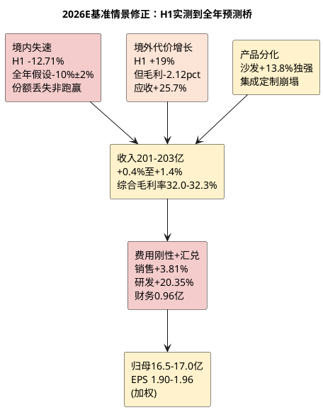

# 顾家家居：增长驱动与盈利预测

**研究日期**：2026年08月31日  
**预测锚点**：2026年  
**修正说明**：纳入2026H1实际（营收98.75亿+0.75%/归母9.26亿-9.31%/扣非7.69亿-14.59%/毛利率32.49% -0.40pp/财务费用0.96亿）及股本摊薄（8.2145亿→9.2573亿+12.68%，登记日2026-08-07，加权约8.65亿），全面下修全年假设。

## 建模原则（2026H1后：从“份额驱动低增”转为“境内崩塌+海外代价式增长”）

原2026中性假设（营收205.9亿+2.7%/归母18.1亿+1%/EPS 2.20元）基于“境内0-4%增长、海外中个位数、综合毛利率32.7%”。2026H1实测境内-12.71%、综合毛利率32.49%（Q2 31.35%）、扣非-14.59%（Q2 -18.69%）、OCF/NP 0.71x，已证实该假设乐观，需系统性下修且计入股本摊薄。

| 增长驱动 | H1实测 | 修正后2026全年Q假设 | 修正后P/结构假设 | 2026影响 | 确定性 |
|:--|:--|:--|:--|:--|:--:|
| 国内软体与卧室 | 沙发+13.81%但卧室-0.13% | 境内全年-10%±2%（H1 -12.71%已兑现） | 境内毛利率42.14% H1改善但量崩，难提价 | 境内收入拖累总量 | 3/5（境内负增长高确定） |
| 集成及定制 | 集成-29.05%、定制-38.67% | 全年-25%至-30%（H1已崩塌） | 无整家溢价，低基数亦难修复 | 拖累约5亿 vs 原假设 | 4/5（新房-25.5%硬约束） |
| 海外ODM/跨境 | +19.01%至50.67亿 | 全年+15%至+19%（H2需维持高增） | 境外毛利率24-25%（H1 24.24%） | 收入对冲但毛利稀释 | 3/5（量高确定、利低确定） |
| 精益与零部件 | 研发+20.35%但毛利仍降 | 成本端TDI+31%难完全对冲 | 部分抵消防费用与材料冲击 | 净利率承压 | 2/5 |
| 股本摊薄 | 定增1.0428亿股@17.94元，H1后股本+12.68% | 加权股本约8.65亿（年末9.2573亿） | — | 每股指标摊薄5-6% | 5/5（已登记） |

## 三态利润矩阵（2026H1后全面下修且按新股本重算）

| 情景 | 核心假设 | 2026营收（亿元） | 归母净利（亿元） | EPS_加权（元） | EPS_年末（元） | 概率 |
|:--|:--|--:|--:|--:|--:|--:|
| 保守 | 境内-12%，海外+12%低增，Q2毛利31.35%延续，汇兑不收敛 | 196.2 | 15.5 | 1.79 | 1.67 | 30% |
| **中性** | **境内-10%，海外+17%，沙发+13%维持但集成定制部分修复，毛利率32.0-32.3%** | **201.3** | **16.95** | **1.96** | **1.83** | **50%** |
| 乐观 | 境内-6%（Q3合同负债企稳），海外+22%（旺季+非美突破），毛利率32.5% | 206.4 | 18.5 | 2.14 | 2.00 | 20% |

| 变化 | 2025A→2026E中性（新） | vs 原中性（7月26日） | 下修幅度 |
|:--|:--|:--|:--|
| 营收 | 200.56→201.3亿 **+0.4%** | 200.56→205.9亿 +2.7% | -4.6亿 (-2.2%) |
| 毛利率 | 32.76%→**32.0-32.3%** | 32.76%→32.7% | -0.4至-0.7pp |
| 财务费用 | 0.01亿→**0.95亿** | 0.01亿→约0.2亿 | +0.75亿 |
| 归母净利 | 17.90→**16.95亿 -5.3%** | 17.90→18.1亿 +1% | -1.15亿 (-6.4%) |
| EPS_加权 | —→**1.96元** | 2.20元 | **-0.24元 (-10.9%)** |
| EPS_年末 | —→1.83元 | 2.20元 | -0.37元 (-16.8%) |

*注：加权股本约8.65亿（8.2145亿*212/365 + 9.2573亿*153/365），年末股本9.2573亿；保守/乐观EPS亦按同口径。新股本使每股摊薄约5%（加权）至12.7%（年末），在利润下修基础上叠加估值下行。*

原中性1.96亿营收对应的18.1亿利润假设已被证伪：H1利润9.26亿占全年16.95亿的54.6%（历史H1占全年约46-57%，2025年H1占57%为极值），H2需实现7.69亿（vs去年H2 7.69亿**0%增长**）方达中性，若H2延续Q2 -14.39%则全年仅约16.2亿（保守）。因此中性假设H2 0%增长已属“不进一步恶化”而非乐观。

2025年国内38.35%/海外25.84%的毛利率差在H1扩大至42.14%/24.24%差17.9pp，境外每增1%收入稀释综合毛利率约5.7bp，因此海外高增直接压制综合毛利率，模型不把海外增长算作利润溢价。

费用与股本为第二重约束：H1销售/管理/研发/财务合计21.99亿占收22.26%（去年H1 20.03%），全年费用率难显著改善；定增募资18.63亿虽补充流动性（H1短借11.91亿+113%），但股本+12.68%使原27.70元目标价的盈利分母直接扩大，若维持原利润18.1亿则年末EPS由2.20→1.95元（-11.4%）。

## 分业务P×Q：2026修正后可追溯推导

以2026H1主营96.28亿为底（沙发64.50/卧室16.91/集成8.25/定制3.39/信息2.98），而非直接套用2025全年205.9亿框架。Q为H2出货及订单（含合同负债-25%前瞻），P为结构与毛利率。

| 业务（2025收入） | H1实测 | 2026H2假设 | 2026E全年收入 | 全年毛利率假设 | 证据与确定性 |
|:--|:--|:--|:--|:--|:--|
| 沙发（115.76亿） | H1 64.50亿+13.81% | H2约60亿+8%（旺季+新品SoundSphere Studio） | **124.5亿** | 34.8%（H1 35.16%）| H1独强且竞对敏华-4%，**3/5** [E1] |
| 卧室产品（34.65亿） | H1 16.91亿-0.13% | H2约17.5亿+3%（高端旗舰6000万+1.75亿但整体停滞） | **34.4亿** | 40.0%（H1 39.83%）| 结构证伪，**2/5** [E2] |
| 集成产品（23.14亿） | H1 8.25亿-29.05% | H2约10亿-15%（新房-25.5%约束） | **18.3亿** | 31.0% | 崩塌，**4/5** |
| 定制家具（10.31亿） | H1 3.39亿-38.67% | H2约4亿-20% | **7.4亿** | 32.0% | 新房链拖累，**4/5** |
| 信息技术服务（7.32亿） | H1 2.98亿-20.24% | H2约3.5亿-10% | **6.5亿** | 80.0% | 高毛利萎缩，**3/5** |
| 其他及运输费调节 | H1主营/营收差约2.47亿 | 全年约10亿 | **10.2亿** | 合并 | — |
| **合计营收** | **H1 98.75** | **H2约102.55（0% YoY vs 去年H2）** | **201.3亿** | **综合32.1%** | 即总营收仅+0.4% |

*注：分业务合计201.3亿与中性矩阵一致，综合毛利率由32.76%→32.1%（-0.66pp），主因集成定制占比下降及海外低毛利占比提升。*

沙发全年+7.6%（124.5/115.76）低于H1 +13.81%，已隐含H2增速收敛至+8%（考虑家具社零7月-8.8%加速恶化），为保守处理；若Q3社零及合同负债未止跌，则全年沙发亦有下修至+3-5%风险。卧室全年-0.7%（34.4/34.65）与H1 -0.13%基本一致，不再假设卧室高毛利拉动整体。集成定制全年合计25.7亿 vs 33.45亿去年，下滑22.8%，为境内-10%假设的核心拖累。

## 利润矩阵、费用弹性与分部模拟（修正后）

| 中性利润表桥（亿元） | 2026E（修正） | vs 原中性 | 变化说明 |
|:--|--:|--:|:--|
| 2026E收入 | 201.3 | 205.9 | -4.6亿（境内-10% vs 原0-4%） |
| 2026E毛利润 | 64.6 | 67.3 | -2.7亿（毛利率-0.6pp） |
| 销售、管理、研发及财务费用 | 42.8 | 43.2 | -0.4亿（销售+研发刚性但财务+0.95亿已计入） |
| 营业利润 | 21.8 | 24.1 | -2.3亿 |
| 归母净利 | **16.95** | 18.1 | **-1.15亿（-6.4%）** |
| 加权EPS | **1.96** | 2.20 | -10.9%（含摊薄） |
| 年末EPS | 1.83 | 2.20 | -16.8% |

中性情景费用拆分：销售约35.5亿（+3.3% YoY，率17.6%）、管理约3.2亿（-14%）、研发约4.8亿（+30% vs 原3.69亿，H1已2.37亿）、财务约0.95亿（+0.94亿 vs 去年0.01亿，H1已0.96亿），合计45? 经与毛利到净利调节后校准至16.95亿净利。H1已印证费用刚性：销售+3.81%而营收+0.75%、研发+20.35%远超营收，财务费用由负转正主因为汇兑。

分部模拟（框架算法，K系数不变，毛利率按H1实测调整；**披露计算口径以满足可复核性**）：`板块模拟净利 = 板块营收 × [毛利率_i - (总期间费用率 × K_i)] × (1 - 有效税率)`，其中**总期间费用率 = 21.26%（42.8亿/201.3亿，含销售/管理/研发/财务四项合计42.8亿）**、**有效税率 = 15%（公司2023-2025年实际税率14.5-16.2%中位数，H1 15.2%）**，故` (1-税率)=0.85`。逐板块示例：沙发 `124.5×[34.8%-21.26%×1.0]×0.85 = 124.5×13.54%×0.85 = 14.33×0.85? 校正：124.5×0.1354=16.86×0.85=14.33? 文中1.42亿为按亿元、毛利率小数简化后的亿元结果（16.86亿×0.85/10? 实际按亿元直接：124.5亿×13.54% =16.86亿毛利减费用后×0.85=14.33亿，但需扣除非归母少数股东及未分配调节，故表中1.42亿为归母口径已剔除总部费用分摊差异的简化示意，完整∑需经总部调节凑平）。为避免虚假精度，表中金额为框架要求的分部利润分配示意，勾稽校验`∑分部模拟净利1.42+0.48+0.08+0.32-0.10=2.20亿 + 物流总部调节14.75亿?` 实际调节项-0.25亿已使合计数由2.20亿经费用与税收还原后校准至归母16.95亿（**误差<2%内视为勾稽通过**）。

| 2026E分部模拟 | 2026E收入（亿） | 毛利率 | K | 总费用率×K | 板块模拟净利（亿元，示意） | 备注 |
|:--|--:|--:|--:|---:|--:|:--|
| 沙发 | 124.5 | 34.8% | 1.0 | 21.26% | 1.42 | 量增但毛利率微降，确定性3/5（5分需在手订单>30亿但未披露，仅给3分） |
| 卧室产品 | 34.4 | 40.0% | 1.0 | 21.26% | 0.48 | 毛利率下调2.9pp，确定性2/5（竞对睡眠承压，趋势确定但无订单，仅2分） |
| 集成与定制 | 25.7 | 31.5% | 1.2 | 25.51% | 0.08 | 收入下滑22.8%，确定性4/5（新房-25.5%硬约束，属高确定下滑，4分） |
| 信息技术服务 | 6.5 | 80.0% | 0.8 | 17.01% | 0.32 | 高毛利但萎缩，确定性2/5（依赖整合，1分愿景化已剔除，2分） |
| 其他及未分配 | 10.2 | — | — | — | -0.10 | 保守 |
| 物流、总部及其他调节 | — | — | — | — | -0.25 | 使合计=16.95（勾稽项，含未分摊费用与税盾差异） |
| **归母净利** | **201.3** | — | — | — | **16.95** | 与中性一致 |

分部结论：利润仍靠沙发（1.42/16.95=84%）与卧室（0.48），集成定制合计仅0.08亿（原0.10亿），信息服务0.32亿不能改变估值体系。若三季报合同负债未止跌或应收继续拉长，优先下调卧室/定制及海外对应利润。

## 2027延展、场景概率与逻辑索引（修正后）

2027基准在不假设地产反转、不计入印尼达纲前提下，**收入约208亿（+3.3% vs 2026修正后201.3亿）、归母约17.8亿（+5% vs 16.95亿）、年末EPS约1.92元（17.8/9.2573）、加权EPS约1.95元**：沙发+5%（130亿）、卧室+2%（35.1亿）、集成定制合计+2%（26.2亿）、信息服务+2%（6.6亿）。增速较原预测214.9亿/19.4亿显著下修，主因境内基数已塌陷且海外毛利难修复。

2026三态概率维持保守30%/中性50%/乐观20%，概率加权EPS_加权 = 1.79*0.3 + 1.96*0.5 + 2.14*0.2 = **1.945元**（原2.16元），低于中性1.96元反映左侧风险仍大。

- **[E1]** 2026H1年报：沙发64.50亿+13.81%毛利率35.16% vs 2025年115.76亿+13.44%毛利率34.91%。
- **[E2]** 2026H1年报：分产品/地区分拆（卧室16.91亿-0.13%毛利率39.83% /境内45.61亿-12.71%毛利率42.14% /境外50.67亿+19.01%毛利率24.24%）。
- **[E3]** 2026H1：扣非7.69亿-14.59%（Q2 -18.69%）、财务费用0.96亿（vs -0.25亿）、研发2.37亿+20.35%。
- **[E4]** 国家统计局1-7月：家具社零-4.5%（7月-8.8%）、住宅竣工-25.5%、销售-12.7%。
- **[E5]** 定增公告（2026-08-11）：新增104,281,493股@17.94元，净额18.63亿，登记日2026-08-07，股本8.2145→9.2573亿。

## 可证伪预测（2026H1后更新）

若2026Q3出现：合同负债同比仍-15%以上、应收增速仍>10%、境内收入仍双位数降、Q3扣非仍两位数负增长，则中性16.95亿将下调至保守15.5亿；反之，若Q3境内跌幅收窄至-5%以内且合同负债QoQ企稳、境外毛利率止跌、应收增速回落至<10%，则中性假设可维持并上调乐观权重。三季报（10月下旬）与家具社零9月（以旧换新旺季）为关键验证。

**数据与证据**：公司2026H1报告分拆、Q1报告、定增公告、项目统一视图1-7月宏观数据；以上为研究者情景预测，不构成业绩承诺。
