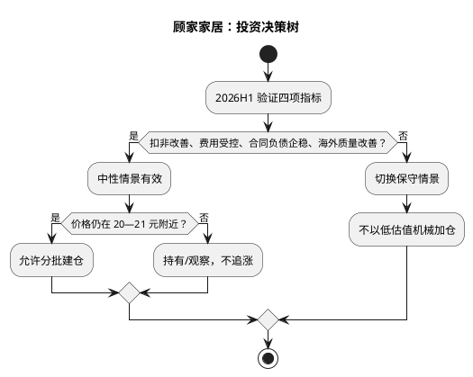

# 顾家家居：投资摘要与风险因素

**研究日期**：2026年07月26日

## 投资摘要

| 投资驾驶舱 | 当前读数 | 决策含义 |
|:--|:--|:--|
| 评级 | 持有/观察，回调建仓 | 不是高胜率追买位置 |
| 现价 / 中性目标价 | 23.83 / 27.70 元 | 中性上行有限 |
| 概率加权价值 | 约 27.0 元 | 已计入尾部风险后的价值 |
| 主要上行证据 | 沙发/卧室结构、现金流、低估值 | 需由中报继续验证 |
| 主要下行证据 | 国内需求、海外毛利/应收、费用与汇兑 | 任两项共振即转保守情景 |

| 风险 | 领先指标 | 预警阈值 | 模型动作 |
|:--|:--|:--|:--|
| 国内需求/渠道 | 家具社零、合同负债、净关店 | 需求低迷且订单继续下滑 | 下调内销数量假设 |
| 竞争/促销 | 沙发毛利率、销售费用率 | 毛利下降与费用上升共振 | 下调利润率 |
| 海外质量 | 境外毛利、应收、运输费率 | 收入增长但三项恶化 | 下调海外利润与 PE |
| 汇率/关税 | 财务费用、原产地与客户分担 | 汇兑损失扩大或成本转嫁失败 | 下调 EPS，不重复折价 |
| 海外基地 | 资本开支、进度、利用率 | 延期或回报低于预期 | 不计入远期成长溢价 |

顾家家居的首次覆盖结论为：**持有/观察，回调建仓；定位第三象限“防御价值”**。公司是软体家居龙头，2025 年在国内家具需求承压的背景下实现收入 200.56 亿元、归母净利 17.90 亿元，经营现金流 27.74 亿元，OCF/净利 1.55x；沙发和卧室品类增长、国内毛利率 38.35%及覆盖近六千家的门店网络显示其具备较强的逆周期份额能力。7 月 24 日 PE TTM 11.08x、PB 1.77x、PCF 6.83x，均处近五年低位，估值已反映相当一部分悲观预期。

但低估值不是立即买入信号。2026Q1 营收仅 +2.42%，扣非净利 -10.64%，且 2026H1 家具类社零 -3.7%、住宅竣工 -25.3%，国内需求仍在向公司传导。海外收入增长可对冲内需，却毛利率仅 25.84%，同时带来应收、汇率和关税变量。中性预测 2026E EPS 为 2.20 元，PE/PB-ROE 加权目标价为 27.70 元；保守/乐观目标价 18.50/37.95 元。以 23.83 元不复权现价计算，中性盈亏比约 0.74，安全边际不够；20—21 元是更合理的观察建仓区。

这一定性不依赖于“房地产反转”或印尼基地提前投产。投资逻辑只要求四件可验证的事同时不恶化：沙发和卧室继续以份额/结构跑赢行业；境外收入的增长不再以毛利率、应收与运输费率恶化为代价；销售和研发投入在收入低增下不失控；经营现金流继续覆盖利润。它也明确承认四件尚未获得验证的事情：国内存量更新能否完全替代交付需求、海外 OBM 是否能提高利润率、智能零部件能否提升 ROIC、印尼基地是否按成本和时间建成。因此结论应是有条件的价值跟踪，而不是对行业周期的方向性押注。

## 三态定价与决策含义

| 情景 | 概率 | 2026E EPS | 目标价（不复权） | 触发组合 | 投资含义 |
|:--|--:|--:|--:|:--|:--|
| 保守 | 30% | 1.85 元 | 18.50 元 | 社零/交付续弱，渠道促销压价，海外毛利和汇兑恶化 | 不以低 PE 加仓，先下调盈利 |
| 中性 | 50% | 2.20 元 | 27.70 元 | 内销低增长、海外稳定，费用率不明显抬升 | 价值修复但上行有限 |
| 乐观 | 20% | 2.53 元 | 37.95 元 | 沙发卧室份额延续、海外回款和毛利改善 | 需要事实而非预期确认 |
| **概率加权** | **100%** | **2.16 元** | **约 27.0 元** | — | 低于中性价，反映左侧风险 |

三态的意义是把“市场低估”拆成可反驳的命题。现价处于五年低估值分位，确实提高了上行情景的可实现性；但保守价距离现价 5.33 元，而中性目标价只高 3.87 元，故在现价直接按中性目标建仓并不具备优良的赔率。若回调到 20—21 元而中报前瞻指标未恶化，保守下行将收窄，赔率才显著改善；若价格先上行至 27—28 元但盈利尚未上修，则应把它视为估值兑现而非新的追买点。

## 风险优先级

1. **国内需求进一步下滑（高）**：竣工与家具社零持续走弱，会同时压低门店客流、经销商订单和定制需求。  
2. **竞争及促销加剧（高）**：功能沙发、床垫和整家赛道竞争强，价格战将先侵蚀毛利率和销售费用率。  
3. **海外业务质量下降（高）**：外贸收入增长若伴随毛利率下降、应收上升或客户去库存，收入增长将不能转为利润。  
4. **汇率、关税和海外产能爬坡（中高）**：Q1 财务费用已显示汇兑影响；印尼项目长周期、重执行。  
5. **渠道与营运资本（中）**：合同负债持续下降、经销商库存再积压或应收回升，会削弱现金流质量。  
6. **并购协同未达预期（中）**：登丰等零部件整合若不能改善产品能力和成本，可能拉低 ROIC。

风险排序遵循对估值的实际影响，而不是新闻热度。国内需求、竞争促销和海外盈利质量位于最高级，因为它们会直接进入收入、毛利和费用，改变 EPS；汇率/关税与海外基地执行既有可量化成本、也有较难量化的尾部风险，部分进入 EPS、部分维持倍数折价；渠道、营运资本和并购协同则是前述三类风险是否正在变成报表问题的领先指标。研究禁止把“印尼项目”“智能产品”“国补”之类叙事直接视为利好，除非能在对应的收入、毛利、现金回收或 ROIC 上看到增量。

## 研究结论象限

| 维度 | 判断 |
|:--|:--|
| 确定性 | 中高：现金流、品牌、渠道及存量产品竞争力较稳定，但需求和海外利润不稳定 |
| 预期收益空间 | 中低：中性上行 16.2%，但保守下行 22.4% |
| 象限 | **第三象限：防御价值** |
| 建议 | 持有/观察；回调至 20-21 元且验证指标未恶化后再逐步建仓 |

本结论的核心不是“家居行业见底”，而是“优秀龙头在低估值下仍值得跟踪”。若中报显示扣非恢复、销售费用受控、合同负债企稳且境外毛利率未继续下滑，可上调确定性；反之，应按保守情景调整。

从组合角度，顾家不适合被当成高弹性地产反转交易，也不适合因 PE 低而一次性重仓。它更适合在组合中充当现金流与估值防御型观察仓：当市场对家居需求的担忧充分反映、而公司份额和现金流仍稳定时，回调可以创造不对称机会；当价格先于基本面反弹至中性目标价附近时，应把估值纪律置于“龙头叙事”之上。8 月中报是首次覆盖后最关键的事实检验，它会决定当前第三象限定位能否向第一象限靠近，或必须转入回避/等待。

研究也明确保留了上行情景：若国内功能与卧室品类继续在低迷行业中取得份额，境外业务从 ODM 逐步提高 OBM/跨境占比且毛利率企稳，海外产能布局的价值会在未来几年释放。但这些是需要订单、产能利用率和利润率逐一验证的期权，而非今天应该提前支付的估值。当前更合适的决策是将公司纳入重点跟踪池，并用可量化阈值替代主观乐观。

## 首次覆盖后的行动清单

1. **评级与仓位语言**：维持“持有/观察、回调建仓”，不使用“买入”或“高弹性反转”描述。这个表述不是回避结论，而是对当前 0.74 盈亏比和未验证的需求/海外变量负责。
2. **上调条件**：2026H1 或后续季报出现扣非利润恢复、销售费用率不升、合同负债企稳，且境外收入增长不伴随应收增速明显快于收入或毛利率下滑；技术上以不复权 25.19 元对应的 MA60 放量站稳为配合信号。
3. **下调条件**：扣非利润连续两期两位数下滑，同时合同负债、应收周转或门店净关店至少两项恶化；此时直接切换保守利润情景，不等待“行业回暖”。
4. **长期重估条件**：只有功能/睡眠产品的单位盈利、海外 OBM 占比和海外基地资本回报被财报持续证实，才讨论由成熟制造估值向更高品牌估值迁移。

这份首覆盖的核心贡献，是把顾家放入“质量尚可、赔率仍不足”的位置。现金流和低估值使其值得持续研究，但 2026 年并不是把估值低位等同于无条件安全的年份；下一次报告披露应被用来检验模型，而不是用来为既有立场寻找佐证。
