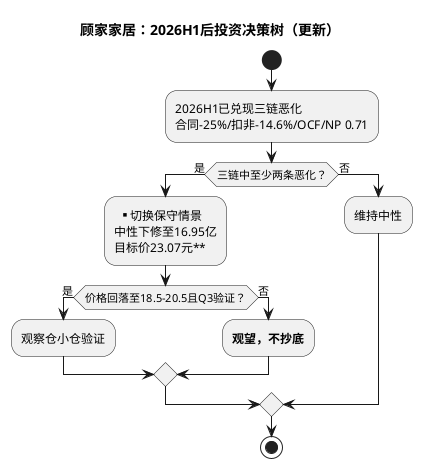

# 顾家家居：投资摘要与风险因素

**研究日期**：2026年08月31日

## 投资摘要（2026H1后：从“回调建仓”下调至“观望等待验证”）

| 投资驾驶舱 | 2026-08-31 读数 | 2026-07-26 读数 | 决策含义 |
|:--|:--|:--|:--|
| 评级 | **持有/观望，等待验证**（原持有/观察，回调建仓） | 持有/观察，回调建仓 | 不再主动寻找回调买点 |
| 现价 / 中性目标价 | **23.61 / 23.07元** | 23.83 / 27.70元 | 现价已高于中性价，上行-2.3% |
| 概率加权价值 | **约22.55元** | 约27.0元 | 加权较现价-4.5% |
| 保守/乐观价 | **16.74 / 29.98元** | 18.50 / 37.95元 | 均因盈利下修+摊薄而下移 |
| 盈亏比 | **-0.15**（(22.55-23.61)/(23.61-16.74)） | 0.74 | **由正转负，无赔率** |
| 主要上行证据 | 沙发+13.81%（64.50亿）为唯一亮点 | 沙发/卧室结构、低估值 | 收窄至单品 |
| 主要下行证据 | **三链共振恶化**：境内-12.71%/合同-25%/OCF/NP 0.71 | 国内/海外/费用 | 已兑现，不再是风险提示 |

| 风险 | 领先指标（H1兑现） | 预警阈值（已触发） | 模型动作（已执行） |
|:--|:--|:--|:--|
| 国内需求/渠道 | 家具社零1-7月-4.5%（7月-8.8%）、合同11.54亿-25.1% YoY、境内-12.71% | 已触发“>15%下降” | 境内全年-10%±2%（原0-4%） |
| 竞争/促销 | 沙发毛利率35.16% -0.89pct、Q2综合31.35% -2.05pp | 毛利与费用共振恶化 | 综合毛利率32.0-32.3% |
| 海外质量 | 境外毛利率24.24% -2.12pct、应收+25.7% | 三项恶化已触发 | 海外毛利下调、PE折价保留 |
| 汇率/关税 | 财务费用0.96亿（vs -0.25亿）、人民币+3%、关税25% | 汇兑+1.21亿已兑现 | 财务费用0.95亿、PE -5% |
| 海外基地 | 在建4.94亿+32.8%、短借+113% | 投入加速 | 不计入利润、折价-2% |
| 现金流 | OCF 6.59亿-39.76%、OCF/NP 0.71x | 已跌破0.8x警戒 | 新增PE折价-3% |

**首次覆盖→H1后修正的核心变化**：公司从“2025年跑赢行业（内贸+6.18% vs 社零+14.6%）”转为“2026H1跑输行业（境内-12.71% vs 社零-4.5%）”，且三链恶化已满足跟踪手册“切换保守情景”条件。中性盈利从18.1亿下修至16.95亿（-6.4%），加权EPS由2.16→1.945元（-10%），股本由8.2145→9.2573亿摊薄12.7%，目标价由27.70→23.07元（-16.7%），盈亏比由0.74→-0.15转负，评级从第三象限防御价值向第四象限回避边缘移动。

但低估值不再构成买入理由：2026-08-31 PE TTM 12.89x（原11.08x）、PB 2.10x（原1.77x）已从5年低分位回升至约30-35%分位，盈利下修快于股价调整，安全边际收窄。境内-12.71%的崩塌幅度远超社零，说明需求端已从“行业β”演变为“公司α”问题，需Q3验证是否为份额丢失或渠道失速。

该结论不依赖“地产反转”或印尼基地投产（2027年3月一期投产，2029年后才达纲），仅要求四项验证中至少三项企稳：①境内跌幅收窄至-5%以内、②合同负债YoY跌幅<15%且QoQ止跌、③OCF/NP回升至>0.8且应收增速<10%、④境外毛利率止跌。

## 三态定价与决策含义（计入摊薄与下修）

| 情景 | 概率 | 2026E归母（亿） | EPS_加权 | EPS_年末 | 年末目标价（不复权） | 触发组合 | 投资含义 |
|:--|--:|--:|--:|--:|--:|:--|:--|
| **保守** | 30% | 15.5 | 1.79 | 1.67 | **16.74元** | 社零/交付续弱，Q2毛利率31.35%延续，汇兑不收敛 | 风控锚，不以低PE加仓 |
| **中性** | 50% | 16.95 | 1.96 | 1.83 | **23.07元** | 境内-10%、海外+17%、毛利率32.0-32.3% | 现价上方-2.3%，无上行 |
| **乐观** | 20% | 18.5 | 2.14 | 2.00 | **29.98元** | 境内-6%、海外+22%、旺季+新品放量 | 需Q3实质验证 |
| **概率加权** | 100% | 16.98 | **1.945** | — | **约22.55元** | — | 低于中性，反映左侧风险 |

原三态27.70/18.50/37.95→现23.07/16.74/29.98，下修幅度-16.7%/-9.5%/-21.0%，主因盈利-6.4%叠加股本+12.7%摊薄。现价23.61已高于中性23.07（-2.3%）及加权22.55（-4.5%），中性盈亏比-0.15为负，理想建仓区由20-21元下移至**18.5-20.5元**（对应保守价上方10-22%安全垫，需更严苛验证）。

三态意义在于证伪低估值幻觉：即使PE维持11.76x（仅较原12.6x下调0.84x），利润与股本双杀已使中性价跌破现价，抢反弹需等待价格回落至18.5-20.5元且三链验证，而非现价介入。

## 风险优先级（2026H1后：三链恶化已兑现，风险由“预警”升为“已触发”）

1. **国内需求与订单失速（已触发，高）**：境内-12.71%（跑输社零8.2pp）、家具社零1-7月-4.5%且7月-8.8%加速、合同-25.1% YoY且QoQ -9.26%（去年+2.5%），定制-38.67%/集成-29%印证新房链拖累。→ 已兑现为境内收入崩塌，Q3若合同仍<-15%则全年可能跌破196亿保守营收。
2. **盈利质量与费用刚性（已触发，高）**：扣非-14.59%（Q2 -18.69%）、综合毛利率32.49% -0.40pp（Q2 -2.05pp）、销售+3.81%/研发+20.35%/财务+1.21亿致费用率22.26% vs 20.03%去年。→ 已兑现为Q2利润加速下滑。
3. **海外以质换量与现金流恶化（已触发，高）**：境外+19%但毛利率-2.12pct、应收+25.7%远快于营收、OCF/NP 0.71x跌破1.0且OCF -39.76%、短借+113%至11.91亿。→ 已兑现为现金转化破1x，海外增长不可持续若回款不改善。
4. **汇率、关税与原材料（中高，持续）**：人民币1H升值3%致130家公司预告汇兑损失、关税现行25%（2027拟提30%延期但转运审查40%）、TDI+31%致海绵+40%。→ H1财务费用+1.21亿已兑现，H2若人民币持续强势则继续压制。
5. **渠道与营运资本（中，高）**：合同-25%+应收+25%+存货去化有限，5,959家门店单店产出估算双位数下滑。→ 单店效率证伪，渠道库存风险未除。
6. **海外基地与并购（中）**：印尼在建+32.8%至4.94亿、建设期4年，登丰/锴创协同未体现为毛利率提升（沙发毛利率仍-0.89pct）。→ 资本开支前置，ROIC 7.65% vs 9.00%去年已降。

风险排序已从“预警”转为“已触发”：前三项（需求/盈利/现金）均已兑现且满足手册证伪条件，估值从“盈利折价”升级为“现金+订单双折价”（PE -16% vs 原-10%）。

## 研究结论象限（2026H1后下调）

| 维度 | 2026-08-31判断 | 2026-07-26判断 | 变化 |
|:--|:--|:--|:--|
| 确定性 | **中低**：三链共振恶化，境内失速超行业且跑输8.2pp | 中高 | 下调一档 |
| 预期收益空间 | **负**：中性-2.3%、加权-4.5%，盈亏比-0.15 | 中低：+16.2% | 转负 |
| 象限 | **第三象限偏第四象限（防御价值→回避/观望边缘）** | 第三象限：防御价值 | 向第四象限移动 |
| 建议 | **持有/观望，等待验证；不抄底，不追涨** | 持有/观察；回调至20-21元建仓 | 取消建仓指引 |

**象限迁移路径**：原第三象限（高确定性+低收益）的“低收益”已转为负收益，确定性亦由中高→中低，整体向第四象限（低确定性+低/负收益）滑动。若Q3境内跌幅收敛至-5%以内且合同/现金企稳，可维持第三象限；若Q3继续三链恶化，则正式转入第四象限回避。

本结论的核心从“龙头在低估值下值得跟踪”转为 **“龙头在三链恶化与股本摊薄下需等待右侧”**。8月H1已证实中性假设过于乐观，三季报（10月下旬）将决定是否从“观望”转为“回避”或“战术反弹”。

从组合角度，顾家不再适合作为“现金流防御型观察仓”在现价持有：OCF/NP 0.71x已破坏现金流防御叙事，且现价高于中性与加权，组合中应降至**标配以下或观察仓**，仅在18.5-20.5元且三链验证后再考虑战术配置。

## H1后的行动清单（更新）

1. **评级与仓位语言**：由“持有/观察，回调建仓”下调至 **“持有/观望，等待验证”** ，取消20-21元建仓指引，改为18.5-20.5元“观察区”且需三重验证。该表述对-0.15盈亏比与三链恶化负责。
2. **上调条件（苛刻）**：2026Q3出现：①境内收入YoY跌幅收窄至-5%以内、②合同负债YoY跌幅<15%且QoQ止跌、③OCF/NP回升至>0.8且应收增速<10%、④境外毛利率止跌。其中①+②为必需，③+④至少一项。技术上需放量收复MA60（23.72元）3日。
3. **下调条件（已半触发）**：三链中至少两条持续恶化已满足；若Q3扣非仍两位数负增长且合同/应收继续恶化，则**正式切换保守情景（16.74元）并评估周期压力12.95元**，不以PE 12.89x低位机械加仓。跌破21.23元一年低点则无条件风控。
4. **长期重估条件**：仅当功能沙发盈利（毛利率企稳>35%）+卧室止跌（收入转正且毛利率>40%）+海外回款改善（应收增速<收入增速）被连续两季验证，且印尼一期2027年投产达产进度超预期，才讨论估值修复，否则维持PE 11.76x折价。

这份H1后修正的核心贡献，是将顾家从“质量尚可、赔率不足”下调至 **“质量转弱、赔率转负”** ，用三链共振与股本摊薄的双重证据推翻原“回调即机会”结论，明确“等待验证”而非“越跌越买”。
