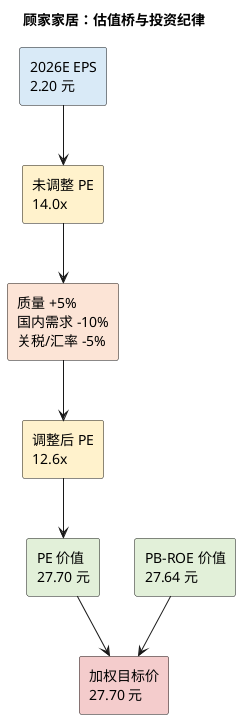

# 顾家家居：估值定价分析

**研究日期**：2026年07月26日  
**市价口径**：2026年07月24日不复权收盘价 23.83 元

## 方法选择

| 估值锚 | 数值 | 它回答的问题 |
|:--|--:|:--|
| 现价 | 23.83 元 | 市场已交易的价格 |
| 概率加权价值 | 约 27.0 元 | 三态风险调整后的预期价值 |
| 中性目标价 | 27.70 元 | 盈利不恶化、估值小幅修复的价值 |
| 保守目标价 | 18.50 元 | 需求与海外质量共同走弱时的盈利锚 |
| 理想建仓区 | 20—21 元 | 中性收益相对保守下行才具有更好赔率 |

顾家是盈利稳定、轻重资产混合且处于成熟行业的消费制造公司。PE 适合锚定未来盈利，PB-ROE 用于检验资本效率与下行保护，经营现金流用于交叉验证利润质量；DCF 对终端需求、长期增长和折现率极敏感，在当前周期中不应单独作为目标价。当前 PE TTM 11.08x、扣非 PE TTM 12.39x、PB 1.77x、PCF 6.83x，均处近五年约 2%-8%低分位。低分位确实提供安全边际，但也是市场对国内需求、Q1 扣非和海外不确定性的定价，不能自动视为错误定价。

中性情景采用 2026E EPS 2.20 元。先以 14.0x 作为现金流合格、ROE 约 16%的成熟龙头的未修正 PE 基准，再按下文全变量矩阵扣除 10%，得到 12.6x、即 27.70 元的 PE 目标价。该倍数略高于当前 TTM、但低于高景气消费品牌估值，反映公司具备现金流与龙头地位、但增长确定性不足。PB 交叉检验不直接沿用 2026Q1 的静态每股净资产，而以 2026E 期末 BVPS 14.1 元和 1.96x PB 得到 27.64 元；二者接近，故按 70% PE、30% PB 得到 27.7 元目标价。若仅按历史低分位估值而不考虑 ROE 和现金流，会错误地把周期折价永久化。

| 情景 | EPS（元） | 合理 PE | 目标价（元） | 相对现价 |
|:--|--:|--:|--:|--:|
| 保守 | 1.85 | 10.0x | 18.50 | -22.4% |
| 中性 | 2.20 | 12.6x | 27.70 | +16.2% |
| 乐观 | 2.53 | 15.0x | 37.95 | +59.3% |

概率取保守/中性/乐观 30%/50%/20%，概率加权价值为 27.0 元；中性 27.70 元仍作为执行目标价。以保守价为止损式风险锚，盈亏比为 `(27.70-23.83)/(23.83-18.50)=0.74`。这一结果不支持追涨，只支持在更高安全边际的价格区间逐步验证。

## 全变量估值审计矩阵

| 审计维度 | 核心因子 | 估值影响力过滤 | 调节 | 结论 |
|:--|:--|:--|--:|:--|
| 企业 DNA | 现金转换、品牌渠道、精益与研发 | 已部分进入 EPS；只有可持续性影响倍数 | +5% | 质量优于一般制造商 |
| 国内宏观 | 家具社零与住宅竣工下行 | 直接影响收入，已进入 EPS；持续不确定性影响信心 | -10% | 主要估值折价 |
| 全球化 | 多国供给、OBM/跨境增量 | 近期海外低毛利，不能给予成长溢价 | 0% | 对冲而非溢价 |
| 汇率/关税 | 汇兑、贸易规则与海外基地执行 | 可量化部分进入 EPS，尾部风险保留折价 | -5% | 外部约束仍大 |
| 市场风格 | 低估值、现金流与分红属性 | 短期风格无法改变长期中枢 | 0% | 不计入目标价 |
| 合计 | — | — | -10% | 对应中性 12.6x，而非高成长倍数 |

逻辑纯净性：国内需求、海外毛利和汇兑的常规影响放入利润预测；关税路线、海外基地能否爬坡、终端需求能否恢复等不可精确计量的置信度影响放入倍数。二者不得对同一风险重复折价。

## PB-ROE 与现金流交叉检查

PB 不是独立于利润的第二个故事，而是检验“盈利能否以合理资本效率留存在净资产中”。2026Q1 归母权益为 110.85 亿元，对应 BVPS 13.49 元；在中性情景下，全年归母净利 18.1 亿元，结合正常分红和少数股东变化，取期末 BVPS 14.1 元作为估值锚。该值不是公司指引，而是为了让 PE 与 PB 模型可以相互校验的研究假设。以 1.96x PB 计算的 27.64 元与 PE 法的 27.70 元接近；对应 2026E ROE 约 16%—17%、隐含 PE 约 12.6x，属于成熟消费制造而非高成长品牌的定价区间。

| 方法 | 关键输入 | 权重 | 每股价值 | 适配性与局限 |
|:--|:--|--:|--:|:--|
| 调整后 PE | 2026E EPS 2.20 元 × 12.6x | 70% | 27.70 元 | 最直接反映盈利、但受周期利润波动影响 |
| PB-ROE | 2026E BVPS 14.1 元 × 1.96x | 30% | 27.64 元 | 约束资本回报与下行保护、但对分红假设敏感 |
| **加权目标价** | — | **100%** | **27.68 元，取27.70元** | 两种方法相互验证，不作虚假精确 |

经营现金流用于否定或支持，而不单独生成一个看似精确的 DCF 目标价。2025 年经营现金流 27.74 亿元、归母净利 17.90 亿元，OCF/净利 1.55x，2021—2025 年均保持在 1.22—1.89x，说明会计利润并非主要依赖应收膨胀。可是投资现金流中同时含金融产品收回和购买，且未来印尼基地、制造升级等资本开支时点不确定；若直接从某一年 OCF 扣“资本开支”推永续 DCF，会把理财收回、营运资本波动和扩产投入误当作可持续自由现金流。因此本研究刻意不用 DCF 作为第三个价格锚，改以 PCF 6.83x、五年 2.0%低分位作为现金流质量与市场悲观程度的佐证。这比给出依赖多个不可验证终值假设的 DCF 数字更审慎。

历史分位也必须被正确使用。PE TTM 11.08x、扣非 PE 12.39x、PB 1.77x、PS 0.97x、PCF 6.83x，分别处于近五年约 7.7%、7.6%、2.0%、2.6%和 2.0%分位。低分位意味着在 2025 年利润恢复、2026Q1 扣非转弱的交界点，市场已对行业和海外风险给出较高折价；它不等于股价一定回到历史中枢。因为新房红利已弱于历史、海外收入的利润率更低，合理 PE 也可能比历史高景气期低。基准 12.6x 只要求盈利稳定和风险不进一步恶化，并没有假设估值回到峰值。

## 极限压力测试与操作结论

| 压力层级 | EPS / 资产假设 | 价格锚 | 使用方式 |
|:--|:--|--:|:--|
| 保守情景 | EPS 1.85 元、10x PE | 18.50 元 | 当前研究的主要下行情景 |
| 周期压力 | EPS 1.40 元、8x PE | 11.20 元 | 需求、渠道与海外订单共振恶化 |
| 资产折价 | 2026Q1 BVPS × 70% | 9.44 元 | 极端资产底线，不是交易止损线 |

真正的一击毙命情景不是单季利润下降，而是国内需求长期萎缩、经销商网络连续收缩，同时海外 ODM 客户订单下降且海外扩产形成低利用率；这会使 ROE 向低双位数回落，PE 失去龙头溢价。利润压力下取 EPS 1.40 元、8x PE，得到约 11.20 元的周期压力价。为满足资产底线审计，再对 2026Q1 BVPS 13.49 元施加 30%清算折价，得到约 9.44 元/股的重资产与营运资产折价锚；它不是可执行止损线，也不代表市场必到该价，而是说明 18.50 元保守情景仍是盈利折价而非净资产清算价。当前应给出“持有/观察，回调建仓”的结论；理想建仓区 20—21 元对应中性情景约 9.1—9.5x PE，盈亏比才明显改善。

**重要提示**：以上为研究情景与估值框架，不构成个性化投资建议。
