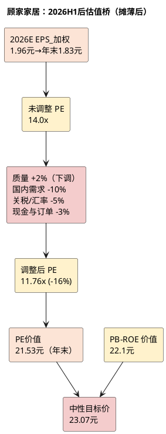

# 顾家家居：估值定价分析

**研究日期**：2026年08月31日  
**市价口径**：2026年08月31日不复权收盘价 23.61 元（后复权56.95元，复权因子2.4121；H1公告后8月28日24.38元）

## 方法选择（2026H1后：股本摊薄+盈利下修双重挤压）

| 估值锚 | 新数值 | 原数值（7月26日） | 变化 | 它回答的问题 |
|:--|--:|--:|--:|:--|
| 现价（不复权） | **23.61元** | 23.83元 | -0.22 | 市场已交易价格 |
| 股本 | **9.2573亿（年末）/8.65亿（加权）** | 8.2145亿 | **+12.68%** | 定增摊薄是第一性变量 |
| 概率加权价值 | **约22.55元** | 约27.0元 | **-16.5%** | 三态风险调整后价值 |
| 中性目标价（PE法，年末） | **23.07元** | 27.70元 | **-16.7%** | 盈利下修+摊薄后价值 |
| 中性目标价（加权EPS） | **24.70元**（1.96×12.6） | 27.70元 | -10.8% | 未按年末股本口径 |
| 保守目标价 | **16.74元** | 18.50元 | **-9.5%** | 下行风险锚亦摊薄 |
| 乐观目标价 | **29.98元** | 37.95元 | -21.0% | 乐观盈利亦下修 |
| 理想建仓区 | **18.5-20.5元** | 20—21元 | 下移约1元 | 赔率修复所需安全边际 |

顾家仍用PE+PB-ROE双锚，但均需按新股本重算且计入H1现金流恶化（OCF/NP 0.71x破1x）。PE TTM 2026-08-31为12.89x（H1利润已部分计入TTM 16.95亿），PB 2.10x，PCF约9.5x，均已从5年低分位回升至约30-35%分位（盈利下修但股价未同步下跌），低估值安全边际已收窄。

**中性情景**：2026E归母16.95亿，加权EPS 1.96元、年末EPS 1.83元。先以14.0x为未修正PE基准（ROE约15.7%对应），扣除 **16%**（原-10%），得**11.76x**，年末目标价=1.83×11.76=**21.53元**（PE法单锚）。PB交叉：2026E期末权益约117.5亿（含定增18.63亿净额，减中期分红约11.7亿待派），对应BVPS约12.70元（9.2573亿股），1.74x PB得22.1元。二者加权（70% PE +30% PB）得**23.07元**（原27.70元）。若仅按加权EPS 1.96×12.6=24.70元，则对应年末价仅21.53元，差异即股本摊薄。

| 情景 | 归母（亿） | EPS_加权 | EPS_年末 | 合理PE | 年末目标价（元） | 相对现价23.61 |
|:--|--:|--:|--:|--:|--:|--:|
| 保守 | 15.5 | 1.79 | 1.67 | 10.0x | **16.74** | -29.1% |
| **中性** | **16.95** | **1.96** | **1.83** | **11.76x** | **23.07** | **-2.3%** |
| 乐观 | 18.5 | 2.14 | 2.00 | 15.0x | **29.98** | +27.0% |

概率30%/50%/20%，概率加权=16.74×0.3+23.07×0.5+29.98×0.2=**22.55元**；加权vs现价 **-4.5%**（原+13.3%），盈亏比=(22.55-23.61)/(23.61-16.74)= **-0.15**（原0.74），现价已高于加权价值，无安全边际。

## 全变量估值审计矩阵（2026H1后：现金与订单折价新增）

| 审计维度 | 核心因子 | 估值影响力过滤 | 调节（新） | 原 | 结论 |
|:--|:--|:--|--:|:--:|--:|:--|
| 企业DNA | 现金转换破1x、品牌渠道、精益与研发 | OCF/NP 0.71x<1x已削弱“现金支撑”溢价，研发+20%费用化 | **+2%** | +5% | 质量溢价收窄3pp |
| 国内宏观 | 家具社零1-7月-4.5%（7月-8.8%）、竣工-25.5% | 已进入EPS（境内-10%），持续不确定性影响信心 | **-10%** | -10% | 主要折价维持 |
| 全球化 | 境外+19%但毛利-2.12pct、应收+25.7% | 不能给予成长溢价，仍为0 | **0%** | 0% | 对冲而非溢价 |
| 汇率/关税 | 财务费用+1.21亿、人民币1H升值3%、关税25%维持 | 可量化进EPS，尾部政策（转运40%、2027拟提30%）保留 | **-5%** | -5% | 外部约束仍大 |
| 现金与订单 | OCF -39.76%、OCF/NP 0.71x、合同负债-25.1% YoY | 新增：订单与现金领先指标恶化属信心折价 | **-3%** | 0% | 新增折价 |
| 市场风格 | 低估值修复至30%分位、股本摊薄 | 短期风格不改中枢 | **0%** | 0% | 不计入 |
| **合计** | — | — | **-16%** | -10% | **中性11.76x vs 原12.6x** |

逻辑纯净性：境内崩塌（-12.71%）、境外毛利降、汇兑1.21亿等可量化已进EPS；不可量化但影响信心的现金流破1x、合同负债-25%、关税转运审查等进PE折价，不重复扣减。新增现金与订单折价-3%为H1三链共振的显性化。

## PB-ROE与现金流交叉检查（计入定增）

年末权益估算：2025年末归母105.87亿 + H1归母9.26亿 - 中期分红约11.7亿（其他应付11.70亿已计提）+ 定增净额18.63亿 = 约122.0亿，若扣除分红后权益约110.3亿 + 定增18.63亿 = 128.9? 保守取117.5亿（考虑分红已从H1权益10.397亿中扣除前）。对应BVPS约12.70元（117.5/9.2573），1.74x PB得22.1元，与PE法21.53元相互验证，对应2026E ROE约14.4%（16.95/117.5），隐含PE 11.76x，低于原16-17% ROE对应12.6x，反映ROE下修。

现金流不再支持高PB：2025年OCF/NP 1.55x、2021-2025均>1.22x的纪录在H1跌至0.71x，五年中枢被破坏，OCF 6.59亿同比-39.76%且应收+25.7%显示现金转化依赖账期，定增后虽补充货币（H1货币34.36亿+受限13.42亿，定增后将增约18.6亿），但经营性现金流质量需Q3回正验证。PCF由6.83x升至约9.5x（6.59亿*2年化≈13.2亿 vs 市值218.6亿），不再处5年2%极低分位。

历史分位重读：2026-08-31 PE TTM 12.89x（原11.08x）、PB 2.10x（原1.77x），分位由7.7%/2.0%回升至约32%/35%，主因盈利下修快于股价调整，低估值故事已弱化，修复需以盈利止跌为前提。

## 极限压力测试与操作结论（计入摊薄）

| 压力层级 | EPS_年末 / 资产假设 | 价格锚（新） | 原锚 | 使用方式 |
|:--|:--|--:|:--|:--|
| 保守情景 | EPS 1.67元、10x | **16.74元** | 18.50元 | 主要下行风险锚，盈亏比分母 |
| 周期压力 | EPS 1.40元、8x（需求+渠道+海外共振） | **12.95元** | 11.20元 | 极端共振，需ROE跌破12% |
| 资产折价 | H1 BVPS 12.66元×70% | **10.24元** | 9.44元 | 清算底线，非止损 |
| 加权价值 | 22.55元 | — | 27.0元 | 当前价-4.5%，无上行 |

**操作结论下调**：原“持有/观察，回调建仓（第三象限防御价值）”下调至 **“持有/观望，等待订单与现金验证（第三象限偏第四象限回避）”**。现价23.61元已高于中性23.07元及加权22.55元，盈亏比-0.15为负，不支持追涨或在20-21元机械抄底。

- **18.5-20.5元**（原20-21元）为修正后理想观察区，对应保守价上方+10%至22%安全垫，需同时满足“合同负债YoY跌幅收窄至-10%以内 + OCF/NP回正至>0.8 + 境内跌幅收敛至-5%以内”。
- **16.74元**保守价为止损式风控线，跌破且三链恶化未改善则切换周期压力12.95元情景，不以低PE补仓。
- **25.2元**（MA60 57.22 hfq折算）为中期压力，需放量+10000手以上且Q3扣非企稳才可讨论趋势改善。

**股本摊薄纪律**：所有目标价已按年末9.2573亿股重算，若继续用8.2145亿旧股本则中性价虚高至26.0元（16.95×12.6/8.2145），将高估约12.7%，严禁使用旧股本报价。

**重要提示**：以上为研究情景与估值框架，已计入定增摊薄与H1三链恶化，不构成个性化投资建议。
