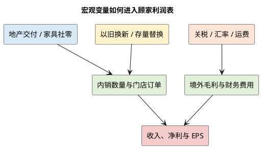

# 顾家家居：外部边界与宏观政策

**研究日期**：2026年07月26日

## 外部变量决策矩阵

| 外部变量 | 当前方向 | 进入模型的位置 | 不能重复计算的部分 |
|:--|:--|:--|:--|
| 住宅竣工、家具社零 | 2026H1 均偏弱 | 国内销量、单店产出与销售费用率 | 同一份需求下滑不可再重复压低 EPS |
| 以旧换新 | 缓冲但有前置风险 | 仅缓冲替换需求的数量 | 不给政策题材估值溢价 |
| 汇率、关税、运费 | 海外利润的不确定来源 | 财务费用、境外毛利与运输费率 | 同一笔成本不再同时在 PE 中扣减 |
| 海外基地 | 长期供应链期权 | 资本开支与远期执行风险 | 不计入 2026—2027 基准 EPS |

## 宏观边界：地产后周期是国内估值中枢的首要变量

| 外部变量 | 当前读数 | 对收入的影响 | 对利润/估值的影响 | 结论 |
|:--|:--|:--|:--|:--|
| 家具社零 | 2026H1 -3.7% | 门店动销、替换需求承压 | 促销与费用率风险上升 | 国内需求不按复苏处理 |
| 住宅竣工 | 2026H1 -25.3% | 新房配套需求池收缩 | 影响未来 6—12 个月订单信心 | 主要估值折价来源 |
| 住宅销售面积 | 2026H1 -12.4% | 改善/装修需求前瞻偏弱 | 影响渠道经营预期 | 不能只看单月数据 |
| 以旧换新 | 2025 高增、2026H1 回落 | 缓冲存量替换 | 需求前置风险 | 只进销量缓冲，不给估值溢价 |

| 海外变量 | 已知事实 | 最先进入的财务科目 | 需要联合验证的指标 |
|:--|:--|:--|:--|
| 汇率 | 2026Q1 财务费用由 -0.07 转为 +0.49 亿元 | 财务费用、报价 | 外币应收、套保、境外毛利 |
| 关税/原产地 | 政策与原产地认定非稳定常数 | 境外毛利、合规成本 | 客户分担、当地增值、产能利用率 |
| 运输费 | 2025 年 8.94 亿元，+17.51% | 销售/运输成本 | 境外收入、运输费率、境外毛利 |
| 海外基地 | 印尼拟投入 11.24 亿元、建设约四年 | 投资现金流、折旧 | 进度、订单、利用率、ROIC |

顾家不是房地产公司，但需求与住房交付、装修和居民大额可选消费高度相关。2026H1 住宅竣工面积同比下降 25.3%、住宅销售面积下降 12.4%，家具类社零下降 3.7%。对公司而言，竣工数据不必与当期收入一一对应，却决定未来 6-12 个月新房配套家具的自然需求池；家具社零更接近终端动销。两项数据同时走弱，说明国内业务的基准假设应是“份额抵消行业下行”，而不是行业复苏。

政策的方向是双刃剑。消费品以旧换新、适老化改造和绿色智能家居支持存量更新，功能沙发、智能床和定制产品较能受益；但补贴会造成购买时点前移，且资金规模、品类覆盖和地方执行均有不确定性。政策只能降低需求下行斜率，不能成为估值溢价的独立理由。利率下降若改善住房交易和消费者分期意愿，会边际利好；但顾家的主要风险不是融资成本，而是终端客流与经销商盈利。

## 外贸、汇率与贸易摩擦

境外收入 93.26 亿元，占公司总收入接近一半。全球化能对冲国内需求，却引入三类外部风险：第一，美元等结算货币波动影响报价和财务费用。2026Q1 财务费用由 -0.07 亿元转为 +0.49 亿元，市场解读主要为汇兑损失；这解释部分扣非下滑，但也证明汇率不是可忽略的噪声。第二，关税和原产地规则可改变产能的经济性。第三，海外家居终端的利率、住房交易和零售库存周期将影响 ODM 订单。

公司布局越南、墨西哥、美国并建设印尼基地，逻辑是客户就近交付、降低关税及物流暴露。印尼项目拟投入 11.24 亿元，计划建设期约四年、全部建成后三年达产，达产收入约 25.2 亿元。因此该项目是供应链期权而非近期 EPS 催化剂：建设期资本开支、爬坡和本地管理成本可能先压低自由现金流，只有获得订单和利用率验证后才配得上估值加分。

## 宏观变量如何进入利润表，而不是停留在叙事

顾家的内销并不直接确认房地产收入，宏观影响要经过“住宅成交/交付—装修与置换意愿—门店客流与订单—经销商补货—公司出货”的链条传导。这个链条至少有两个时滞：交付到家具采购通常以月计，渠道从消费者订单到总部下单又会受到库存和促销影响。因此，单月房地产数据不能解释单季业绩；但当施工、竣工、销售和家具社零同时连续走弱时，企业即使报表暂时增长，未来 6—12 个月也更可能面临订单与费用压力。2026H1 的组合正是如此：住宅竣工 -25.3%、住宅销售面积 -12.4%、家具社零 -3.7%。这构成国内估值中枢的基本折价，而不是可以靠一次促销解决的短期噪声。

以旧换新、家装厨卫焕新和适老化改造是另一条传导链：政策补贴降低消费者的实付价格，品牌商通过线上线下活动、旧品回收、送装服务把需求转化为订单。其对顾家最有意义的并非普遍降价，而是降低大件家具替换中的搬运、回收和交付摩擦，因此对床垫、功能沙发和整套卧室产品的转化效率可能更高。不过政策并非公司独有的价格权。2025 年家具类零售 +14.6%、2026H1 转负已经表明，补贴的边际效果会随地方执行、预算、消费者观望和前置购买而变化。报告不会把“政策支持”单独加一个估值溢价；在预测里只把它作为需求跌幅的缓冲，在估值里视为中性。

融资成本是次要变量。公司 2025 年末短期借款 5.58 亿元、货币资金 25.69 亿元，净负债并不高，因此国内利率下行对利息费用的直接影响有限；它的主要作用是改善居民分期、住房交易和经销商的营运资本压力。这意味着宏观宽松若不转化为家具社零和合同负债改善，就不应上调顾家盈利预测。反之，顾家有较强经营现金流，能够在需求低迷期继续投入零售数字化和供应链，构成相对同业的防御性，但这属于企业层面的现金流质量，不能替代终端需求验证。

## 关税、原产地与汇率：全球化收益的对价

贸易政策是海外业务最需要避免线性外推的变量。美国于 2025 年对进口软体家具等品类实施 25%关税，原计划于 2026 年初上调的软体家具税率被延后一年；这一政策时间线说明关税并非稳定的成本常数，可能随谈判和原产地审查变化。顾家没有在公开年报中披露各市场、各原产地和各客户的精确收入/毛利，因此不能简单假定越南、墨西哥或印尼生产就自动消除关税。真正的经济效果取决于货物原产地认定、当地增值比例、客户承担比例、转运成本和产能利用率。对公司而言，多地生产降低单一国家风险，却提高合规、采购、库存和组织复杂度；这是一种风险分散，而非免费套利。

汇率的损益路径同样分为经营和报表两层。经营层面，人民币升值会削弱以外币计价出口的人民币收入或要求调整报价，人民币贬值则可能提升出口价格竞争力，但同时影响进口材料、海外人工和资本开支。报表层面，外币货币性资产负债、套保安排和结算时点会造成季度财务费用波动。2026Q1 财务费用从上年同期的 -715 万元转为 +4,897 万元，足以使一个本来温和的收入季度表现为扣非利润 -10.64%。因此模型不应该用单一汇率方向赌 EPS：基准情景采用汇兑损益接近 2025 年常态化水平，保守情景假设外汇与关税共同压缩海外毛利，乐观情景也只在海外收入、应收回款和毛利率同时改善时才给予收益。

运输费是最直接的跨境成本温度计。2025 年运输费 8.94 亿元、同比 +17.51%，高于公司收入 +8.53%和境外收入 +11.46%的增速；无论其中含有运价、发货结构还是会计归类变化，这一差异都说明海外规模扩大并未立即产生物流规模效应。若后续海外本地化生产有效，首先应观察的是运输费率、境外毛利率和应收周转的联动改善，而不是只看海外收入。若收入增长而这三项继续恶化，全球化会成为“高周转低回报”的规模扩张。

## 原材料、运输与监管

| 成本变量 | 业务暴露 | 已披露信息 | 建模处理 | 触发上调/下调的信号 |
|:--|:--|:--|:--|:--|
| 原材料 | 家具制造成本 | 原材料占制造成本 65.28%；沙发成本占比 79.48% | 进入毛利率假设 | 成本变动与产品毛利方向背离 |
| 运费 | 境外收入与海外供应链 | 2025 年运输费 +17.51% | 进入境外利润率 | 收入增长而运费率、毛利同步恶化 |
| 汇兑 | 外币资产负债与结算 | Q1 财务费用显著转差 | 情景化处理财务费用 | 汇兑损失连续扩大 |
| 合规/环保 | 全行业准入 | 龙头可摊薄投入 | 不单独给收入或估值溢价 | 仅在实际成本/准入变化时调整 |

| 外部风险的处理纪律 | 应进入 EPS | 应进入 PE 折价 | 不应做的事 |
|:--|:--|:--|:--|
| 国内需求下行 | 内销数量、费用率 | 持续不确定性造成的信心折价 | 对同一份销量下滑双重扣减 |
| 关税与汇率 | 可量化的毛利、财务费用 | 尾部政策和海外执行不确定性 | 用单一汇率方向赌长期 EPS |
| 海外基地 | 建设期资本开支、远期折旧 | 项目爬坡和回报的不确定性 | 在 2026—2027 提前确认达产利润 |
| 以旧换新 | 替换需求的数量缓冲 | 通常不单独给溢价 | 把 2025 高增重复外推至 2026 |

家具制造成本中原材料占 65.28%，沙发成本中原材料占 79.48%，海绵及其化工原料、皮革、木材、面料、五金为主要敏感项。2025 年公司运输费用增加 17.51%，高于收入增速，说明海外增长带来的物流成本需持续跟踪。成本下降会进入毛利修复；成本上涨时，在需求疲弱和价格竞争中不一定能完全向下游传递。公司可以靠采购规模、海外本地采购和产品结构缓冲，却不能完全规避。

环保、产品安全和有害物质限量标准是行业的准入成本，龙头更容易摊薄合规投入，因而中期有利于集中度提升；但这类政策并不会直接创造需求。对估值有真实影响的只有贸易结构变化与国内耐用消费需求，其他政策信息不应被过度资本化。

## 外部变量的量化处理与边界判断

| 外部变量 | 已进入盈利预测的项目 | 不应重复计入的项目 | 需要验证的高频信号 |
|:--|:--|:--|:--|
| 国内地产与家具需求 | 内销销量、单店产出、销售费用率 | 再额外下调估值以反映同一份销量下滑 | 家具社零、合同负债、门店净开关 |
| 以旧换新 | 仅缓冲替换需求的量，不把 2025 高增外推 | 政策题材估值溢价 | 补贴覆盖、线上线下零售、客单价 |
| 关税/原产地 | 海外毛利率、物流及合规费用的保守假设 | 对同一关税损失再次下调净利 | 海外工厂投产、客户分担、境外毛利 |
| 汇率 | 财务费用和报价的情景波动 | 用汇率噪声改变长期收入中枢 | 财务费用、套保披露、外币应收 |
| 原料与运费 | 原材料成本率和运输费率 | 无依据地给采购规模溢价 | 海绵/皮革/木材价格、运输费率 |

这张表是防止“宏观因素双重扣减”的纪律。具体可计算的收入、毛利、费用影响只进 E；无法精确计量但会影响投资者信心的长期关税与海外执行风险，才在后续 PE 折价中处理。现阶段最重要的外部事实仍是国内耐用消费尚未稳定、海外关税与汇率的分布不确定，故顾家属于可以依赖现金流穿越周期、但不能被当作纯内需复苏或纯出海成长标的的公司。

## 边界结论

基准情景采用“国内弱、海外增、汇率和成本波动”的组合。将住宅竣工和家具社零的疲弱直接放入收入增速假设；把汇兑、原材料和运费的可量化影响放入利润率；把关税、海外基地执行和政策持续性作为估值折价，避免重复计算。此原则将传导至下一章的 P×Q 模型和估值审计矩阵。

**主要证据**：[国家统计局 2026H1 社零](https://www.stats.gov.cn/sj/zxfb/202607/t20260715_1964127.html)、[国家统计局房地产数据](https://www.stats.gov.cn/zwfwck/sjfb/202607/t20260715_1964126.html)、[中国家具协会 2025 年行业简报](https://cnfa.com.cn/messdetail1s58.html?lid=2)、[美国关税政策报道](https://apnews.com/article/a89ea5c044af3c2ac8ffcb481e0150ef)、[印尼项目可研](https://stockmc.xueqiu.com/202509/603816_20250902_EMS1.pdf)、公司 2025 年年报和 2026Q1 报告。
