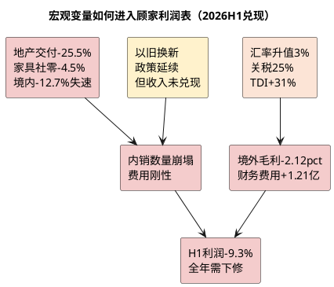

# 顾家家居：外部边界与宏观政策

**研究日期**：2026年08月31日

## 外部变量决策矩阵（2026H1后：国内失速与汇兑成本兑现）

| 外部变量 | 最新方向 | 进入模型的位置 | 不能重复计算的部分 |
|:--|:--|:--|:--|
| 住宅竣工、家具社零 | **1-7月住宅竣工-25.5%、家具社零-4.5%（7月-8.8%），H1境内-12.71%跑输行业** | 国内销量、单店产出与销售费用率 | 同一份需求下滑不可再重复压低 EPS |
| 以旧换新 | 政策延续但成交仍降，境内-12.71%显示未落地为收入 | 删除销量缓冲假设 | 不给政策题材估值溢价 |
| 汇率、关税、运费 | **财务费用H1 0.96亿（去年-0.25亿）+1.21亿、人民币1H升值3%、软体家具关税25%维持且2027拟提至30%延期** | 财务费用、境外毛利与运输费率 | 同一笔成本不再同时在 PE 中扣减 |
| 原材料（TDI/聚醚） | **TDI均价1.63万+31% YoY，成本传导不畅致综合毛利率-0.40pp** | 毛利率 | 已进入成本，不再单独PE折价 |
| 海外基地 | 印尼3月奠基、建设期4年，H1在建+32.8% | 资本开支与远期执行风险 | 不计入2026—2027基准EPS |

## 宏观边界：地产后周期未见底，以旧换新缓冲证伪

| 外部变量 | 最新读数 | 较7月26日研报时恶化 | 对模型的影响 |
|:--|:--|:--|:--|
| 家具社零 | 1-7月1004亿 **-4.5%**；7月145亿 **-8.8%** | H1 -3.7%→-4.5%扩大0.8pp，7月为年内最差 | 境内全年假设由0-4%→-10%±2% |
| 住宅竣工 | 1-7月13443万㎡ **-25.5%** | H1 -25.3%→-25.5%未收敛 | 新房配套需求池继续萎缩 |
| 住宅销售面积 | 1-7月37425万㎡ **-12.7%** | H1 -12.4%→-12.7% | 二手房/改善装修前瞻仍弱 |
| 以旧换新 | 2026年商务部等7部门政策延续，但顾家境内-12.71% | 原“缓冲”假设证伪 | 删除缓冲，直接按竣工/社零定价 |
| 汇率 | 2026H1人民币兑美元**升值3%**，CFETS指数+4.7% | Q1 -0.07→0.49亿、H1 -0.25→0.96亿，**费用恶化1.21亿** | 汇兑损失已兑现，全年财务费用假设上调 |
| 关税 | 现行软体家具**25%**，原拟2026提至30%**延期至2027-01-01** | 25%压力维持12个月缓冲期 | 短期税负不增但不确定性延续 |
| 原材料 | TDI上半年均价**1.63万+31% YoY**，软泡聚醚+14.6% | Q2综合毛利率31.35% vs 33.40%去年 | 成本冲击已部分兑现，全年毛利率下调 |

顾家内销与住房竣工的相关性在2026H1被极端验证：境内-12.71%对竣工-25.5%弹性约0.5，且定制-38.67%与竣工同步，表明竣工数据确为领先指标，不必与当期收入一一对应但决定6-12个月需求池。以旧换新政策虽延续（发改环资〔2025〕1745号、商务部2026通知、29省补贴15%至1500元/件），但家具社零1-7月-4.5%且7月-8.8%显示政策未能转化为终端动销，模型删除“政策缓冲”假设。

融资成本仍为次要变量：H1短期借款11.91亿+113% vs 年初、货币资金中受限13.42亿，但定增18.63亿净额8月到账后净负债压力将缓解，利率下行对利息费用影响有限。

## 外贸、汇率与贸易摩擦（2026H1：汇兑损失已成报表主导变量）

境外收入50.67亿（+19.01%）占主营52.6%，对冲境内-12.71%使总营收+0.75%勉强为正，但引入三重恶化：

1. **汇率**：2026H1人民币升值3%（1H末6.7852）、130家A股公司预告提及汇兑损失。顾家财务费用H1 0.96亿 vs 去年-0.25亿，单季看Q1 -0.07→0.49亿、Q2 -0.18→0.47亿（推算），合计增加1.21亿，几乎吞噬半数毛利降幅。同业梦百合净利近乎归零、海尔智家汇兑损失7.04亿+扰动15.86亿、TCL智家1.98亿损失均指向行业共性。顾家海外敞口约50亿、若套保率按行业平均35%则仍有约65%敞口暴露，H2升值若持续则扰动延续。

2. **关税/原产地**：美国对华软体家具现行25%（2025年实施），原拟2026提至约30%（橱柜至50%）已延期至2027-01-01，争取12个月窗口期。但白宫行政命令明确转运认定将加征40%（界定未明），对越南、墨西哥、印尼等地“洗产地”审查趋严。顾家越南、墨西哥、美国基地虽已常态化，印尼3月奠基（1.6亿美元、19.5万㎡、一期2027年3月投产），但原产地增值税、当地增值比例、客户分担均未披露，不能假定多地生产自动豁免关税。

3. **运输费**：2025年运输费8.94亿+17.51%已高于营收，2026H1主营运输费4.04亿-2.64%（得益于海外本土采购及集中发运，但境外毛利率仍-2.12pct，说明物流改善不足以抵消价格竞争）。H1未披露运输费占营收比，但境外+19%而毛利率仍降，暗示单箱运费或账期让利仍在。

印尼项目（总投11.24亿、土地建筑占85.09%、HGB使用权30年可续、建设期4年、达纲3年、满产25.20亿、回收期8.6年）仍为期权：H1在建+32.8%至4.94亿仅为投入期，2026-2028年不计入EPS，仅计折旧与现金流出及PE折价。

## 宏观变量如何进入利润表（2026H1兑现版）

2026H1的传导链条已走完：**竣工-25.5%/社零-4.5%→境内-12.71%/合同负债-25.1%→费用率22.24%（+2.21pp）→毛利率32.49%（-0.40pp, Q2 -2.05pp）→财务费用+1.21亿→扣非-14.59%**。以旧换新不再作为缓冲：境内-12.71%显著弱于社零-4.5%，说明存量翻新的份额争夺中顾家并未受益。

成本传导受阻：TDI+31% vs 顾家营业成本+1.36%（缓于TDI涨幅，显示集中采购与海外本土化部分对冲），但Q2毛利率仍降2.05pp，说明下游议价能力弱，上游涨价最终以综合毛利率下降形式兑现，而非转嫁。

## 原材料、运输与监管（2026H1更新）

| 成本变量 | 2026H1验证 | 建模处理 | 信号 |
|:--|:--|:--|:--|
| 原材料（TDI/聚醚/海绵） | TDI 1.63万+31%、海绵+40%（Q1）、家具制造成本65.28%中原材料79.48%沙发 | 进入毛利率：全年假设32.0-32.5% vs 原32.7% | 成本上行已兑现为毛利率-0.40pp |
| 运费 | 主营运输费4.04亿-2.64%但境外毛利-2.12pct | 进入境外毛利率：24-25% vs 原25.84% | 物流改善不足以对冲让价 |
| 汇兑 | 财务费用+1.21亿、人民币1H升值3% | 财务费用全年假设由0.01亿→0.9-1.1亿 | H1已兑现130家公司共性 |
| 合规/环保 | 龙头可摊薄但不创造需求 | 不单独溢价 | 中性 |

| 外部风险处理纪律 | 应进EPS | 应进PE折价 | 已兑现 |
|:--|:--|:--|:--|
| 国内需求下行 | 内销数量、费用率（已兑现境内-12.71%） | 持续不确定性-2%（保留） | 是 |
| 关税与汇率 | 财务费用+1.21亿、境外毛利率-2.12pct | 尾部政策-3%（关税延期但审查趋严） | 是 |
| 海外基地 | 在建+32.8%资本开支 | 爬坡不确定性-2% | 进行中 |
| 以旧换新 | 删除缓冲（境内-12.71%证伪） | 不溢价 | 是 |

## 外部变量的量化处理与边界判断（2026H1后）

| 外部变量 | 已进入盈利预测的调整 | 验证信号 |
|:--|:--|:--|
| 国内地产与家具需求 | 境内全年-10%±2%（原0-4%），合同负债-25%、费用率+2.21pp | 家具社零1-7月-4.5%、竣工-25.5%、境内-12.71% |
| 关税/原产地 | 海外毛利率24-25%（原25.84%），不假设 indonesia 豁免 | 现行25%、2027拟提30%、白宫转运40% |
| 汇率 | 财务费用0.9-1.1亿（原0.01亿），H1已0.96亿 | 人民币+3%、H1费用+1.21亿 |
| 原料与运费 | 综合毛利率32.0-32.5%（原32.7%），境外毛利率下调 | TDI+31%、海绵+40% |
| 海外基地 | 资本开支计入、在建4.94亿，不计入利润 | 印尼3月奠基、2027投产 |

## 边界结论（2026H1后修正）

基准情景从“国内弱、海外增、汇率成本波动”修正为 **“国内崩塌超行业、以旧换新证伪、汇兑与原材料成本已兑现为利润侵蚀”**。国内-10%±2%收入假设、综合毛利率32.0-32.5%、财务费用0.9-1.1亿、境外毛利率24-25%将传导至下一章P*Q模型。全年盈利需下修约6-8%且计入股本摊薄12.7%，目标价下行主因是利润与股本双重挤压，非单纯PE收缩。

**主要证据**：国家统计局2026年1-7月社零（家具类1004亿-4.5%、7月-8.8%）、房地产（竣工-25.5%/销售-12.7%）、人民币升值（央行CNFIN 1H +3%）、TDI（隆众1.63万+31%/FX168+30%）、软体关税延期（龙源Forwarding 2026延期至2027-01-01现行25%转运40%）、公司2026H1（财务费用0.96亿 vs -0.25亿/境外毛利率24.24% -2.12pct/在建4.94亿+32.8%）、印尼奠基（2026-03-16，总投1.6亿美元，建设期4年）。
