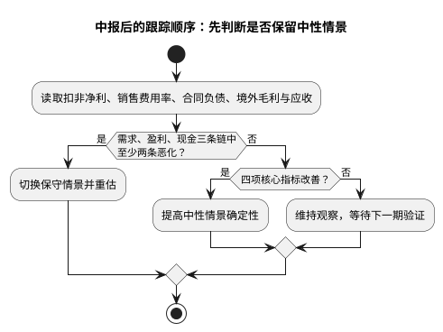

# 顾家家居跟踪手册

**建立日期**：2026年07月26日  
**当前评级**：持有/观察，回调建仓（第三象限防御价值）

## 核心逻辑验证点

| 指标 | 看好阈值 | 警戒阈值 | 数据来源 |
|:--|:--|:--|:--|
| 扣非净利增速 | 2026H1 同比转正或较Q1的 -10.64%明显收窄 | 连续两季同比双位数下降 | 季报/半年报 |
| 综合毛利率 | ≥32.5% | <31.5%且连续两季 | 利润表 |
| 境外收入与毛利 | 收入增长且毛利率不低于 25% | 收入增、毛利率持续下滑 | 年报/中报 |
| 销售费用率 | 稳定或下降 | 上升且收入低增 | 利润表 |
| 合同负债 | 与季节性相符地环比企稳，且不低于上年同期趋势 | 连续两季同比明显下降 | 资产负债表 |
| OCF/归母净利 | ≥1.0x | <0.8x | 现金流量表 |
| 应收账款 | 增速不高于境外收入 | 增速显著高于营收 | 资产负债表 |

## 外部变量

| 变量 | 当前基准 | 关注方向 |
|:--|:--|:--|
| 家具类社零 | 2026H1 同比 -3.7% | 转正或降幅收窄为内需改善信号 |
| 住宅竣工 | 2026H1 同比 -25.3% | 降幅收窄决定新房配套需求 |
| 汇率 | Q1 财务费用转正 | 人民币升值及汇兑损失扩大为利空 |
| 原材料/运费 | 原材料占制造成本 65.28% | 成本上升而产品无法提价将压毛利 |
| 海外政策 | 印尼项目建设中 | 关税、原产地规则和项目利用率 |

## 逻辑证伪警报

1. 国内自有品牌门店连续两期净关闭且合同负债下降超过 15%。  
2. 综合毛利率低于 31.5%并持续两个报告期，且销售费用率上升。  
3. 境外收入连续两期负增长，或应收账款连续两期显著快于境外收入。  
4. OCF/净利连续两期低于 0.8x，显示利润质量转弱。  
5. 印尼等海外产能投入显著超预算且没有订单/利用率证据。

逻辑证伪并非任一单项波动即自动卖出。扣非利润和合同负债存在季节性，必须观察同比、产品和地区拆分；但若“需求（合同负债/门店）—盈利（毛利/费用）—现金（OCF/应收）”三条链中至少两条同时恶化，则应立即以保守情景重估，而不是等待行业叙事好转。反之，若境外收入增长、毛利率稳定、应收不快于收入，海外业务才从风险对冲转为可上调的增长证据。

## 关键时间节点与操作纪律

| 验证顺序 | 先看什么 | 结论如何传导 |
|:--|:--|:--|
| 需求 | 家具社零、合同负债、门店趋势 | 判断内销数量假设是否需下调 |
| 盈利 | 扣非、毛利率、销售费用率 | 判断 EPS 与估值倍数是否共同承压 |
| 现金 | OCF/净利、应收、境外回款 | 判断收入增长是否具有质量 |
| 价格 | 20—21 / 25.19 / 27.70 元 | 只在基本面结论后决定执行动作 |

| 时间 | 事件 | 关注点 |
|:--|:--|:--|
| 2026年8月 | 2026H1 报告 | 扣非净利、销售费用率、合同负债、境外毛利率 |
| 2026年10月 | 三季报 | 国内份额与海外回款是否延续 |
| 2027年4月 | 2026 年报 | 全年 ROE、OCF、分红及印尼项目进度 |
| 持续 | 家具社零/竣工/汇率 | 验证需求、成本与外贸假设 |

- 回调至 20-21 元、上述验证指标未恶化：可逐步建仓。
- 上涨至 27.7 元而基本面未超预期：评估减仓或等待新证据。
- 任一前四项证伪警报触发：重新建模并下调评级，不以低 PE 机械补仓。

## 估值与技术联动纪律

| 场景 | 不复权价格 | 需要同时满足的事实 | 动作 |
|:--|--:|:--|:--|
| 低于近一年低点 | <21.23 元 | 先查是否有基本面证伪；若无，才讨论分批 | 不把图形破位自动等同于机会 |
| 理想建仓区 | 20—21 元 | 合同负债、应收、扣非和境外毛利未同步恶化 | 分批、小仓验证 |
| 趋势确认 | >25.19 元并放量 | 中报扣非、费用率和回款改善 | 可提高跟踪仓位优先级 |
| 基准价值区 | 27.70 元附近 | 无新的盈利上修 | 不追涨，等待新证据 |
| 保守情景价 | 18.50 元 | 需求/盈利/现金三链至少两条恶化 | 下调模型，不以低估值补仓 |

技术均线判断采用后复权价格，表内执行价均为不复权价格；若分红除权改变复权因子，MA20、MA60 的即时换算须重新计算。跟踪手册的首要任务是避免把低估值和低点价格混淆：只有财报验证没有破坏核心假设，价格回调才可能改善赔率。
