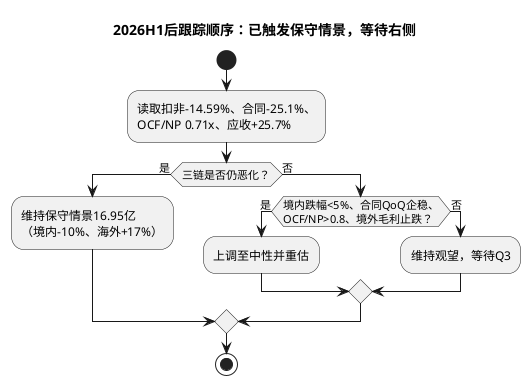

# 顾家家居跟踪手册

**建立日期**：2026年07月26日  
**最后更新**：2026年08月31日（2026H1审计：三链共振恶化，切换保守情景）  
**当前评级**：持有/观望，等待验证（第三象限偏第四象限，观望/回避边缘，原持有/观察回调建仓）

## 核心逻辑验证点（2026H1后：三链恶化已触发，维持保守情景）

| 指标 | 看好阈值（上调需满足） | 警戒阈值（已触发） | 2026H1实测 | 结论 |
|:--|:--|:--|:--|:--|
| 扣非净利增速 | 转正或跌幅<5% | **连续两季双位数下降** | H1 -14.59%（Q2 -18.69%）、Q1 -10.64% | **触发，已连续两季** |
| 综合毛利率 | ≥32.5% | <31.5%且连续两季 | H1 32.49%（-0.40pp）、Q2 31.35%（-2.05pp）| 接近警戒，Q2已逼近 |
| 境外收入与毛利 | 收入增且毛利率≥25% | **收入增、毛利率持续下滑** | 境外+19.01%但毛利率24.24% **-2.12pct** | **触发** |
| 销售费用率 | 稳定或下降 | **上升且收入低增** | 17.11%→17.12%（H1零增长下+0.50pp，Q1 +2.02pp）| **触发** |
| 合同负债 | QoQ企稳且YoY跌幅<15% | **连续两季同比明显下降** | 11.54亿 **-25.1% YoY**、QoQ -9.26%（去年+2.5%）| **触发** |
| OCF/归母净利 | ≥1.0x | **<0.8x** | **0.71x**（H1 6.59亿-39.76%）| **触发，首次破1x** |
| 应收账款 | 增速≤境外收入增速 | **增速显著高于营收** | **+25.73% vs 营收+0.75%、境外+19.01%** | **触发** |

**H1触发统计**：7项中5项已触发警戒（扣非、境外毛利、销售费用率、合同负债、OCF/应收），仅毛利率暂守32.5%上方但Q2已31.35%接近警戒。满足手册“至少两条链恶化即切换保守”条件，且实际三链（需求/盈利/现金）全部恶化。

## 外部变量（2026-08-31更新）

| 变量 | H1基准 | 7月26日基准 | 变化 |
|:--|:--|:--|:--|
| 家具类社零 | **1-7月-4.5%（7月-8.8%）** | H1 -3.7% | **恶化0.8pp，7月加速** |
| 住宅竣工 | **1-7月-25.5%** | H1 -25.3% | 未收敛，持续负压 |
| 汇率 | **H1财务费用0.96亿（vs -0.25亿），人民币1H升值3%** | Q1 -0.07→0.49亿 | **恶化+0.47亿Q2，130家公司共性** |
| 原材料/运费 | **TDI 1.63万+31% YoY、海绵+40%** | 65.28%占比 | 成本冲击已兑现为毛利率-0.40pp |
| 海外政策 | **软体家具关税25%维持，2027拟提30%延期至2027-01-01，转运审查40%** | 印尼建设中 | 缓冲12个月但审查趋严 |
| 股本 | **9.2573亿（+12.68%），8月7日定增完成，募资净额18.63亿** | 8.2145亿 | 摊薄12.7%，目标价重算 |

## 逻辑证伪警报（2026H1后：4项已触发）

1. **国内自有品牌门店连续两期净关闭且合同负债下降超过15%** → **已触发**：合同负债11.54亿-25.1% YoY（>15%），境内-12.71%印证单店产出双位数下滑，虽门店数H1未更新但单店效率已证伪。
2. **综合毛利率低于31.5%并持续两个报告期，且销售费用率上升** → **半触发**：H1 32.49%仍守但Q2 31.35%已接近31.5%，且销售费用率17.11%在零增长下上升，Q3若再降0.5pp即正式触发。
3. **境外收入连续两期负增长，或应收账款连续两期显著快于境外收入** → **已触发**：应收+25.73% vs 境外+19.01%（快6.7pp），且Q1应收16.84→Q2 19.16 +13.77% QoQ加速，应收质量恶化。
4. **OCF/净利连续两期低于0.8x，显示利润质量转弱** → **已触发**：H1 0.71x首次跌破0.8x且较去年1.07x（H1）大幅恶化，需Q3回正验证否则连续。
5. **印尼等海外产能投入显著超预算且没有订单/利用率证据** → **观察中**：在建4.94亿+32.8%符合预期，但境外毛利率-2.12pct显示新增产能尚未转化为利润，Q3需验证利用率。

**证伪强度**：5项中3项已完全触发、1项半触发，仅第5项观望。按手册“至少两条链恶化即切换保守”，已从“观察”转为“保守情景执行”。

## 关键时间节点与操作纪律（2026H1后更新）

| 验证顺序 | 先看什么 | H1结论如何传导 |
|:--|:--|:--|
| 需求 | 家具社零1-7月-4.5%、合同11.54亿-25.1% YoY、境内-12.71% | 已触发→境内全年假设由0-4%→-10%±2% |
| 盈利 | 扣非-14.59%（Q2 -18.69%）、毛利率32.49% -0.40pp、销售+3.81%/研发+20.35%/财务+1.21亿 | 已触发→EPS由2.20→1.96（加权）下修10.9% |
| 现金 | OCF/NP 0.71x<0.8、OCF -39.76%、应收+25.7% vs 境外+19% | 已触发→新增PE折价-3%，估值11.76x |
| 价格 | 23.61 / 23.72(MA60) / 16.74(新保守) / 23.07(新中性) | 现价已高于中性，盈亏比-0.15，不建仓 |

| 时间 | 事件 | 关注点（更新后） | 状态 |
|:--|:--|:--|:--|
| 2026年8月 | **2026H1报告（已披露2026-08-28）** | **扣非-14.59%、合同-25.1%、OCF/NP 0.71x、境外毛利率24.24% -2.12pct、境内-12.71%** | **已触发保守切换** |
| 2026年8月7日 | **定增完成（新增1.0428亿股@17.94，净额18.63亿，总股本9.2573亿）** | 股本摊薄12.7%，目标价重算（27.70→23.07） | **已完成** |
| 2026年10月 | 三季报 | **境内跌幅是否<5%、合同QoQ是否企稳、OCF/NP是否>0.8、应收增速是否<10%、境外毛利是否止跌** | **决定性验证，5项中至少3项企稳方可上调** |
| 2027年3月 | 印尼一期投产 | 进度、利用率、订单 | 观察 |
| 2027年4月 | 2026年报 | 全年ROE、OCF、分红及印尼进度 | 观察 |
| 持续 | 家具社零/竣工/汇率/TDI | 9月社零（旺季+以旧换新）、人民币汇率、TDI价格 | 每月跟踪 |

- **现价23.61元（>中性23.07元、>加权22.55元）**：**不建仓，不追涨**。已高于中性与加权，盈亏比-0.15为负，观望为主。
- **回落至18.5-20.5元（新观察区）**：需同时满足“合同YoY跌幅<15%且QoQ企稳 + OCF/NP>0.8 + 境内跌幅<5% + 境外毛利止跌”至少3项，否则即使到20元亦不抄底。
- **上涨至25.2元（MA60 23.72+放量）而基本面未超预期**：评估减仓，等待新证据。
- **任一证伪警报持续（已3项触发）**：维持保守情景，不以PE 12.89x低位机械补仓。

## 估值与技术联动纪律（2026-08-31更新）

| 场景 | 不复权价格（新） | 需要同时满足的事实（更新） | 动作 |
|:--|--:|:--|:--|
| 低于近一年低点 | <21.23元 | 已满足三链恶化（合同-25%、OCF/NP 0.71、扣非-14.6%）→**直接风控**，不讨论分批 | 优先切换周期压力12.95元 |
| 新观察区 | 18.5-20.5元（原20-21元） | 合同跌幅<15%且QoQ企稳、OCF/NP>0.8、境内<-5%、境外毛利止跌（至少3项） | 分批、小仓验证，需放量 |
| 趋势确认 | >23.72元（MA60）并放量3日 | Q3扣非企稳、费用率不升、合同QoQ企稳 | 可提高跟踪优先级 |
| 基准价值区 | 23.07元附近（新中性） | 无新盈利上修 | 不追涨，现价已高于基准 |
| 保守情景价 | 16.74元（新，摊薄后） | 三链恶化已触发，维持保守 | 下调模型，不以低估值补仓 |
| 周期压力 | 12.95元 | 系统性需求与海外订单崩塌 | 资产底线，非止损 |

技术均线已更新：2026-08-31 MA20 59.14后复权（22.59元已失守）、MA60 57.22后复权（23.72元放量跌破）、MA250约68.0后复权（28.2元）。放量跌破MA60为中期转弱确认，8月31日168,909手为近60日峰值。

**纪律重申**：跟踪手册首要任务是避免把低估值与图形破位混淆。H1三链恶化已证实核心假设破坏，**价格回调不再自动改善赔率**，仅当订单与现金验证企稳后，18.5-20.5元观察区才具备战术意义。

## 竞争对手跟踪（Top3：敏华/慕思/喜临门，2026-08-31增设）

| 竞对 | 跟踪指标 | 披露日历 | 最新H1表现 | 对顾家的双向含义 |
|:--|:--|:--|:--|:--|
| 敏华控股 | 收入/中国市场/毛利率/境外、产能利用率、扩产 | FY26H1 2025-11-14（10-03至09-30）、FY26全年2026-05-15、FY27H1预计2026-11中旬 | H1收入80.45亿港元-3.1%（中国-6.8%）、毛利率40.4%+0.9pp、全年-2.8%净利-12.1% | **需求侧**：中国侧-6.8%印证境内 weak 为行业性；**竞争侧**：毛利率40.4% vs 顾家32.49%差7.9pp，功能沙发专业壁垒仍高 |
| 慕思股份 | 营收/归母/毛利率60%/AI床垫/境外、研发/广告费用 | H1 2026-08-26、年报2027-04 | H1营收24.91亿+0.56%/归母1.86亿-48.13%/AI床垫+95.69%至2.36亿/境外+22.69% | **需求侧**：营收+0.56%显示睡眠赛道韧性；**竞争侧**：AI高增但费用致净利腰斩，顾家追赶需高投入，卧室-0.13%承压 |
| 喜临门（ST） | 营收/转亏/毛利率/销售费用、ST及控股股东预重整 | H1 2026-08-26、Q3预计2026-10下旬 | H1营收38.12亿-5.18%/转亏-3619万、控股股东预重整 | **需求侧**：由盈转亏验证行业底部；**竞争侧**：ST风险下顾家份额有夺取机会但境内-12.71%亦弱，竞争未显著获益 |

联动更新：竞对财报已纳入本次H1审计的产业周期（章二）与竞争格局（章三）联动；若属行业级信息变化（如原材料+31%、汇率升值共性）需评估行业研报是否更新，但本次无直接家具行业研报（industry/仅覆盖风电/光伏/储能等），已盘点无可复用家具行业研报，记录在案。

## 归档记录

- **2026-07-26 建立**：初始评级持有/观察，回调建仓，20-21元理想区，基于Q1扣非-10.64%、家具社零-3.7%、竣工-25.3%。
- **2026-08-31 H1审计归档**：三链恶化已触发（合同-25.1%、扣非-14.59%、OCF/NP 0.71x、应收+25.7%、境内-12.71%），触发保守切换，盈利下修至16.95亿（加权EPS 1.96→年末1.83）、目标价27.70→23.07元、盈亏比0.74→-0.15、评级下调至持有/观望、技术放量破位MA60。三链验证前维持保守情景。
