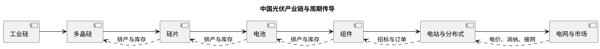
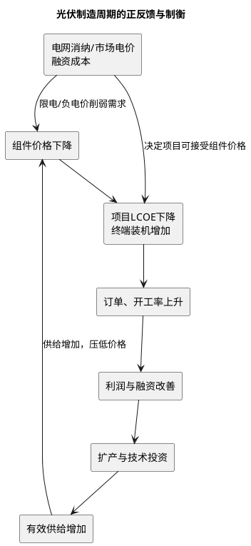

# 中国光伏行业深度研究报告

**日期**：2026年8月2日  
**研究覆盖**：中国光伏制造、国内应用、出口与电力系统，重点研究供给、价格、技术与需求的周期性  
**数据截至**：2026年7月31日；除另注外，制造端为CPIA口径、应用端为国家能源局（NEA）并网口径。7月月度装机、制造数据和上市公司2026年半年报尚未集中发布  
**研究性质**：行业研究，不构成对任何证券、项目或企业的投资建议

---

## 一、执行摘要

### 核心判断

中国光伏处于**产能出清已开始、但盈利反转尚未确认**的深度调整中段。2025年国内新增并网太阳能发电装机318GW、累计装机1.20TW，全球光伏新增装机也首次超过600GW；终端能源转型需求并未消失。与此同时，2025年中国多晶硅、硅片、电池片、晶硅组件的名义产能已分别约350万吨、1,500GW、1,400GW和1,100GW，显著大于当期有效需求。由此形成的并非单一“需求周期下行”，而是**供给资本开支周期、技术替代周期、价格—利润周期、终端收益率周期和贸易重构周期叠加**。

2026年上半年，国内新增光伏装机72.07GW，同比下降约66%；这个同比不宜直接解读为需求塌陷。2025年6月1日前投产项目可按旧规则衔接电价，导致2025年上半年出现异常抢装，抬高基数。更有解释力的指标是：2026年H1制造端多晶硅、硅片、电池、组件产量分别同比下降9.8%、7.3%、21.9%、35.1%，而7月相对1月的价格指数中硅料、硅片、电池仍分别下跌42.3%、28.7%、27.7%。量缩与价跌并存，说明有效供给尚未收缩到足以恢复行业利润的程度。

**本报告的基准判断**是：2026年更可能是“底部磨底与结构性修复”而不是全行业V形反转。最先改善的环节可能是具备现金成本优势、可真实减产且集中度相对高的上游；但其价格修复也最易诱发复产。组件、电池等同质化环节需要看到低效产线永久退出、应收和存货压力缓解、海外本地化供给形成成本纪律，才能确认修复。技术差异化（BC、高效TOPCon、场景化组件）能改善企业相对份额，却不能单独消除全行业过剩。

### 五项关键结论

1. **需求仍增长，制造业却可以长期亏损。** 光伏终端需求由度电成本、能源安全和减排目标支撑；制造环节的利润却由有效供给决定。2025年中国组件产量约620GW，而全球新增装机约600GW，且全球安装并不只使用当年中国产组件；单用年度装机与产量比较会低估库存、海外产能和供应链重复建设。
2. **目前是供给主导的熊市，不是传统库存小周期。** 2025年以名义产能除以产量计算，硅料、硅片、电池、组件的“产量/名义产能”分别仅约38%、45%、47%、56%。这不是严格的开工率，但足以显示产能利用不足；低利用率反过来又令固定成本摊薄变差、企业以现金成本而非全成本接单。
3. **价格尚未构成反转证据。** 2026年上半年产量已主动收缩，然而7月硅料、硅片、电池价格相对年初继续走弱，说明减产更多是排产调节而非不可逆的资产退出。组件价格小幅回升亦不能被视作全链盈利修复：其涨幅必须覆盖银、玻璃、胶膜、运费、汇率和账期成本，且要经由实际订单而非报价验证。
4. **136号文改变的是需求的质量与时点。** 新项目全面进入市场交易、通过竞价决定机制电价，组件需求从“是否建设”转为“项目在市场电价下能否获得足够IRR”。因此，今后装机增速、限电、现货低价时段、配储成本和融资条件的解释力将高于单纯的核准备案规模。
5. **出清的终点不等于价格暴涨。** 行业具有短建设周期、设备可迁移、地方就业与融资支持、以及技术升级触发的新一轮扩产等特征。即使硅料先涨价，若不能同步看到资本开支下降、落后产线永久关停、经营现金流改善和应收账款周转恢复，价格反弹仍可能只是“去库反弹”。

### 周期定位：五条链条的当前信号

| 周期链条 | 2026年8月观察 | 所处阶段 | 对行业的含义 |
|---|---|---|---|
| 终端需求/电力系统 | H1装机同比大降，受2025抢装高基数与电价机制切换影响；累计光伏仍快速增长 | 政策切换后的再定价 | 装机不再是单一数量目标，消纳与收益率决定项目质量 |
| 制造供给/资本开支 | 2025名义产能远超当年产量，2026H1产量继续同比收缩 | 被动减产、主动出清初期 | 减产不等于退出，核心看永久关停与资本开支 |
| 价格/利润 | 上游至电池的价格指数仍较年初下降，多家龙头2025亏损 | 现金成本竞争 | 全行业尚未跨过全成本盈利线 |
| 技术迭代 | TOPCon主导，BC/HJT等争取差异化溢价 | 路线再分化 | 技改可淘汰旧线，也可能造成重复投资 |
| 贸易/区域化 | 出口量增长但金额承压；东南亚转口受阻、海外建厂加快 | 全球化重构 | 产能转移不等于全球供给出清，成本与合规门槛上升 |

---

## 二、行业定义、边界与数据口径

### 2.1 产业链与价值实现

光伏行业不是单纯的“组件制造业”。制造端成本下降必须最终在电站端以更低LCOE、更高可利用电量和更稳定现金流实现价值。完整链条如下：



本报告研究边界包括工业硅至组件、国内集中式和分布式电站、主要出口市场与电力市场化；逆变器、支架、玻璃、胶膜、银浆、储能和电网作为影响需求质量或制造成本的关键配套环节讨论，但不单独建立产能平衡表。

### 2.2 必须区分的四个口径

| 概念 | 含义 | 常见误用 | 本报告处理方式 |
|---|---|---|---|
| 名义产能 | 设计或公告的年化产出能力 | 直接等同于可供货量 | 仅用来判断潜在供给压力 |
| 可运行产能 | 已建成、具备开车条件的产能 | 忽略检修、技改、现金流约束 | 作为供给上限的第二层口径 |
| 有效供给 | 在特定价格下愿意且能够持续生产并交付的产能 | 把停产产线永久剔除 | 结合现金成本、订单、融资、复产周期判断 |
| 新增装机 | 已并网的交流侧电站容量 | 与组件出货GW一一对应 | 使用NEA并网口径，并说明与直流侧组件、出口和库存的差异 |

国际机构与中国官方对2025年中国新增光伏的估计并不完全一致：IEA在全球能源回顾中以“commissioned”口径估算中国约370GW，而NEA正式并网统计为318GW。两者可能受到直流/交流容量、分布式统计、统计时点和预估方法差异影响。**本报告国内历史序列固定使用NEA正式并网数据，不用不同口径相加或互相替代。**

---

## 三、周期框架：为什么光伏比一般制造业更易“长需求、长亏损”

### 3.1 五个相互耦合的循环



1. **需求与电力系统周期**：组件降价会降低初始投资，但当午间现货价格下降、弃光增加、接网排队拉长时，项目的有效发电收入可能下降得更快。因而“组件更便宜”不必然转化为同等比例的装机增加。
2. **供给与资本开支周期**：光伏设备建设周期相对短、模块化程度高，上一轮利润与融资容易转化为扩产；在价格下跌后，既有产线为覆盖现金费用继续生产，压低全行业价格。
3. **价格、库存与利润周期**：价格下降先刺激渠道补库和项目抢装，随后若终端收益率不支持，则订单回落、库存与应收抬升。账面毛利改善不能替代经营现金流改善。
4. **技术迭代周期**：PERC退出、TOPCon快速普及、BC和HJT推进时，旧产线可能发生经济性折旧；但设备改造和新技术扩产也能在供给过剩期继续增加产能，延长出清。
5. **贸易与区域化周期**：贸易壁垒会压缩某一路径，却可能经由市场多元化、海外建厂或供应链再配置改变流向。它抬高合规和资本成本，但不会自动减少全球组件供给。

### 3.2 周期真正反转的必要条件

行业反转至少需要“价格止跌”之外的三类共同证据：

| 维度 | 必要证据 | 伪反转信号 |
|---|---|---|
| 供给 | 连续两个以上季度的永久关停、项目取消、资本开支下降，且复产受制于资产负债表 | 单月排产下调、检修或行业自律倡议 |
| 价格 | 主链价格高于领先企业的完全成本，且可通过订单、回款和毛利兑现 | 现货报价上调、短期补库、硅料单点涨价 |
| 财务 | 经营现金流转正、应收天数回落、存货跌价损失减少、固定资产减值充分计提 | 通过压缩采购付款或处置资产带来的短期现金流 |
| 需求质量 | 竞价项目收益率稳定、并网接入可得、市场化电量和绿证收入可预期 | 仅由政策截止日触发的集中抢装 |

结论是：**供给侧“减产”是反转的必要条件，不是充分条件；终端收益率和财务出清才决定反弹能否跨越一个季度。**

---

## 四、需求端：装机高增长进入“电力系统约束”阶段

### 4.1 中国装机的历史跃迁

| 年份 | 新增太阳能并网装机（GW） | 年末累计（GW） | 年度特征 |
|---|---:|---:|---|
| 2021 | 54.9 | 307 | 补贴退出后平价项目扩张 |
| 2022 | 87.4 | 393 | 分布式和大基地共同拉动 |
| 2023 | 216.9 | 609 | 产业链降价释放需求 |
| 2024 | 277.6 | 887 | 集中式大基地与分布式高景气 |
| 2025 | **318.0** | **1,200** | 136号文前抢装；风光累计装机超过火电 |
| 2026H1 | **72.07** | 约1,270（6月底） | 高基数、机制切换和项目收益率重估 |

**来源**：NEA历年全国电力统计及2025年可再生能源并网运行情况；2026H1新增装机为CPIA在2026年7月23日发布会披露。2026年6月底NEA披露太阳能累计12.7亿千瓦，含非光伏太阳能发电的统计口径，故表中不将其与“光伏新增”机械相减。

2025年新增318GW、同比增加约40GW，但年度总量掩盖了强烈的时点错配：136号文以2025年6月1日作为存量与增量机制的分界，大量项目在窗口前集中并网。2026H1同比降幅因此同时包含基数效应、项目审批和招标节奏重排、收益率重新测算，而不能简单外推全年需求下降66%。国家能源局建档立卡公告显示，2026年6月新增项目中有36个集中式光伏、3,751个工商业分布式光伏（不含户用光伏）；该数据是项目数而非容量，不能替代月度并网GW，但显示分布式项目仍是备案端的主要构成。

#### 4.1.1 集中式与分布式：同一装机总量下的两种需求函数

| 指标 | 2025年集中式 | 2025年分布式 | 合计/含义 |
|---|---:|---:|---|
| 新增装机 | **164GW** | **153GW** | 317GW，集中式占51.7%、分布式占48.3% |
| 年末累计装机 | 670GW | 530GW | 1.20TW；集中式仍略高，但分布式已接近一半 |
| 首要约束 | 大基地外送、用地、接网、市场电价 | 配电网承载、屋顶资源、用户负荷和自发自用比例 | 组件价格对二者的传导不同 |
| 制造端订单特征 | 单体项目大、招标集中、容易受并网节点扰动 | 订单更碎片化、渠道与融资更重要 | 共同决定组件排产，但季节性不同 |

**来源**：[NEA 2025年可再生能源并网运行情况](https://www.nea.gov.cn/20260212/742b8c6a078347b0b39de676c05c5d58/c.html)。

这组拆分改变对2026H1低装机的解释。集中式项目往往受基地外送、竞价和并网窗口影响，单月波动可很大；分布式则更受配电网接入、工商业负荷和屋顶投资者收益影响。两者都进入市场化定价，但不能把一个类别的抢装或收缩外推为另一个类别的需求函数。

#### 4.1.2 装机、出货与制造产量的“缺口表”

| 指标 | 2025年 | 能回答的问题 | 不能回答的问题 |
|---|---:|---|---|
| 国内新增并网 | 317—318GW | 中国终端项目完成量 | 当年组件采购量与库存变化 |
| 中国晶硅组件产量 | >620GW | 国内制造的供给规模 | 中国企业海外产线、非晶硅组件、年初年末库存 |
| 中国组件出口量 | 约258GW | 直接出口的跨境需求 | 境外本地制造和目的地库存 |
| 全球新增光伏装机 | >600GW | 全球终端部署强度 | 各国使用的产地、直流/交流容量和组件库存 |

因此，报告不采用“620GW产量－318GW国内装机－258GW出口≈剩余44GW”的机械算法。它忽略了直流/交流容配比、海外中国企业本地制造、产品口径、渠道库存以及跨年交货。正确做法是把这张表视为**供需压力的方向性证据**，再以企业库存、应收、开工率和价格验证。

### 4.2 136号文：需求从“补贴/标杆价驱动”转为“市场收益率驱动”

2025年1月，国家发展改革委、国家能源局印发[发改价格〔2025〕136号](https://zfxxgk.ndrc.gov.cn/web/iteminfo.jsp?id=20482)。其核心是推动新能源上网电量全面进入电力市场，存量和增量项目分别衔接，并对增量项目通过竞价形成机制电价和机制电量。

对制造业的传导不是“政策不支持光伏”，而是以下四项变化：

- **收益不确定性前移**：开发商须在决策时估计现货价、绿证、保障机制电量、配储、调峰和接网成本；组件采购价格下降只是其中一个变量。
- **抢装与真需求分离**：临界日期会把未来部分项目提前并网，随后出现阶段性真空，制造商不能按抢装月份排产外推全年。
- **区域分化扩大**：同一组件价格在资源禀赋、电网接入、负荷中心距离和市场规则不同的省份，对项目IRR的影响不同。
- **竞争焦点下沉至系统能力**：组件效率、双面率、衰减、运维、支架与储能方案、融资和履约能力，对开发商的价值将高于单一名义功率价格。

### 4.3 消纳、现货价格与储能：长期需求的约束变量

2025年风电和太阳能合计发电量2.3万亿千瓦时，约占全社会用电量22%；这验证了新能源已从边际电源变为系统主体之一。随着渗透率提高，光伏的挑战从“能否建成”转向“能否在有价值的时段发电并结算”。IEA也指出，多国的弃电和负电价增加与太阳能出力高峰重合，反映灵活性和电网投资不足。

对光伏周期而言，需持续追踪：

| 指标 | 含义 | 对组件需求的影响 |
|---|---|---|
| 弃光率、限发电量 | 电站物理消纳约束 | 抬高项目要求的组件降价幅度，抑制边际项目 |
| 午间现货价/捕获电价 | 光伏实际获得的电价，不等于平均电价 | 决定新增项目的真实收入 |
| 接网排队和并网周期 | 建设到发电的时间成本 | 拉长库存和资金占用，平滑制造订单 |
| 新型储能、抽蓄、调峰规模 | 对出力波动的吸收能力 | 改善项目价值但增加初始投资 |
| 跨省交易与绿证 | 电量和环境价值的变现渠道 | 提高外送基地与绿电直连项目的可融资性 |

### 4.4 海外需求：总量增长与中国直接出口并非同义词

IEA预计2025—2030年全球可再生能源新增装机约4,600GW，光伏约占其中80%，长期需求空间仍大。2025年全球新增光伏装机超过600GW；中国仍是最大市场，但欧洲、印度、中东、拉美、东南亚等市场的重要性上升。

中国机电产品进出口商会统计，2025年中国硅片、电池片、组件出口额约294.5亿美元，同比下降8%。同时，行业统计显示硅片、电池、组件出口量仍分别约70GW、113GW、258GW，量增价跌的组合表明：出口成为消化产量的通道，却未必给制造商带来盈利。东南亚四国的贸易限制、美国对第三国路径的调查，以及印度本地化规则，使出口目的地与产地结构持续重排。

---

## 五、供给端：名义产能过剩到有效供给收缩之间，仍有很长距离

### 5.1 2025年制造能力与产量

| 环节 | 2025年名义产能 | 2025年产量 | 产量/名义产能（测算） | 周期解读 |
|---|---:|---:|---:|---|
| 多晶硅 | 约350万吨 | 约134万吨 | **38%** | 高资本开支后的低负荷运行，停复产和现金成本最关键 |
| 硅片 | 超1,500GW | 约680GW | **45%** | 尺寸、薄片化与技术迭代令部分产能经济性下降 |
| 电池片 | 超1,400GW | 超660GW | **47%** | TOPCon同质化快速形成，供需压力向中游集中 |
| 晶硅组件 | 超1,100GW | 超620GW | **56%** | 产能最易全球化，品牌和渠道并未阻止价格竞争 |

**来源及限制**：产能来自CPIA在2026年行业年度回顾中披露的年末规模，产量来自CPIA年度统计。上表是“年度产量/名义产能”的近似利用度，**不是设备实际开工率**；产能投产月份、检修、产品良率、技改和跨年度库存会导致二者不完全匹配。该测算的价值在于判断供给冗余量级，而非精确计量每家企业的开工水平。

### 5.2 2026年上半年：供给在收缩，但收缩速度尚未证明足够

| 环节 | 2026H1产量 | 同比变化 | 观察 |
|---|---:|---:|---|
| 多晶硅 | 53.8万吨 | -9.8% | 产量下降较温和，仍需观察停复产的持续性 |
| 硅片 | 293GW | -7.3% | 旧规格、低效率与现金弱的产线承压更大 |
| 电池片 | 260.7GW | -21.9% | 需求与技术路线双重压缩排产 |
| 光伏组件 | 201.3GW | -35.1% | 国内抢装结束、出口价格低位和渠道去库存共同影响 |

**来源**：CPIA 2026年7月23日“2026年上半年发展回顾与下半年形势展望”披露，经公开报道交叉核验。

一个重要但常被忽略的事实是：H1组件产量降幅远大于硅料和硅片。这可能意味着组件端更先进行排产削减，也可能反映前段库存、代工结构和出口节奏差异；不能据此断言上游供需更好。应与各环节库存、现货成交和企业现金流一并观察。

#### 5.2.1 本轮出清的实物证据：减产、停产、复产必须分开统计

| 事件类型 | 已观察到的例子 | 对有效供给的含义 | 研究处理 |
|---|---|---|---|
| 排产下调 | 2026H1组件产量同比-35.1%，电池同比-21.9% | 反映短期订单与库存压力 | 仅记为“减产”，不直接计为产能退出 |
| 完全停产 | 公开行业跟踪显示通威曾在2026年1月底完全停产部分多晶硅产能 | 能快速降低当期供给与库存压力 | 必须继续确认停产范围、人员/设备处置和复产条件 |
| 复产计划 | 同一跟踪显示通威、协鑫等在年中存在复产或提产安排 | 证明高价或现金流改善会带来供给弹性 | 作为价格反弹的上限约束，而非利多 |
| 并购与退出 | 2026年行业出现尾部企业退出、资产处置与头部收购的公开案例 | 可能减少低效供给，也可能仅发生资产所有权转移 | 看收购后是否实际关停旧线、是否新增复产 |

**证据等级**：前两类可用协会产量和公司公告交叉验证；停复产的精确GW/万吨通常属于高频行业数据，应标注为待公司财报或项目环评验证。仅凭“反内卷”表态或一次停产消息，不能推导为有效供给永久减少。

#### 5.2.2 分环节出清速度为何不同

| 环节 | 固定成本/停复产特点 | 2026H1量的信号 | 本轮最关键的验证变量 |
|---|---|---|---|
| 多晶硅 | 单厂规模大、能耗与折旧高，停复产有显著成本 | 产量仅同比-9.8% | 低成本产线复产速度、在建项目是否取消、库存与现金成本 |
| 硅片 | 规格切换快，PERC旧线与N型适配度决定经济性 | 同比-7.3% | 旧尺寸/低效产线是否报废而非技改待命 |
| 电池 | TOPCon供给同质、技术切换快，客户认证影响产能价值 | 同比-21.9% | TOPCon改造与BC/HJT新增是否净增加有效产能 |
| 组件 | 设备相对通用、品牌与渠道驱动，最容易以低价维持出货 | 同比-35.1% | 海外库存、质保义务、应收账款及低价订单的现金回收 |

这解释了一个看似矛盾的现象：组件的减产最显著，却未必最先盈利；硅料减产较慢，却可能在短期最先对价格产生弹性。前者的供给分散且可通过出口和渠道库存缓冲，后者更集中但复产杠杆更高。

### 5.3 出清为何缓慢

1. **沉没成本与现金成本定价**：已建成产线若仍能覆盖电力、原料和工资等现金支出，即使不能覆盖折旧与利息，也可能继续生产；这会拖慢全成本意义上的出清。
2. **产线并非同质资产**：高效率、低能耗、可转换为新技术的产线与老旧线有不同的复产价值，公告的“减产”需要区分是检修、技改、永久关停还是产能迁移。
3. **地方融资与就业约束**：大型项目停产涉及银行、供应商、地方税收与就业，清算速度通常慢于商品价格下跌。
4. **技术升级可能制造新供给**：以淘汰PERC为名的新建TOPCon或BC项目，在总需求不足时会抵消旧产线退出。
5. **出口与海外建厂延缓压力暴露**：海外订单和境外制造可吸收部分产能，但贸易合规、低价竞争和资本支出也会把过剩从中国境内转移到全球。

### 5.4 供给出清的可验证阈值

| 观察项目 | 底部磨底 | 趋势反转的最低要求 |
|---|---|---|
| 排产 | 季节性降负荷、月度波动 | 多季度低负荷后出现不可逆关停/项目取消 |
| 资本开支 | 已公告项目延后 | 在建规模下降，新增扩产少于淘汰与折旧替代 |
| 资产减值 | 个别企业计提 | 龙头普遍充分计提、低效资产被处置或退出 |
| 价格 | 短期涨跌受补库影响 | 连续覆盖头部企业完全成本且订单量不萎缩 |
| 资产负债表 | 靠短债、票据或延长账期维持 | 经营现金流改善、应收与存货周转同步好转 |

---

## 六、价格、成本和盈利：低价并非需求刺激的免费午餐

### 6.1 2023年以来的价格冲击

IEA指出，中国光伏组件价格自2023年以来下降超过60%，最大的制造商净利率降至约-10%，自2024年初累计亏损接近50亿美元。价格下降显著降低全球项目的初始投资，是光伏装机增长的基础之一；但对制造商而言，它已越过多数企业全成本线。

2026年7月相对1月，CPIA价格指数显示多晶硅、硅片和电池分别下跌42.3%、28.7%和27.7%，组件上涨3.0%。该组数据支持以下判断：

- 上游和中游尚未摆脱价格竞争；
- 组件的小幅环比上涨可能反映成本传导、订单结构或低价治理，不能单独证明终端需求全面改善；
- 不同环节的价格变化不应简单相加：硅料价格下降可能扩大硅片空间，也可能被更激烈的中下游降价完全传导；
- 只有组件ASP、单位制造成本、出货、回款和库存同时改善，才可确认利润修复。

#### 6.1.1 量价周期复盘：三段而非单一“价格暴跌”

| 阶段 | 量价特征 | 利润与资本开支行为 | 对当前周期的遗产 |
|---|---|---|---|
| 2021—2022：硅料紧缺与高价期 | 上游供给约束，硅料价格一度处于历史高位；组件成本受压 | 高利润与长期需求预期推动全链扩产 | 为2023年后的名义产能过剩埋下基础 |
| 2023—2024：产能集中释放与价格重估 | 硅料、硅片、电池、组件价格下行，组件价格自2023年以来累计降幅超过60% | 利润从上游向全链收缩，企业仍以规模和技术升级竞争 | 存量设备、在建工程、低价长单和库存形成财务压力 |
| 2025—2026H1：低价磨底与结构性波动 | 2025年中组件成交价约0.6元/W；2026H1产量下降但上游至电池价格仍弱 | 减产、减值、并购和海外本地化并行 | 价格修复受复产、银等辅材成本和终端收益率共同约束 |

> 注：不同高频机构对规格、税口径和交付地的报价不同，表中不把单一现货报价当作全行业ASP；趋势结论由CPIA价格指数、公司财报和行业成交信息共同支持。

#### 6.1.2 成本线与价格线：必须同时观察的五个差额

| 差额 | 计算 | 为何重要 | 常见误读 |
|---|---|---|---|
| 现货价－现金成本 | 即期售价减原料、电力、人工等可变成本 | 判断企业是否有继续生产的短期动机 | 正数不代表覆盖折旧、利息与质保 |
| ASP－完全成本 | 销售均价减现金成本、折旧、费用、财务成本 | 判断行业是否真正盈利 | 用领先企业成本替代行业平均成本 |
| 组件ASP－辅材成本变化 | 组件售价变化减银、玻璃、胶膜等变化 | 判断组件端是否获得成本传导 | 只看硅料降价而忽略银与账期 |
| 出货增速－应收增速 | 量增与信用扩张的差 | 判断订单是否健康 | 把长账期或渠道压货当作需求复苏 |
| 经营现金流－净利润 | 营运资本与真实现金创造的差 | 判断能否承受下一轮价格战 | 把单季回款改善等同于经营性盈利 |

#### 6.1.3 龙头财务验证：规模没有自动转化为利润

| 公司/样本 | 最新可核验指标 | 周期含义 | 数据来源 |
|---|---|---|---|
| 通威股份 | 2025年归母净亏损95.53亿元；2026Q1归母净亏损24.44亿元 | 上游与电池组件一体化也未能隔离全链低价 | 2025年报、2026Q1公告 |
| 隆基绿能 | 2025年归母净亏损64.20亿元；2026Q1组件出货12.62GW，其中BC 8.34GW | 技术和品牌可优化产品结构，但仍需验证溢价与盈利 | 2025年报、2026Q1公告 |
| 晶澳科技 | 2026Q1亏损10.67亿元；电池组件出货11.87GW，海外组件占比约77% | 高海外占比降低单一市场风险，同时承受贸易、汇率和回款风险 | 2026Q1公告 |
| 组件Top10样本 | 2026Q1前十出货79.89GW，前四占64.08%；前四头部企业合计仍亏损46.20亿元 | 集中度提高尚不足以形成价格纪律 | 行业出货统计、公司财报 |

财务表的正确读法是：企业“减亏”可能来自价格、成本、减值基数、汇兑或营运资本变化，不能仅凭归母净利润同比改善判定周期反转。报告后续更新以单位ASP、毛利率、经营现金流、应收/存货周转和资本开支五项同时确认。

### 6.2 成本曲线：决定谁能熬过周期，而非决定行业一定盈利

| 环节 | 主要成本与变量 | 周期低点的胜负手 | 不能忽略的风险 |
|---|---|---|---|
| 多晶硅 | 电力、工业硅、折旧、能耗与良率 | 低电价、低单位能耗、稳定运行、现金与停复产纪律 | 高固定成本和复产冲动导致价格二次承压 |
| 硅片 | 硅料、拉晶电力、坩埚、切片、薄片化良率 | N型适配、薄片化、非硅成本下降 | 技术规格变化令设备和库存减值 |
| 电池 | 硅片、银浆、设备折旧、转换效率、良率 | 提效、少银/无银、良率、专利与客户认证 | TOPCon同质化、银价与专利纠纷 |
| 组件 | 电池、玻璃、胶膜、边框、人工、保修与渠道 | 可靠性、品牌、海外渠道、项目交付能力 | 账期、质保、汇率、关税和低价订单 |

成本领先企业可以在价格战中扩大份额，却不能保证行业利润回归：当领先企业的边际成本仍低于市场价格、且其目标是利用率或客户份额时，价格下限会进一步下移。因而研究重点应从“谁成本最低”延伸到“最低成本企业是否仍在扩大供给、其现金流能否支持持续扩张”。

### 6.3 财务压力已经从利润表传导至资产负债表

2025年头部企业的财报验证行业并未完成出清：

| 企业 | 主体环节 | 2025年归母净利润/损益 | 需要怎样解读 |
|---|---|---:|---|
| 通威股份 | 硅料、电池、组件 | **-95.53亿元** | 供需失衡下硅料与电池组件业务毛利承压，并计提较大减值 |
| 隆基绿能 | 硅片、电池、组件 | **-64.20亿元** | 低价竞争下减亏但未扭亏；BC量产与场景化是差异化尝试 |
| 晶科能源 | 一体化组件 | 见公司年报 | 高出货与全球化可改善相对竞争力，但不能抵消全行业价格压力 |

通威2025年营业收入841.28亿元、归母净亏损95.53亿元；隆基2025年年报披露归母净亏损64.20亿元，且全年经营活动现金流净额为43.59亿元。后者说明经营现金流可以因收款、采购和营运资本变化而优于利润，不能被直接解读为制造盈利全面恢复。研究者应同时检查：应收账款及合同资产、存货跌价、固定资产和在建工程减值、资本开支、短期债务与票据。

---

## 七、技术路线：出清的工具，也是新一轮过剩的来源

### 7.1 从PERC到TOPCon，再到BC/HJT的经济含义

| 路线 | 当前产业位置 | 对周期的正面作用 | 对周期的负面作用 |
|---|---|---|---|
| PERC | 成熟且被N型替代 | 低效产线退出可减少有效供给 | 退出资产若未报废、可低价外溢，仍可能扰乱市场 |
| TOPCon | 当前量产主流 | 提效与成熟供应链降低LCOE | 进入门槛相对可复制，形成快速同质化扩产 |
| BC | 高效率、场景化和品牌差异化方向 | 有望形成效率、外观和应用价值溢价 | 量产良率、设备投资和客户认证周期长；未必能普遍溢价 |
| HJT/钙钛矿叠层 | 潜在下一代方向 | 长期效率上限更高，可能重构设备和材料价值 | 技术尚未完全规模化时的提前扩产风险最高 |

CPIA路线图披露的量产效率中，TOPCon、HJT、XBC在2025年已分别达到约25.7%、25.9%、26.5%。效率差异是真实的，但投资判断必须把“电池效率”转换为“组件功率、系统BOS节省、衰减与质保、产线良率、专利费用及全生命周期发电量”。只比较实验室或电池端效率，会高估技术溢价。

#### 7.1.1 技术路线的市场验证，而非实验室排序

| 指标 | TOPCon | BC | HJT | 研究结论 |
|---|---|---|---|---|
| 2025年产业位置 | N型主流路线，行业统计产出份额约85% | 约60GW出货、约9%产出份额的差异化路线 | 约19GW产出、利用率相对偏低 | TOPCon仍是产量主线，BC/HJT是否扩大取决于成本和客户价值 |
| 核心优势 | 供应链成熟、PERC升级路径相对清晰 | 效率与外观/场景化潜力 | 效率潜力高、工艺差异明显 | 优势要落实为组件端度电收益或溢价 |
| 核心风险 | 同质化扩产与专利/银耗压力 | 良率、资本开支、认证与规模化 | 成本、设备投资、材料体系和低利用率 | 任何路线的新建产能都可能延缓行业出清 |
| 必须跟踪 | 实际出货、良率、售价与非硅成本 | BC组件占总出货、溢价、订单复购 | 产能利用率、铜电镀等降本验证 | 用商业化指标取代“发布效率纪录” |

数据来自CPIA路线图及行业统计，属于行业汇总口径；不同机构对“产能”“产出”及技术归类有差异，后续应以公司产线与产品出货披露复核。

#### 7.1.2 PERC退出、TOPCon技改与BC新建：三类资本开支的周期含义

| 资本开支类型 | 对行业有效供给 | 对企业的正确评价 |
|---|---|---|
| PERC永久报废 | 减少低效供给，是出清 | 看固定资产处置、减值和设备去向 |
| PERC→TOPCon改造 | 可能降低成本、也可能维持总供给 | 看改造资本开支、良率和新产品是否真实替代旧线 |
| BC/HJT新建 | 在需求未同步增长时增加供给 | 只有已验证的客户溢价、订单和现金回收才支持其合理性 |

### 7.2 技术替代对供给的两面性

技术升级会带来三种不同结果：

1. **替代型出清**：低效产线无经济改造价值、永久报废，行业有效供给下降；这是最有利于周期修复的情形。
2. **改造型延寿**：旧产线以较低资本开支切换路线，成本下降但总产能不减；这会提高龙头竞争力，却未必改善行业供需。
3. **新增型扩张**：企业一边保留旧线、一边以新技术新建大规模产能；若需求未同步增长，技术叙事会延后出清。

因此，判断技术周期对盈利的影响，关键不是发布会上的转换效率，而是旧线处置、改造资本开支、新线爬坡良率、单位折旧和实际订单溢价。

---

## 八、竞争格局与全球化：规模、技术、渠道和资产负债表的四维淘汰赛

### 8.1 竞争不再只看GW规模

| 竞争维度 | 作用 | 周期低点的含义 |
|---|---|---|
| 制造成本 | 决定现金成本下的生存能力 | 是必要条件，不是盈利充分条件 |
| 技术与知识产权 | 决定效率、良率和客户差异化 | 需转换为可验证溢价和出货，而非单点纪录 |
| 海外渠道与本地交付 | 降低单一市场和贸易路径风险 | 同时带来库存、汇率、关税和本地合规成本 |
| 资产负债表 | 决定能否承受亏损、给客户账期并完成技改 | 周期末往往比产能规模更重要 |

头部一体化企业具备采购、客户、技术和融资协同，但一体化并不能消除供给过剩，反而可能使价格压力沿产业链内部传导。专业化企业若在某一技术或成本节点形成极强优势，仍可生存；但其对单一价格的敏感性与客户集中度通常更高。

### 8.2 贸易重构不是“出口消失”

2025年中国光伏产品出口额下降而出口量增长，反映全球需求扩张与单位价值下降并存。贸易壁垒的影响主要是：

- 增加直接出口与经第三国转口的合规成本和不确定性；
- 推动电池、组件等环节在海外本地化，改变中国企业的资本开支结构；
- 降低单一市场的可得性，却未必削弱中国企业在设备、硅片、电池工艺、供应链与项目经验上的竞争力；
- 使“海外产能”也成为需要核验的名义产能：必须区分宣布、建设、认证、达产和可进入特定市场的产能。

对行业周期而言，贸易壁垒可能使某些企业的供给约束更早出现，但全球产能区域化会提高固定成本并造成重复建设，长期未必等于全球供给收缩。

### 8.3 出口目的地与贸易壁垒：看金额、数量、路径三张表

| 维度 | 2025年/近期事实 | 周期含义 | 不能据此推导 |
|---|---|---|---|
| 总出口金额 | 硅片、电池、组件出口额约294.5亿美元，同比-8% | 价格下行快于出口规模扩张，海外未能恢复制造毛利 | 海外终端需求消失 |
| 东南亚四国路径 | 对泰国、越南、马来西亚、柬埔寨出口量同比约-65% | 转口路径受贸易壁垒压缩，供应链重构加快 | 中国企业全球竞争力终结 |
| 拉美与中东 | 对智利、哥伦比亚组件/逆变器出口额增长；沙特、阿联酋的高端组件与系统需求增长 | 新兴市场承接增量，项目型需求对交付、融资和系统能力要求更高 | 可无限替代欧美市场的利润池 |
| 2026年逆变器出口区域 | 1—4月欧洲金额最高，亚太次之，中东、非洲、拉美紧随 | 逆变器可作为项目活跃度的辅助领先指标 | 可直接替代组件出口数据 |

贸易数据的跟踪纪律：每月同时看HS口径数量、金额、单位价值、目的地、原产地规则和企业海外产能利用率。只看出口量会把低价清库存误判为需求繁荣；只看出口金额又会把单位价格下降误判为终端需求衰退。

---

## 九、周期定位与2026—2028年情景推演

### 9.1 基准情景的逻辑

本报告不以单一“年度新增装机预测”代替周期判断。基准情景认为：全球能源转型仍支持需求增长；中国终端需求将在市场化电价机制下重新定价；制造端将持续减产、降资本开支、处置低效资产，但存量产能与复产弹性令全行业盈利修复慢于价格预期。

### 9.1.1 从组件价格到项目IRR：需求质量的最小模型

136号文后，项目是否投资取决于收益率而非单纯的组件降价。建议用下列透明模型按省份、项目类型和投产批次重算，而不使用一个全国统一IRR：

```text
初始投资 = 组件 + 逆变器/支架/电缆 + EPC + 土地/屋顶 + 接网 + 储能 + 建设期利息
年可结算电量 = 装机 × 等效利用小时 × (1 - 弃光/限发率) × 系统可用率
年收入 = 机制电量 × 机制电价 + 市场电量 × 光伏捕获电价 + 绿证/其他收益
年净现金流 = 年收入 - 运维 - 土地/屋顶租金 - 辅助服务/调节成本 - 税费 - 更新支出
项目IRR = 使全生命周期净现值为零的折现率
```

| 敏感变量 | 对IRR的方向 | 2026年应优先取得的数据 |
|---|---|---|
| 组件价格 | 降低初始投资，抬升IRR | 实际中标/交付价，而非单一现货报价 |
| 光伏捕获电价 | 直接决定市场化部分收入 | 省级现货/中长期交易、时段电价和机制结算规则 |
| 弃光与接网 | 降低可结算电量、延后现金流 | 分省利用率、接网排队、限发记录 |
| 储能与调节成本 | 抬高初始投资或运营成本，也可能改善收益 | 配储比例、容量/电量成本、市场化调用收益 |
| 利用小时和容配比 | 改变单位装机发电量与组件需求 | 项目可研、资源评估与实际运行数据 |

这不是为了制造精确到小数点的“全国平均IRR”，而是为了识别边际项目何时从可投变为不可投。报告将优先跟踪西部基地与东部工商业两类项目，因为二者分别代表消纳/外送约束与配电网/自发自用约束。

### 9.2 情景表

| 情景 | 概率判断* | 2026—2028年的关键假设 | 价格与利润路径 | 验证指标 |
|---|---:|---|---|---|
| **基准：磨底后结构修复** | 50% | 国内市场化规则逐步稳定；海外新增装机增长但贸易壁垒持续；低效产线逐步退出 | 2026年价格低位震荡，领先企业先改善现金流；2027年后部分环节才恢复全成本盈利 | 资本开支下降、减值充分、回款改善、组件价格覆盖全成本 |
| **乐观：供给出清加速** | 25% | 大量低效产能永久退出，融资收紧抑制新扩产；电网和储能改善带动高质量需求 | 上游先修复，再向中下游传导；行业利润率回升但不回到上一轮暴利 | 连续季度退出大于新增、订单与价格同步增长、资产负债表去杠杆 |
| **保守：反复价格战** | 25% | 停产产线快速复产，新技术名义扩产抵消退出；电价和消纳压力令项目延期 | 局部价格反弹后再下行，亏损延长，资产减值和现金流压力加大 | 价格上涨但排产未降、资本开支高企、应收/库存恶化、出口量增而金额降 |

> *概率为研究框架下的主观判断，不是统计预测；每个季度应随数据更新。

### 9.3 哪些事件会改变基准判断

**上修为乐观的触发器**：

- 多晶硅至组件的价格连续覆盖龙头完全成本，且订单、回款未下降；
- 多季度出现可核验的永久关停、项目取消、并购重组或破产清算，而非临时检修；
- 头部企业资本开支显著下降、固定资产减值充分，经营现金流和应收周转共同改善；
- 现货市场、绿证、储能和跨省交易提高新增项目的捕获电价，使需求从抢装转为常态化建设。

**下修为保守的触发器**：

- 短期涨价诱发大规模复产与新扩产；
- 新增项目因并网、机制电价、限电或融资而持续延期；
- 海外贸易限制进一步扩展，同时本地化产能无法形成有利润的交付；
- 龙头为维持市占率以低于全成本价格接单，导致应收、质保义务和现金流继续恶化。

---

## 十、风险全景

| 风险 | 传导路径 | 领先信号 | 缓释或验证方式 |
|---|---|---|---|
| 供给复产 | 价格反弹→复产/扩产→再次过剩 | 开工率快速抬升、扩产公告增加 | 追踪实际开工、设备交付与资本开支而非公告 |
| 消纳与低捕获电价 | 项目IRR下降→招标延后→组件需求弱 | 弃光、午间现货价、接网排队 | 分省跟踪市场规则、储能和跨省交易 |
| 原材料涨价 | 银、玻璃、硅料等上涨→组件毛利压缩 | 原材料价格领先组件ASP | 同时看长协、传导能力和产品结构 |
| 技术路线错配 | 旧产线减值/新线良率不达标 | 良率、转换效率、客户认证延迟 | 观察单位资本开支、折旧和真实溢价 |
| 海外贸易与汇率 | 关税、原产地、汇兑→订单/利润下降 | 海外库存、目的地变化、调查进展 | 用目的地、产地和本地化成本拆分验证 |
| 信用风险 | 长账期/项目回款慢→现金流恶化 | 应收天数、票据、坏账、经营现金流 | 区分真实销售与渠道压货 |

---

## 十一、结论：从“赌反弹”转向“验证出清”

光伏的长期能源价值没有因制造业亏损而消失：组件成本下降、全球能源安全、减排目标和电气化仍构成需求底座。但一个长期正确的产业并不自动产生当期制造利润。当前周期的核心矛盾是，过去高利润期形成的名义产能和技术扩张，超过了在市场化电价、消纳和贸易约束下的有效需求。

因此，行业观察的优先级应是：

1. **先验证供给是否永久收缩**，而不是先预测某一月价格；
2. **再验证需求是否有经济性**，而不是只看备案和并网总量；
3. **最后验证利润是否转化为现金流**，而不是只看毛利率或出货量。

在基准情景下，2026年是分化扩大的一年：低成本、技术领先、渠道和资产负债表更强的企业更可能保住现金流和客户；全行业盈利反转仍须等待供给、价格、需求质量和财务指标共同确认。对周期研究最重要的纪律是：把“减产”“涨价”“抢装”视为待验证的中间信号，而不是底部结论。

---

## 十二、持续跟踪框架

### 12.1 月度与季度监测仪表盘

| 频率 | 指标 | 数据源优先级 | 关注阈值与解释 |
|---|---|---|---|
| 周度 | 硅料、硅片、电池、组件成交价与报价 | 行业协会/高频机构/公司采购信息 | 价格必须结合成交量、库存和成本，避免只看报价 |
| 月度 | 分环节排产、库存、开工 | 行业协会与高频机构交叉验证 | 连续两月下调不等于退出；看是否伴随停产与裁员 |
| 月度 | NEA新增装机、累计装机、电力投资 | NEA | 以季节性和政策窗口调整后的同比判断 |
| 月度 | 弃光、现货价、绿证价、储能投运 | NEA、交易中心、电网公司 | 捕获电价与接网约束比平均电价更重要 |
| 季度 | 龙头出货、ASP、毛利、现金流、应收、存货 | 上市公司公告 | 出货增长若以应收和库存扩张换取，不是高质量复苏 |
| 季度 | 资本开支、在建工程、减值、停复产 | 公司公告、环评、项目备案 | 对照“公告产能—设备到厂—试产—量产”四个阶段 |
| 年度 | 全球装机、出口目的地、贸易政策 | IEA/IRENA/海关/监管机构 | 防止把市场转移误读为全球需求下降 |

### 12.2 供需平衡的最小数据集

#### 12.2.1 周期阶段判据：把“底部”拆成可证伪的状态

| 阶段 | 供给与资本开支 | 价格与利润 | 需求质量 | 当前判断（2026年8月） |
|---|---|---|---|---|
| 高景气扩产 | 新增产能持续高于退出，开工率高 | 价格覆盖完全成本，利润与现金流扩张 | 项目收益率和并网顺畅 | 已结束 |
| 价格下行初期 | 产能投放快于需求，企业仍扩产 | ASP下跌但部分环节尚有利润 | 低组件价刺激装机 | 已结束 |
| 深度调整 | 排产下调、减值出现，但存量产能仍大 | 多环节低于完全成本，亏损扩大 | 装机仍高但掺杂政策抢装 | 2024—2025年的主要状态 |
| **磨底/出清初期** | 产量收缩、停产与并购出现；复产弹性仍高 | 价格反复，少数产品或企业减亏 | 市场化机制下项目重新测算 | **当前状态** |
| 出清确认 | 永久退出大于新增，资本开支下降 | 价格稳定覆盖完全成本，现金流改善 | 捕获电价、接网和绿证支撑常态化建设 | 尚未确认 |
| 再扩产风险 | 价格/利润修复后新项目快速上马 | 供应紧张溢价扩大 | 需求仍强或预期过强 | 未来需防范 |

当前状态不能仅由“产量同比下降”决定。2026H1多晶硅产量仅同比下降9.8%，而组件下降35.1%，再加上公开可见的复产计划，说明供给的缩减仍呈不均衡、可逆特征；故定为“磨底/出清初期”，而非“出清确认”。

#### 12.2.2 光伏周期的信号灯

| 信号 | 当前基准 | 升级为趋势的条件 | 降级/证伪条件 | 频率与来源 |
|---|---|---|---|---|
| 制造端减产 | 2026H1四环节产量均同比下降 | 连续两个季度下降，且公司披露永久关停/资本开支取消 | 价格反弹后快速复产、在建项目继续增加 | 月度协会数据；季度财报/环评 |
| 组件价格修复 | 7月相对年初小幅上涨，前段环节仍弱 | 组件ASP、毛利、订单和回款同步改善 | 仅报价上涨、成交量下降或账期拉长 | 周度价格；季度财报 |
| 上游供给纪律 | 部分停产与减产已发生 | 复产受限且库存连续下降 | 复产规模超出需求增长 | 周度行业数据；公司公告 |
| 国内需求质量 | H1新增72.07GW，受抢装高基数影响 | 分省机制规则稳定、接网和捕获电价改善 | 项目备案/招标增长但并网和结算延后 | 月度NEA、电网/交易中心 |
| 出口质量 | 2025量增价跌、金额下降 | 单位价值、回款和海外库存同步改善 | 量增但单位价值继续下跌、贸易壁垒扩散 | 月度海关；企业电话会 |
| 财务出清 | 龙头仍大额亏损、减值持续 | 应收与存货周转改善、经营现金流持续转强 | 靠票据/延付或融资维持现金流 | 季报、年报、债券披露 |

#### 12.2.3 噪声与趋势：更新时的强制校验

1. **一周现货涨价不是趋势**：至少需要四周成交价、订单量与排产方向一致；否则按补库或规格切换处理。
2. **单月装机骤降不是需求崩塌**：先剔除政策截止日抢装、季节性、并网统计时点和集中式项目并网批次。
3. **停产公告不是退出**：只有设备处置、员工/订单转移、固定资产减值、环评注销或持续多个季度零产出，才计入永久退出。
4. **出货增长不是盈利修复**：必须检查ASP、应收账款、存货、经营现金流和质保负债；其中任一显著恶化，优先解释为以信用或低价换量。
5. **技术发布不是技术商业化**：必须有量产良率、客户认证、真实出货、组件端溢价和生命周期发电收益五项证据。

#### 12.2.4 更新纪律

| 更新类型 | 触发条件 | 必做动作 |
|---|---|---|
| 数据刷新 | NEA月度装机、CPIA季度/半年度制造数据、海关月度数据发布 | 更新数据表、保留原口径和统计截止日，不立即改写结论 |
| 信号标注 | 单一价格/停产/政策事件达到预警条件 | 标记“待验证”，列出需要的第二来源与确认期限 |
| 研判修正 | 两个季度以上的供给、价格、财务信号同向确认 | 上调或下调周期阶段，并同步修改情景概率和触发器 |
| 结构性重写 | 136号文地方细则显著改变收益模式；大规模永久退出；核心技术路线替代；贸易规则导致主要市场关闭 | 重算项目收益率模型、供给台账和出口地图，重写核心判断 |

> **一条纪律**：光伏的价格传导快于资产出清。任何“反转”结论都必须晚于价格信号，等待资本开支、退出和现金流三项慢变量确认。

#### 12.2.5 最小数据集与计算

每次更新应至少重算下列关系，而不是复用旧结论：

```text
有效供给 = 可运行产能 × 可持续开工率 × 良率 × 产品可销售性
有效需求 = 国内并网对应组件需求 + 出口/海外本地交付 + 库存变化
盈利修复 = ASP − 现金成本 − 折旧/财务/质保等全成本 > 0
需求质量 = 市场化电量 × 捕获电价 + 绿证/机制收入 − 接网/储能/调节成本
```

其中“有效需求”不能把国内并网、组件出货和出口简单相加；需剔除重复口径并显式列示渠道库存、海外库存、直流/交流容量和统计时差。

---

## 十三、资料来源与置信度说明

### Tier 1：官方、协会与公司原始披露

- [国家能源局：2025年可再生能源并网运行情况](https://www.nea.gov.cn/20260212/742b8c6a078347b0b39de676c05c5d58/c.html)：2025年累计光伏装机、集中式/分布式结构。
- [国家能源局：2025年全国新增风电、太阳能装机4.38亿千瓦](https://www.nea.gov.cn/20260212/7778cf9907bf4eabb0e73a939ff2ade2/c.html)：其中太阳能新增318GW。
- [国家能源局：2026年1—6月全国电力统计数据](https://www.nea.gov.cn/20260722/3b678308556b4df0a574537b59a28731/c.html)：截至6月底太阳能发电装机12.7亿千瓦。
- [国家能源局：2026年6月全国新增建档立卡新能源发电项目](https://www.nea.gov.cn/20260720/f978dbe5fcbc4d8085a3909410b9366e/c.html)：集中式及工商业分布式光伏新增项目数量（不含户用光伏）。
- [国家发展改革委、国家能源局：发改价格〔2025〕136号](https://zfxxgk.ndrc.gov.cn/web/iteminfo.jsp?id=20482)：新能源上网电价市场化改革与机制电价安排。
- [国家发展改革委、国家能源局：促进新能源消纳和调控的指导意见](https://www.ndrc.gov.cn/xxgk/zcfb/tz/202511/t20251110_1401469.html)：电力系统、调节资源和市场机制。
- 中国光伏行业协会：2025年度行业发展系列报告、2025—2026年发展路线图、2026年上半年发展回顾与展望（制造产量、产能、价格指数与装机披露）。协会数据的公开转引已以多家媒体报道交叉核验。
- [隆基绿能2025年年度报告](https://static.cninfo.com.cn/finalpage/2026-04-29/1225251647.PDF)、[晶科能源2025年年度报告](https://ir.jinkosolar.com/financials/annual-reports)、通威股份2025年年度报告（经营和财务验证）。
- [晶澳科技2026年第一季度报告](https://static.cninfo.com.cn/finalpage/2026-04-29/1225249473.PDF)、[晶科能源2026年第一季度业绩](https://ir.jinkosolar.com/news-releases/news-release-details/jinkosolar-announces-first-quarter-2026-financial-results)：海外出货、应收与收入的公司层验证。

### Tier 2：国际机构与行业组织

- [IEA《Renewables 2025》执行摘要](https://www.iea.org/reports/renewables-2025/executive-summary)：全球装机预测、中国组件价格及制造商盈利压力。
- [IEA《Global Energy Review 2026》：Solar PV and Wind](https://www.iea.org/reports/global-energy-review-2026/technology-solar-pv-and-wind)：2025年全球及中国风光装机比较。
- [中国机电产品进出口商会：2025年光伏产业对外贸易形势](https://www.cccme.org.cn/model5-1/news/details.aspx?classid=3AFFFDC5D50285DC&id=B31FE14D32F9104E20D30B61AB70D332&xgid=F868932F64EB7AAF)：出口金额、贸易路径和壁垒。
- [中国新能源报：光伏上市企业退出与并购](https://paper.people.com.cn/zgnyb/pc/content/202607/20/content_30170405.html)：尾部退出和行业整合的事件性证据。

### 使用限制

1. 高频价格、排产和库存信息具有样本覆盖、报价/成交差异与修订风险，不能替代财报和协会年度统计。
2. 产能公告不能视为已投产，更不能视为有效供给；本报告对供给结论优先使用“产量、减值、资本开支、停复产、现金流”的组合证据。
3. 预测与情景为研究推演，明确区别于实绩；尚未发布的全年官方数据不作确定性表述。
