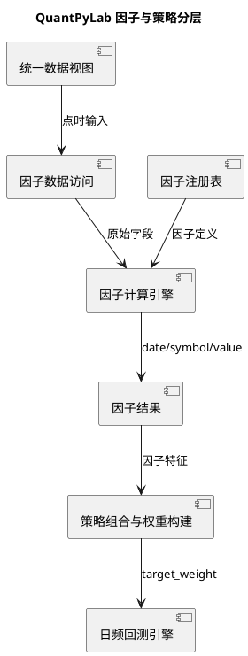

# QuantPyLab 独立因子库设计提案

**提案日期**：2026-08-16
**提案状态**：已确认并实施
**适用范围**：日频股票回测与后续横截面研究

## 1. 背景与目标

当前 `price-momentum` 与 `quality-value-recovery` 将动量、均线、估值分位数和质量指标直接计算在策略类内部。这样可以快速验证回测引擎，但会带来以下问题：

1. 同一个因子无法被多个策略、因子检验和归因模块复用。
2. 因子计算、横截面标准化、选股和权重分配混在一起，难以独立测试。
3. 财务指标的公告日对齐规则容易在新策略中被重复实现或误用。
4. 因子版本、参数和数据需求无法统一记录。

本提案的目标是建立独立的因子计算层：

- 因子只负责从点时数据生成 `date`、`symbol`、`value`。
- 策略负责组合因子、筛选股票、约束风险并生成目标权重。
- 数据访问统一经过 DuckDB 视图，不允许因子直接读取 Parquet 或绕过 ASOF 对齐。
- 首期按回测任务按需计算，不新增因子 Parquet 落盘和持久化表，避免缓存失效与数据版本错配。
- 保持现有回测引擎的 T+1 开盘成交、后复权收益、交易成本和退市清算口径不变。

## 2. 非目标

首期不处理以下内容：

- 分钟级或盘中因子。
- 因子自动寻优、机器学习训练和参数搜索。
- 因子结果的全市场物化存储、增量更新和缓存调度。
- 做空、杠杆、融资融券和多资产组合。
- 改变当前回测引擎的成交规则。

## 3. 分层关系



因子与策略是上下游关系，不是两个互相竞争的策略体系：

- 因子回答“股票在某个时点具有什么可比较特征”。
- 策略回答“如何组合这些特征并形成投资组合”。
- 回测引擎只负责按目标权重执行，不解释因子含义。

## 4. 目录与模块设计

首期建议新增以下模块：

```text
analysis/factors/
├── __init__.py
├── base.py                 # 因子定义、元数据和输入需求契约
├── registry.py             # 显式因子注册表
├── engine.py               # 批量计算、拼接和结果校验
├── transforms.py           # 截面排名、标准化、缩尾等纯变换
├── market.py               # 动量、趋势、波动率、流动性因子
└── fundamental.py          # 估值、盈利质量、成长和财务稳健性因子
```

数据访问仍由回测侧统一负责，建议扩展 `backtest/data_access.py`，而不是让因子模块直接连接数据库。因子计算模块只接收已经通过统一视图加载并完成点时对齐的 `DataFrame`。

## 5. 核心接口

### 5.1 因子定义

每个因子实现统一的 `FactorDefinition` 契约，至少声明：

- `name`：稳定、唯一、动宾含义清晰的因子名，例如 `price_momentum_120d`。
- `version`：因子公式或数据口径变更时递增。
- `description`：公式、方向和经济含义。
- `required_columns`：需要的视图字段。
- `lookback_days`：计算所需的历史交易日数量。
- `higher_is_better`：原始值方向，高值是否代表更强信号。
- `compute(data, parameters)`：纯计算方法，不访问数据库、不修改输入数据。

计算结果统一为：

```text
date       DATE
symbol     VARCHAR
value      DOUBLE
```

结果必须满足：

- `date`、`symbol` 唯一。
- 同一因子同一股票同一天最多一条记录。
- 无法计算时返回 `NULL`，不使用默认值伪造信号。
- 不在因子内部决定持仓数量、目标权重或交易时点。

### 5.2 因子输入需求

因子通过输入需求声明自动汇总数据请求：

- 行情字段：`close_hfq`、`open_hfq`、`volume`、`amount` 等。
- 估值字段：`pe_ttm`、`pb`、`ps_ttm`、`pcf_ttm` 等。
- 财务指标：通过 `fin_indicator` 的公告日期 ASOF JOIN 获取。
- 历史窗口：取所有因子的最大 `lookback_days`，避免每个因子重复查询。

数据访问层负责：

1. 调用 `db_manager.ensure_views(...)` 加载所需视图及依赖。
2. 按回测开始日期向前获取足够的交易日。
3. 将财务数据按公告日期对齐，而不是按报告期对齐。
4. 返回单一输入数据集，避免因子之间出现日期和股票集合不一致。

## 6. 首期因子范围

首期实现以下基础因子，覆盖现有策略并能验证复用能力：

| 因子名 | 类型 | 公式或定义 | 方向 |
|:---|:---|:---|:---|
| `price_momentum_120d` | 动量 | `close_hfq / close_hfq.shift(120) - 1` | 越高越好 |
| `price_trend_gap_120d` | 趋势 | `close_hfq / MA(close_hfq, 120) - 1` | 越高越好 |
| `price_volatility_60d` | 波动 | 60 日后复权日收益率标准差 | 越低越好 |
| `valuation_pe_ttm` | 估值 | 点时 `pe_ttm`，非正值置为缺失 | 越低越好 |
| `valuation_pb` | 估值 | 点时 `pb`，非正值置为缺失 | 越低越好 |
| `quality_roe_weighted` | 质量 | 公告日对齐的加权 ROE | 越高越好 |
| `quality_operating_cashflow_ratio` | 质量 | 公告日对齐的经营现金流/营业收入 | 越高越好 |

因子只生成原始数值。横截面排名、标准化和方向翻转放在 `transforms.py`，避免把某一种策略的评分口径硬编码进因子。

## 7. 因子变换与策略使用

提供独立的纯变换函数：

- `rank_factor_cross_sectionally`：按交易日进行百分位排名。
- `winsorize_factor_cross_sectionally`：按交易日缩尾，降低极端值影响。
- `standardize_factor_cross_sectionally`：按交易日计算标准分。
- `combine_factor_scores`：按显式权重合成多因子分数。
- `filter_valid_factor_rows`：按策略声明处理缺失值。

首个使用者建议是新增一个多因子策略，例如 `multi-factor-quality-value-momentum`：

1. 过滤上市交易日不足和关键因子缺失的股票。
2. 分别对价值、质量和动量因子做截面排名。
3. 按配置权重合成综合分数。
4. 按综合分数排序，选择前 N 只股票。
5. 初期采用等权，后续再增加波动率调整和单股权重上限。

现有两个策略先保持行为不变，待因子测试完成后再以兼容方式迁移，避免因子库首期改造同时改变已有回测结果。

## 8. 点时数据与未来函数控制

因子库必须把无未来函数作为接口约束，而不是依赖开发者自觉：

1. 财务因子只能读取公告日已经可见的记录。
2. 滚动窗口只能使用当前日期及之前的数据。
3. 截面标准化只能在同一交易日的股票集合内进行。
4. 不能使用回测结束日之后的数据补齐历史缺失值。
5. 因子输入的开始日期由最大历史窗口自动向前扩展。
6. 因子版本和参数必须写入回测结果的 `parameters.json`。

测试中加入“修改未来日期数据不影响过去因子值”的回归样例，作为未来函数门禁。

## 9. 测试计划

新增测试覆盖：

- 因子注册、重名和未知因子拒绝。
- 每个首期因子的可手算样例。
- 滚动窗口不足时的缺失值行为。
- 截面排名、缩尾、标准化和方向处理。
- 输入字段缺失、重复 `date/symbol` 和全空因子的错误处理。
- 公告日 ASOF 对齐，以及未来数据变更隔离。
- 多因子合成后目标权重列和权重和校验。
- 现有两个策略回归结果不因因子库引入而改变。

核心代码完成后必须依次通过：

```bash
uv run ruff check .
uv run ruff format --check .
uv run pytest tests/
```

## 10. 实施阶段

### 阶段一：因子库基础能力

- 建立 `FactorDefinition`、输入需求、结果校验和显式注册表。
- 实现首期七个基础因子。
- 实现截面变换函数。
- 扩展点时数据访问字段选择，但不改变现有回测口径。

### 阶段二：策略接入

- 新增多因子策略并提供 TOML 配置。
- 将因子版本、参数和输入需求写入回测结果。
- 用现有回测引擎完成 T+1、成本和退市清算。

### 阶段三：验证与文档沉淀

- 完成单元测试、回测样本核验和性能采样。
- 新增 `docs/factor_library.md`，记录接口、因子公式和点时规则。
- 根据实际查询成本决定是否将稳定、高频使用的因子下沉为 `storage/database/views/analysis/` 视图。

## 11. 需要确认的范围

本提案默认采用以下范围：

- 首期只做按需计算，不落地因子结果。
- 首期实现七个基础因子和截面变换。
- 首期新增一个多因子策略作为集成验证。
- 首期保持现有回测引擎和两个旧策略行为不变。

用户确认后，才进入代码实现阶段；实现过程中如需改变上述范围，应重新提交提案确认。
